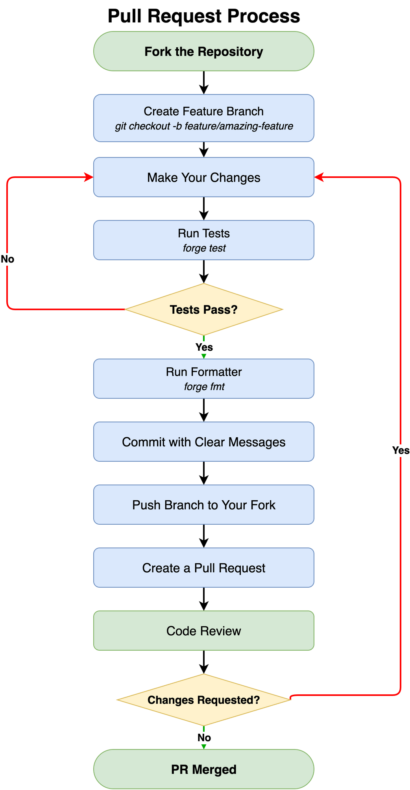

# Contributing to The Fixer Hook

Thank you for your interest in contributing! This document provides guidelines.

## Development Setup

```bash
# Clone and install
git clone https://github.com/guglxni/the-fixer-hook.git
cd the-fixer-hook
forge install

# Build
forge build

# Test
forge test -vvv
```

## Pull Request Process



1. Fork the repository
2. Create a feature branch (`git checkout -b feature/amazing-feature`)
3. Make your changes
4. Run tests (`forge test`) — fix any failures before continuing
5. Run formatter (`forge fmt`)
6. Commit with clear messages
7. Push branch to your fork and create a Pull Request
8. Address any review feedback and re-run tests if needed

## Code Style

- Follow Solidity style guide
- Use NatSpec comments for all public functions
- Run `forge fmt` before committing

## Testing Requirements

- All new features must have tests
- Maintain 90%+ code coverage
- Include fuzz tests for validation logic
- ERC-8004 agent features should follow the mock registry pattern used in `test/ERC8004.t.sol`
- Agent registration tests must use `registerAgent(uint256 agentId, AgentPlatform platform)` (ERC-8004 permissionless)

## Architecture Notes

The project follows the **Agent Infrastructure Stack** pattern with a **DELEGATECALL Extension** architecture:

| Layer | Protocol | Role |
|:-----:|:--------:|:-----|
| Communication | **XMTP** | Wallet-to-wallet messaging between agents |
| Payments | **x402** | HTTP 402 micropayments, EIP-3009 gasless transfers |
| Identity & Trust | **ERC-8004** | NFT identity, reputation scoring, validation |

**Contract Architecture:**
- **FixerRegistryUpgradeable** (20.5KB) — Core logic behind ERC1967Proxy
- **FixerRegistryExtension** (14.7KB) — Agent/XMTP/EIP-3009 functions via DELEGATECALL
- **FixerLib** (2.3KB) — External library for tier math and reward calculations
- **FixerHookV2** (4.5KB) — Lightweight per-pool `afterSwap` hook
- **FixerCredential** — Soulbound ERC-721 (ERC-5192)

All agent registration is ERC-8004-only (permissionless, no staking). See `internal/ERC8004_ENHANCEMENT.md` for full details.

**Test baseline:** 381 tests, 35 suites, 0 failures, >95% coverage.

## Security

- Never commit private keys
- Report vulnerabilities privately
- Follow checks-effects-interactions pattern
- All external calls to ERC-8004 registries must use `try/catch`
