# Contributing to The Referral Hook

Thank you for your interest in contributing! This document provides guidelines.

## Development Setup

```bash
# Clone and install
git clone https://github.com/your-org/the-referral-hook.git
cd the-referral-hook
forge install

# Build
forge build

# Test
forge test -vvv
```

## Pull Request Process

```mermaid
flowchart LR
    Fork["Fork repo"] --> Branch["Create branch"]
    Branch --> Code["Make changes"]
    Code --> Test["forge test"]
    Test --> Fmt["forge fmt"]
    Fmt --> PR["Create PR"]
    PR --> Review["Code review"]
    Review --> Merge["Merge"]

    style Fork fill:#1e3a8a,color:#fff
    style Branch fill:#1e3a8a,color:#fff
    style Code fill:#1e3a8a,color:#fff
    style Test fill:#059669,color:#fff
    style Fmt fill:#f59e0b,color:#000
    style PR fill:#1e3a8a,color:#fff
    style Review fill:#1e3a8a,color:#fff
    style Merge fill:#059669,color:#fff
```



1. Fork the repository
2. Create a feature branch (`git checkout -b feature/amazing-feature`)
3. Make your changes
4. Run tests (`forge test`)
5. Commit with clear messages
6. Push and create a Pull Request

## Code Style

- Follow Solidity style guide
- Use NatSpec comments for all public functions
- Run `forge fmt` before committing

## Testing Requirements

- All new features must have tests
- Maintain 90%+ code coverage
- Include fuzz tests for validation logic

## Security

- Never commit private keys
- Report vulnerabilities privately
- Follow checks-effects-interactions pattern
