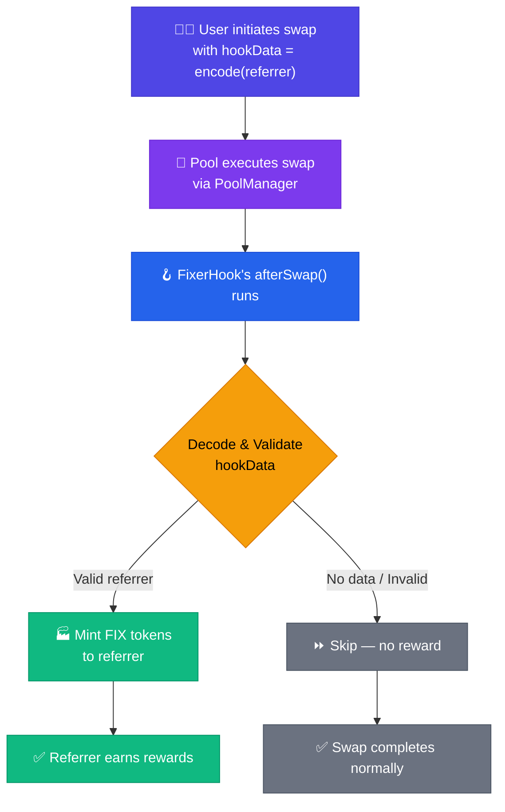
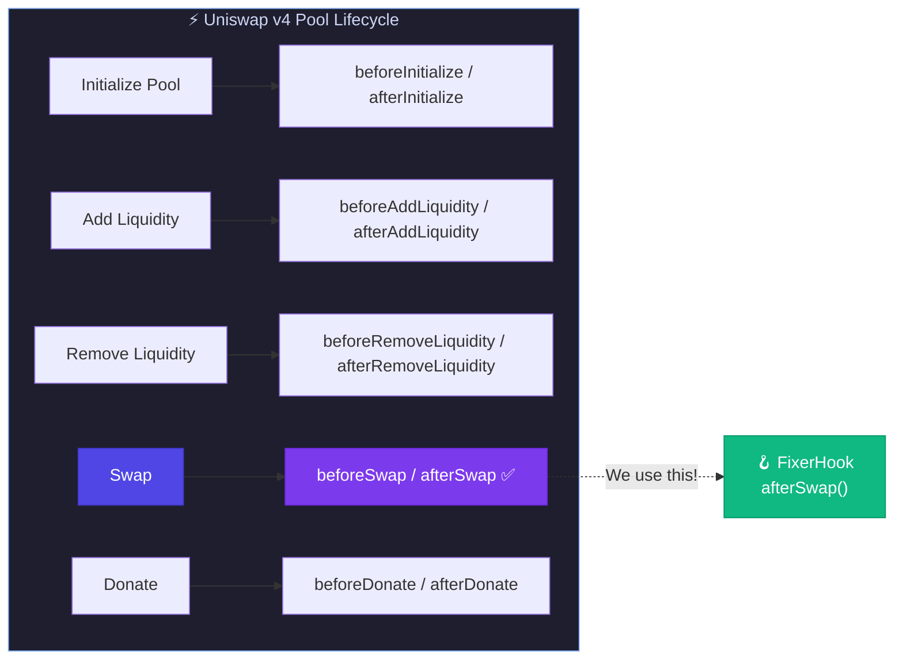
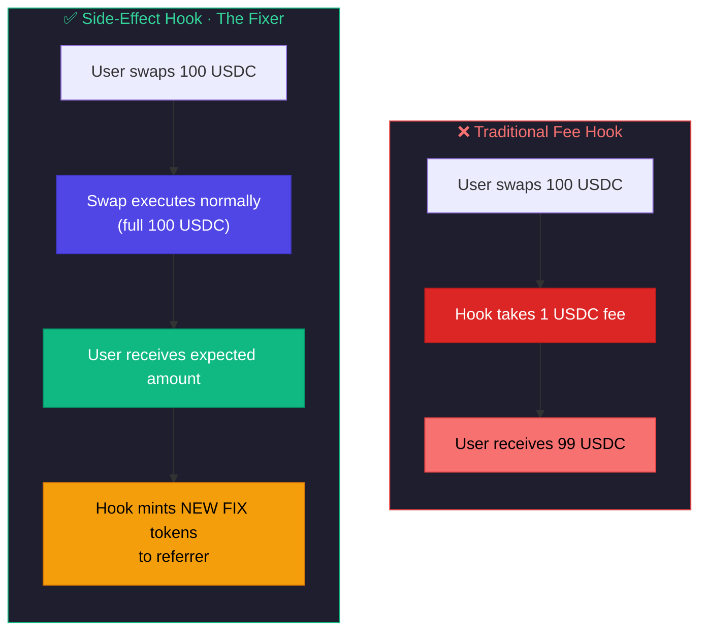
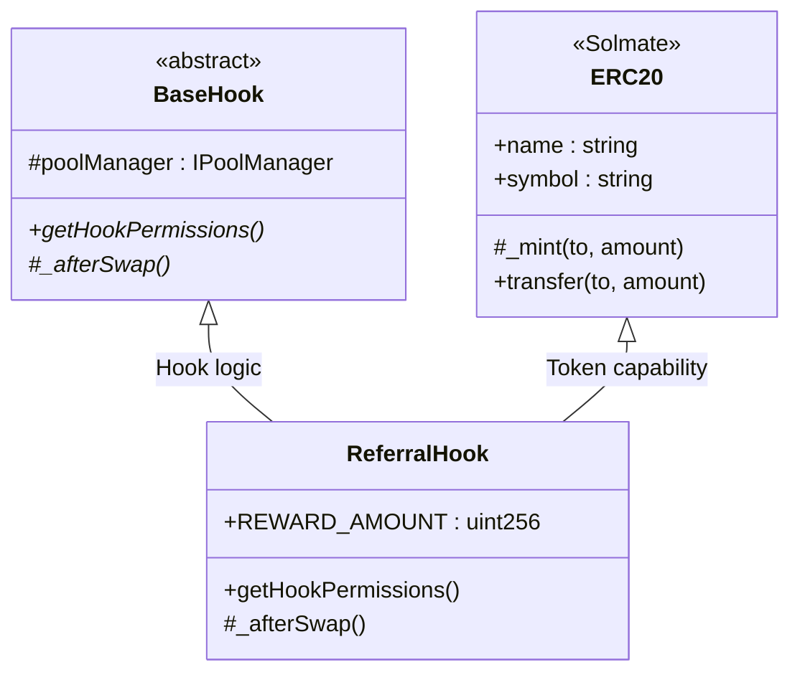
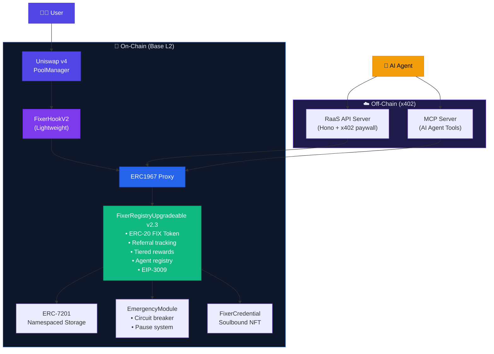

# The Fixer Hook

> **A Learning-Focused Implementation of On-Chain Referral Rewards for Uniswap v4**

*"Everybody pays the Fixer."*

---

## About This Project

This repository documents my journey building my first Uniswap v4 hook. If you're new to v4 hooks, this codebase is designed to be **educational first, functional second**. Every design decision is explained, every concept is broken down, and the code is heavily commented for learning.

**What you'll learn:**
- How Uniswap v4 hooks work
- How to decode `hookData` from swap transactions
- How to implement the `afterSwap` hook
- How to combine a hook with an ERC-20 token
- Best practices for hook development

---

## Table of Contents

1. [The Concept](#the-concept)
2. [Prerequisites](#prerequisites)
3. [Understanding Uniswap v4 Hooks](#understanding-uniswap-v4-hooks)
4. [How The Fixer Hook Works](#how-the-fixer-hook-works)
5. [Code Walkthrough](#code-walkthrough)
6. [Project Structure](#project-structure)
7. [Running the Project](#running-the-project)
8. [Key Learnings](#key-learnings)
9. [Further Reading](#further-reading)

---

## The Concept

**The Problem:** Liquidity pools have no native way to reward people who bring in new traders. Frontends and aggregators route users to pools but receive nothing in return.

**The Solution:** The Fixer Hook creates an on-chain affiliate system. When someone swaps, they can include a referrer's address. The hook automatically mints reward tokens to that referrer.



---

## Prerequisites

Before diving in, you should understand:

| Concept | Why It Matters |
|---------|----------------|
| **Solidity basics** | We're writing smart contracts |
| **ERC-20 tokens** | The hook mints reward tokens |
| **ABI encoding** | We decode data passed to the hook |
| **Uniswap v3 concepts** | Pools, swaps, liquidity (v4 builds on these) |

**Tools needed:**
- [Foundry](https://book.getfoundry.sh/) - Smart contract development framework
- Git

---

## Understanding Uniswap v4 Hooks

### What Are Hooks?

Hooks are **smart contracts that extend pool behavior**. They're called at specific points during pool operations:



### The Hook Address System

Here's something unique about v4: **your hook's address determines its permissions**.

The last few bits of the hook's deployed address tell the PoolManager which functions to call:

```
Address: 0x...80
              ^^
              ||
              |+-- Bit 7 = afterSwap permission
              +--- Other bits = other permissions
```

This means you can't just deploy to any address. You need to **mine** an address with the correct bits set. We use CREATE2 for this (see `script/HookMiner.sol`).

### The hookData Parameter

Every swap can include arbitrary bytes called `hookData`. This is how external data reaches your hook:

```solidity
// Frontend encodes referrer address
bytes memory hookData = abi.encode(referrerAddress);

// Passed to swap function
router.swap(poolKey, swapParams, hookData);

// Your hook receives it in afterSwap
function afterSwap(..., bytes calldata hookData) {
    address referrer = abi.decode(hookData, (address));
}
```

---

## How The Fixer Hook Works

### Architecture Decision: Side-Effect Pattern

The Fixer Hook uses what I call the **"Side-Effect Pattern"**:



**Why this approach?**
- User experience unchanged (they get exactly what they expect)
- No fee extraction complexity
- Simpler to implement and audit
- Reward tokens are separate from swap tokens

### Dual Inheritance Pattern

The hook inherits from two parents:

```solidity
contract ReferralHook is BaseHook, ERC20 {
```



> **Learning Point:** Single contract = Hook + Token. Deploy once, get both capabilities.

| Parent | Purpose |
|--------|---------|
| `BaseHook` | Provides Uniswap hook interface and validation |
| `ERC20` | Makes the hook contract itself be the reward token |

**Why combine them?** Simplicity. Instead of deploying two contracts (hook + token), we deploy one that does both.

---

## Code Walkthrough

### The Core Logic (Annotated)

Here's the heart of the hook with educational comments:

```solidity
function _afterSwap(
    address sender,          // Usually the SwapRouter, not the user
    PoolKey calldata key,    // Identifies which pool (unused here)
    SwapParams calldata params,  // Swap details (unused here)
    BalanceDelta delta,      // Token amounts changed (unused here)
    bytes calldata hookData  // THIS IS WHERE OUR DATA LIVES
) internal override returns (bytes4, int128) {
    
    // LEARNING POINT 1: Early return pattern
    // If no hookData, this is a normal swap without referral
    // We save gas by returning early
    if (hookData.length == 0) {
        return (this.afterSwap.selector, 0);
    }
    
    // LEARNING POINT 2: ABI decoding
    // hookData was encoded as: abi.encode(address)
    // We decode it back to get the referrer
    address referrer = abi.decode(hookData, (address));
    
    // LEARNING POINT 3: Input validation
    // Never trust input data. Always validate.
    
    // Check 1: Is it a real address?
    if (referrer == address(0)) {
        return (this.afterSwap.selector, 0);
    }
    
    // Check 2: Is someone trying to refer themselves?
    // tx.origin = the actual human who initiated the transaction
    // sender = often a router contract, not helpful for this check
    if (referrer == tx.origin) {
        return (this.afterSwap.selector, 0);
    }
    
    // LEARNING POINT 4: State modification
    // All validation passed. Mint reward tokens.
    // _mint comes from our ERC20 inheritance
    _mint(referrer, REWARD_AMOUNT);
    
    // LEARNING POINT 5: Return values
    // First: selector (required for hook validation)
    // Second: delta modification (0 = we don't change swap amounts)
    return (this.afterSwap.selector, 0);
}
```

### The Permissions Configuration

```solidity
function getHookPermissions() public pure override 
    returns (Hooks.Permissions memory) 
{
    return Hooks.Permissions({
        beforeInitialize: false,
        afterInitialize: false,
        beforeAddLiquidity: false,
        beforeRemoveLiquidity: false,
        afterAddLiquidity: false,
        afterRemoveLiquidity: false,
        beforeSwap: false,
        afterSwap: true,      // <-- THE ONLY ONE WE NEED
        beforeDonate: false,
        afterDonate: false,
        beforeSwapReturnDelta: false,
        afterSwapReturnDelta: false,
        afterAddLiquidityReturnDelta: false,
        afterRemoveLiquidityReturnDelta: false
    });
}
```

**Learning Point:** Only enable what you need. Each enabled permission:
- Adds gas cost to operations
- Increases attack surface
- Requires more code to maintain

---

## Project Structure

```
the-fixer-hook/
├── src/
│   ├── FixerHook.sol                  # v1 — Original hook (BaseHook + ERC20)
│   ├── FixerHookV2.sol                # v2 — Lightweight hook (delegates to registry)
│   ├── FixerRegistry.sol              # v1 — Non-upgradeable central registry
│   ├── FixerRegistryUpgradeable.sol   # v2.3 — UUPS proxy registry + EIP-3009
│   ├── FixerCredential.sol            # v2.1 — Soulbound NFT credentials
│   ├── storage/
│   │   └── FixerRegistryStorage.sol   # ERC-7201 namespaced storage
│   ├── modules/
│   │   └── EmergencyModule.sol        # Circuit breaker + pause system
│   ├── libraries/
│   │   └── BPSMath.sol                # Basis-point math helpers
│   ├── interfaces/                    # IFixerRegistry, IAgentRegistry, etc.
│   └── types/
│       └── AgentTypes.sol             # Tier constants, fee constants
│
├── test/                              # 314 tests across 28 suites
│   ├── FixerHook.t.sol                # v1 hook tests
│   ├── FixerRegistry.t.sol            # v1 registry tests
│   ├── FixerRegistryUpgrade.t.sol     # Proxy + upgrade tests
│   ├── FixerCredential.t.sol          # NFT credential tests
│   ├── Hardening.t.sol                # Supply cap, timelock, invariants
│   ├── EmergencyModule.t.sol          # Emergency / circuit breaker tests
│   └── X402.t.sol                     # x402 agent & EIP-3009 tests
│
├── script/
│   ├── Deploy.s.sol                   # v1 deployment
│   ├── DeployUpgradeable.s.sol        # UUPS proxy deployment
│   ├── DeployV2.s.sol                 # v2 hook + registry deployment
│   ├── DeployX402.s.sol               # v2.3 x402 upgrade / fresh deploy
│   └── HookMiner.sol                  # CREATE2 address mining
│
├── x402/                              # Off-chain x402 services
│   ├── raas-server/                   # RaaS API (Hono + x402 paywall)
│   └── mcp-server/                    # MCP server for AI agents
│
├── docs/                              # Comprehensive documentation
└── foundry.toml                       # Foundry configuration
```

---

## Running the Project

### 1. Install Foundry

```bash
curl -L https://foundry.paradigm.xyz | bash
foundryup
```

### 2. Clone and Install Dependencies

```bash
git clone https://github.com/guglxni/the-fixer-hook.git
cd the-fixer-hook
forge install
```

### 3. Build

```bash
forge build
```

### 4. Run Tests

```bash
forge test -vvv
```

Expected output:
```
Ran 28 test suites: 314 tests passed, 0 failed
```

### 5. Run Tests with Gas Report

```bash
forge test --gas-report
```

---

## Key Learnings

### What I Learned Building This

1. **Hook addresses matter.** The address bits determine permissions. You can't just deploy anywhere.

2. **`tx.origin` has valid use cases.** Everyone says "never use tx.origin" but for anti-gaming checks (not authentication), it's appropriate.

3. **Start with one permission.** I only enabled `afterSwap`. Adding more would complicate testing and increase gas.

4. **Side-effect pattern is safer.** Not modifying swap amounts means fewer things can go wrong.

5. **Inherited contracts add complexity.** Dual inheritance (BaseHook + ERC20) works but requires understanding both parent contracts.

### Common Pitfalls I Encountered

| Pitfall | How I Fixed It |
|---------|----------------|
| v4-core and v4-periphery version mismatch | Use v4-core bundled inside v4-periphery |
| `IPoolManager.SwapParams` not found | API changed; use `SwapParams` from `PoolOperation.sol` |
| Hook address validation failing in tests | Use pure logic tests instead of full deployment tests |
| `via_ir` causing slow compilation | Disabled for development; enable for production |

---

## Further Reading

### Official Resources
- [Uniswap v4 Documentation](https://docs.uniswap.org/)
- [Uniswap v4 Core Repository](https://github.com/Uniswap/v4-core)
- [Foundry Book](https://book.getfoundry.sh/)

### Recommended Video
- [How to Build a Custom Liquidity Pool with OpenZeppelin Uniswap Hooks](https://www.youtube.com/watch?v=IDBZ-p9AACE)

### Related Concepts
- [EIP-1014: CREATE2](https://eips.ethereum.org/EIPS/eip-1014) - How address mining works
- [Solmate ERC20](https://github.com/transmissions11/solmate) - Gas-optimized token implementation

---

## v2 Architecture: UUPS Upgradeable Registry

As the project evolved beyond v1, we built a **UUPS proxy-based upgradeable architecture** with a central registry, emergency controls, and x402 AI agent support:



> **Learning Point:** The v2 architecture separates concerns — the hook stays lightweight (just routing), while the registry handles all business logic behind a UUPS proxy for upgradeability.

---

## Documentation

For deeper dives into specific topics:

| Document | What You'll Learn |
|----------|-------------------|
| [System Design](./docs/SYSTEM_DESIGN.md) | Full architecture with diagrams |
| [Implementation Guide](./docs/IMPLEMENTATION_GUIDE.md) | Step-by-step build instructions |
| [Integration Guide](./docs/INTEGRATION_GUIDE.md) | How frontends connect |
| [Security Analysis](./docs/SECURITY.md) | Threat model and mitigations |
| [Testing Strategy](./docs/TESTING.md) | Test patterns and coverage |
| [Deployment Guide](./docs/DEPLOYMENT.md) | Going to production |

---

## Contributing

This is a learning project, and I'm still learning too. If you spot issues or have improvements:

1. Open an issue describing the problem
2. Fork and submit a PR with your fix
3. Help improve the documentation

---

## License

Business Source License 1.1 (BSL-1.1) - See [LICENSE](./LICENSE).
- Educational and non-commercial use is permitted.
- Commercial production use requires prior consent from the Licensor (Aaryan Guglani).
- Transitions to MIT License on 2030-01-01.

---

## Acknowledgments

- Uniswap Labs for the v4 architecture
- The Solmate team for gas-optimized contracts
- The Foundry team for excellent tooling

---

<p align="center">
  <em>Built as a learning exercise. Comments, questions, and feedback welcome.</em>
</p>
