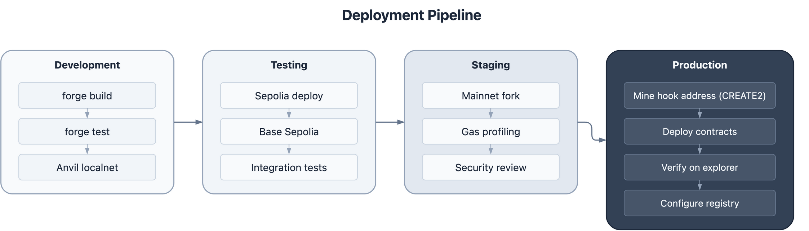

# Deployment Guide

> Deploy the FixerHook Protocol — Hook, Upgradeable Registry, and Proxy Infrastructure

**Last Updated:** February 22, 2026
**Covers:** FixerHookV2 + FixerRegistryUpgradeable v2.3 (UUPS proxy), Hook mining, Upgrade process

---

## Overview

Uniswap v4 hooks require deployment to addresses with specific bits set based on enabled permissions. This guide covers the address mining and deployment process for the full Fixer Protocol v2.3 stack.

For live testnet deployment addresses and interaction instructions, see [Testnet Deployments](./TESTNET_DEPLOYMENTS.md).



---

## Address Requirements

### Permission Bits

Uniswap v4 uses the **lowest 14 bits** of the hook address as permission flags. The Fixer Hook only enables `afterSwap`:

| Permission | Bit Position | Flag Value |
|------------|--------------|------------|
| afterSwap | 6 | `0x0040` |

The hook address must have **exactly** bit 6 set and **no other permission bits** set in the lowest 14 bits. This is enforced by the `HookMiner` using a 14-bit mask:

```solidity
uint160 internal constant ALL_HOOK_MASK = uint160((1 << 14) - 1); // 0x3FFF
// Check: address & 0x3FFF == flags (exact match, not subset)
```

---

## Hook Mining

### CREATE2 with Deterministic Deployer

Foundry's `new Contract{salt}()` syntax uses the deterministic CREATE2 deployer at a fixed address. The `HookMiner` must use this address (not the EOA deployer) when computing addresses:

```solidity
// Foundry's deterministic CREATE2 deployer
address constant CREATE2_DEPLOYER = 0x4e59b44847b379578588920cA78FbF26c0B4956C;

library HookMiner {
    uint160 internal constant ALL_HOOK_MASK = uint160((1 << 14) - 1);

    function find(
        address deployer,      // Must be CREATE2_DEPLOYER, not EOA
        uint160 flags,
        bytes memory creationCode,
        bytes memory constructorArgs
    ) internal pure returns (address hookAddress, bytes32 salt) {
        bytes memory initCode = abi.encodePacked(creationCode, constructorArgs);
        bytes32 initCodeHash = keccak256(initCode);

        for (uint256 i = 0; i < 100000; i++) {
            salt = bytes32(i);
            hookAddress = computeAddress(deployer, salt, initCodeHash);

            // EXACT match — no extra permission bits allowed
            if (uint160(hookAddress) & ALL_HOOK_MASK == flags) {
                return (hookAddress, salt);
            }
        }
        revert("HookMiner: No valid address found within iteration limit");
    }
}
```

### Common Pitfalls

| Pitfall | Cause | Fix |
|---------|-------|-----|
| Hook address mismatch | Using EOA address instead of CREATE2 deployer | Pass `0x4e59b44847b379578588920cA78FbF26c0B4956C` to `HookMiner.find()` |
| `HookAddressNotValid` from PoolManager | Extra permission bits set in address | Use exact flag matching (`& ALL_HOOK_MASK == flags`) instead of subset matching (`& flags == flags`) |
| Contract size > 24576 bytes | FixerRegistryUpgradeable exceeds EIP-170 limit | Set `via_ir = true` in `foundry.toml` |

---

## Network Configuration

### Verified Testnet Addresses

| Network | Chain ID | PoolManager | RPC |
|---------|----------|-------------|-----|
| Base Sepolia | 84532 | `0x05E73354cFDd6745C338b50BcFDfA3Aa6fA03408` | `https://sepolia.base.org` |
| Arbitrum Sepolia | 421614 | `0xFB3e0C6F74eB1a21CC1Da29aeC80D2Dfe6C9a317` | `https://sepolia-rollup.arbitrum.io/rpc` |
| Unichain Sepolia | 1301 | `0x00B036B58a818B1BC34d502D3fE730Db729e62AC` | `https://sepolia.unichain.org` |

### Mainnet Addresses

| Network | Chain ID | PoolManager | Notes |
|---------|----------|-------------|-------|
| Ethereum | 1 | `0x000000000004444c5dc75cB358380D2e3dE08A90` | High gas costs |
| Base | 8453 | Verify before deploy | Recommended for low gas |
| Arbitrum | 42161 | `0x360E68fa3A5b8061C76533c66db9FB32Ccc0614C` | Recommended for low gas |

---

## Environment Setup

Create `.env` file (see `.env.example`):

```bash
# Required
PRIVATE_KEY=0x...              # Deployer private key (never commit!)

# Testnet RPCs
BASE_SEPOLIA_RPC=https://sepolia.base.org
ARB_SEPOLIA_RPC=https://sepolia-rollup.arbitrum.io/rpc
UNICHAIN_SEPOLIA_RPC=https://sepolia.unichain.org

# Optional (defaults to deployer address)
SECURITY_COUNCIL=0x...         # Multisig for emergency pause
GOVERNANCE=0x...               # DAO governance address

# Block explorer API keys (for --verify)
BASESCAN_API_KEY=...
ARBISCAN_API_KEY=...
UNISCAN_API_KEY=...
```

### foundry.toml RPC Configuration

```toml
[rpc_endpoints]
base_sepolia = "${BASE_SEPOLIA_RPC}"
arb_sepolia = "${ARB_SEPOLIA_RPC}"
unichain_sepolia = "${UNICHAIN_SEPOLIA_RPC}"

[etherscan]
base_sepolia = { key = "${BASESCAN_API_KEY}", url = "https://api-sepolia.basescan.org/api", chain = 84532 }
arb_sepolia = { key = "${ARBISCAN_API_KEY}", url = "https://api-sepolia.arbiscan.io/api", chain = 421614 }
unichain_sepolia = { key = "${UNISCAN_API_KEY}", url = "https://api-sepolia.uniscan.xyz/api", chain = 1301 }
```

---

## Deployment Scripts

### Chain-Specific Scripts (Recommended)

Each chain has a dedicated deployment script with hardcoded, verified addresses:

| Script | Network | Token Pair |
|--------|---------|-----------|
| `script/DeployBaseSepolia.s.sol` | Base Sepolia | USDC / WETH |
| `script/DeployArbSepolia.s.sol` | Arbitrum Sepolia | USDC / WETH |
| `script/DeployUnichainSepolia.s.sol` | Unichain Sepolia | USDC / WETH |

### Generic Script

`script/DeployTestnet.s.sol` reads all addresses from environment variables and optionally deploys mock tokens if `TOKEN0`/`TOKEN1` are not set.

### Deployment Commands

```bash
# Dry run (simulation only)
forge script script/DeployBaseSepolia.s.sol --rpc-url base_sepolia -vvvv

# Deploy to network (broadcast transactions)
forge script script/DeployBaseSepolia.s.sol \
  --rpc-url base_sepolia --broadcast -vvvv

# Deploy + verify on block explorer
forge script script/DeployBaseSepolia.s.sol \
  --rpc-url base_sepolia --broadcast --verify -vvvv
```

### What Gets Deployed

Each deployment script executes 5 transactions in order:

1. **Deploy Implementation** — `new FixerRegistryUpgradeable()` — the UUPS logic contract
2. **Deploy Proxy** — `new ERC1967Proxy(impl, initData)` — calls `initialize()` atomically
3. **Deploy Hook** — `new FixerHookV2{salt}(...)` — CREATE2-mined for correct flag bits
4. **Register Hook** — `registry.registerHook(hook, poolId)` — authorizes hook to record referrals
5. **Deploy Credential** — `new FixerCredential(registry, owner)` — soulbound NFT

---

## Post-Deployment Verification

Run these checks after deployment to confirm everything is correctly wired:

```bash
# Set variables for your deployment
PROXY=0x...    # Registry proxy address
HOOK=0x...     # FixerHookV2 address
RPC=...        # RPC URL

# 1. Registry version (expect: 2003000)
cast call $PROXY "VERSION()(uint256)" --rpc-url $RPC

# 2. Ownership
cast call $PROXY "owner()(address)" --rpc-url $RPC

# 3. FIX token metadata
cast call $PROXY "name()(string)" --rpc-url $RPC     # "Fixer Token"
cast call $PROXY "symbol()(string)" --rpc-url $RPC    # "FIX"

# 4. Hook authorized in registry
cast call $PROXY "isAuthorizedHook(address)(bool)" $HOOK --rpc-url $RPC  # true

# 5. Pool ID stored correctly
cast call $HOOK "getPoolId()(bytes32)" --rpc-url $RPC

# 6. Hook references the correct registry
cast call $HOOK "registry()(address)" --rpc-url $RPC  # Should match $PROXY
```

### Addresses to Record

After deployment, save these in `deployments/<network>.json`:
- **Implementation** — The raw `FixerRegistryUpgradeable` logic contract
- **Proxy** — The `ERC1967Proxy` (this is what users interact with)
- **FixerHookV2** — The hook contract (CREATE2-mined address)
- **FixerCredential** — The soulbound NFT contract
- **Pool ID** — The Uniswap v4 pool identifier

> **Important:** All interactions go through the **proxy** address, never the implementation directly.

---

## Upgrade Process

### Overview

The registry uses UUPS proxy pattern with a **48-hour timelock**. Upgrades are a three-step process:

1. `proposeUpgrade(newImplementation)` — starts the timelock
2. Wait 48 hours
3. `executeUpgrade()` — applies the upgrade

### Pre-Upgrade Checklist

- [ ] New implementation compiled and tested locally
- [ ] Storage layout compatibility verified (no slot conflicts with ERC-7201 namespaced storage)
- [ ] All tests passing (`forge test`)
- [ ] Upgrade script dry-run successful
- [ ] 48-hour timelock period completed

### Upgrade Commands

```bash
# Step 1: Propose the upgrade
cast send $PROXY \
  "proposeUpgrade(address)" <NEW_IMPLEMENTATION> \
  --private-key $PRIVATE_KEY --rpc-url $RPC

# Step 2: Wait 48 hours, then execute
cast send $PROXY \
  "executeUpgrade()" \
  --private-key $PRIVATE_KEY --rpc-url $RPC

# Or cancel if needed
cast send $PROXY \
  "cancelUpgrade()" \
  --private-key $PRIVATE_KEY --rpc-url $RPC
```

### Post-Upgrade Verification

```bash
# Verify version bumped
cast call $PROXY "VERSION()(uint256)" --rpc-url $RPC

# Verify state preserved
cast call $PROXY "getGlobalStats()(uint256,uint256,uint256)" --rpc-url $RPC

# Verify hook still authorized
cast call $PROXY "isAuthorizedHook(address)(bool)" $HOOK --rpc-url $RPC
```

### Rollback

UUPS proxies do not support direct rollback. If an upgrade has issues:
1. Deploy the previous implementation version as a new contract
2. Use `proposeUpgrade()` + `executeUpgrade()` to point back (requires 48h wait)
3. This requires the owner to still have upgrade authority

---

## Deployment Checklist

### v2.3 (Full Stack)

- [ ] PoolManager address verified on-chain (`cast code <addr>`)
- [ ] CREATE2 deployer exists at `0x4e59b44...B4956C` on target chain
- [ ] Private key has sufficient gas balance
- [ ] `via_ir = true` set in foundry.toml (contract size under 24576 bytes)
- [ ] Dry run completes without errors
- [ ] All 5 transactions confirm on-chain
- [ ] `VERSION()` returns `2003000`
- [ ] `owner()` returns deployer address
- [ ] `isAuthorizedHook()` returns `true` for deployed hook
- [ ] Hook address has correct permission bits (bit 6 only in lowest 14 bits)
- [ ] `registry()` on hook matches proxy address
- [ ] Deployment record saved to `deployments/<network>.json`

---

## Gas Considerations

| Network | Deployment Gas (5 txs) | Cost (est.) |
|---------|------------------------|-------------|
| Base Sepolia | ~12M gas | ~0.01 ETH |
| Arbitrum Sepolia | ~12M gas | ~0.01 ETH |
| Unichain Sepolia | ~12M gas | < 0.001 ETH |
| Ethereum (L1) | ~12M gas | 0.5-5 ETH |

**Recommendation:** Deploy on L2 (Base, Arbitrum, Unichain) for cost-effective deployments and referral operations.

---

## Troubleshooting

### "Hook address mismatch" during deployment

**Cause:** `HookMiner.find()` computed the address using a different deployer than Foundry uses.

**Solution:** Pass `0x4e59b44847b379578588920cA78FbF26c0B4956C` (Foundry's deterministic CREATE2 deployer) as the `deployer` parameter to `HookMiner.find()`.

### "HookAddressNotValid" from PoolManager

**Cause:** The mined hook address has extra permission bits set beyond `afterSwap`. Uniswap v4 requires the address flag bits to **exactly match** the hook's declared permissions.

**Solution:** Use exact flag matching in HookMiner:
```solidity
// Wrong (subset matching — allows extra bits):
if (uint160(hookAddress) & flags == flags)

// Correct (exact matching — no extra bits):
uint160 ALL_HOOK_MASK = uint160((1 << 14) - 1);
if (uint160(hookAddress) & ALL_HOOK_MASK == flags)
```

### "Contract code size exceeds 24576 bytes"

**Cause:** `FixerRegistryUpgradeable` is a large contract with ERC-20, tier logic, fee distribution, and agent management.

**Solution:** Enable the Yul IR pipeline in `foundry.toml`:
```toml
via_ir = true
```

### "vm.envUint: failed parsing $PRIVATE_KEY"

**Cause:** Private key in `.env` is missing the `0x` prefix.

**Solution:** Ensure the key starts with `0x`:
```bash
PRIVATE_KEY=0x7122...e2c9    # Correct
PRIVATE_KEY=7122...e2c9      # Wrong — missing 0x
```

### "Contract verification failed"

**Solution:** Check constructor arguments are correctly encoded, and that the block explorer API key is valid:
```bash
# Verify manually
forge verify-contract \
  <ADDRESS> \
  src/FixerHookV2.sol:FixerHookV2 \
  --chain-id <CHAIN_ID> \
  --constructor-args $(cast abi-encode \
    "constructor(address,address,address,address,uint24,int24,uint256)" \
    $POOL_MANAGER $REGISTRY $TOKEN0 $TOKEN1 3000 60 0)
```

---

## References

- [Live Testnet Deployments](./TESTNET_DEPLOYMENTS.md) — All deployed addresses and interaction guide
- [Integration Guide](./INTEGRATION_GUIDE.md) — Frontend integration with hookData encoding
- [Uniswap v4 Hook Deployment](https://docs.uniswap.org/)
- [Foundry Deployment Scripts](https://book.getfoundry.sh/tutorials/solidity-scripting)
- [CREATE2 Address Computation](https://eips.ethereum.org/EIPS/eip-1014)
- [EIP-170: Contract Code Size Limit](https://eips.ethereum.org/EIPS/eip-170)
