# FixerHook Enhancement Brainstorm & Review

> Comprehensive Review of Current Enhancements, Synergy Analysis, and New Ideas

**Document Version:** 1.0.0  
**Created:** February 5, 2026  
**Last Updated:** February 5, 2026  
**Status:** Active Brainstorming

---

## Table of Contents

1. [Current Enhancement Summary](#current-enhancement-summary)
2. [Enhancement Synergy Matrix](#enhancement-synergy-matrix)
3. [Gap Analysis](#gap-analysis)
4. [New Feature Ideas](#new-feature-ideas)
5. [Ecosystem Integration Opportunities](#ecosystem-integration-opportunities)
6. [Monetization Strategies](#monetization-strategies)
7. [User Experience Improvements](#user-experience-improvements)
8. [Governance & DAO Structure](#governance--dao-structure)
9. [Risk Assessment](#risk-assessment)
10. [Prioritized Roadmap](#prioritized-roadmap)
11. [Implementation Dependencies](#implementation-dependencies)
12. [Open Questions](#open-questions)

---

## Current Enhancement Summary

### Completed Versions

| Version | Feature | Key Components | Status |
|---------|---------|----------------|--------|
| **v1.0** | Fixed Rewards | 10 FIX per referral | ✅ Complete |
| **v1.1** | Dynamic Rewards | Volume-based calculation | ✅ Complete |
| **v1.2** | Tiered System | Bronze → Platinum tiers | ✅ Complete |
| **v2.0** | Cross-Pool | Multi-pool stats aggregation | ✅ Complete |
| **v2.1** | NFT Credentials | Soulbound FixerCredential | ✅ Complete |

### Planned Versions

| Version | Feature | Key Components | Status |
|---------|---------|----------------|--------|
| **v2.2** | UUPS + AI Agents | Upgradeable contracts, Agent support | 📋 Planned |
| **v2.3** | Reactive Network | Cross-chain automation | 📋 Planned |

---

## Enhancement Synergy Matrix

### How Current Plans Work Together

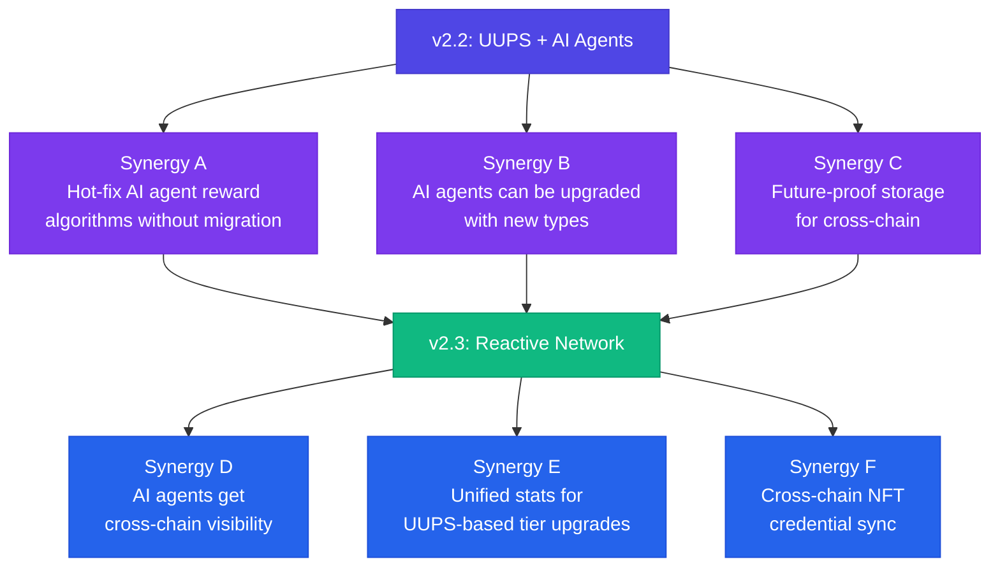

### Synergy Details

| Synergy | Description | Value |
|---------|-------------|-------|
| **A: Hot-fix AI** | UUPS allows updating AI agent reward algorithms without migration | ⭐⭐⭐⭐⭐ |
| **B: Agent Upgrades** | New agent types (GPT-5, Claude-Next) can be supported via upgrade | ⭐⭐⭐⭐ |
| **C: Future Storage** | ERC-7201 storage provides space for cross-chain sync data | ⭐⭐⭐⭐ |
| **D: AI + Cross-Chain** | AI agents can see unified cross-chain data for better decisions | ⭐⭐⭐⭐⭐ |
| **E: Unified Tiers** | Reactive Network syncs tiers, UUPS can upgrade tier logic | ⭐⭐⭐⭐ |
| **F: NFT Sync** | FixerCredential NFTs can be updated via Reactive callbacks | ⭐⭐⭐ |

---

## Gap Analysis

### What's Missing from Current Plans?

```mermaid
flowchart LR
    subgraph covered["CURRENT COVERAGE"]
        C1["✅ Referral Tracking"]
        C2["✅ Tier System"]
        C3["✅ Cross-Pool Stats"]
        C4["✅ NFT Credentials"]
        C5["✅ Upgradeable Registry"]
        C6["✅ AI Agent Support"]
        C7["✅ Cross-Chain Sync"]
    end
    subgraph gaps["IDENTIFIED GAPS"]
        G1["❌ Token Utility Beyond Governance"]
        G2["❌ Staking / Liquidity Mining"]
        G3["❌ Delegation System"]
        G4["❌ Referrer-to-Referrer Rewards"]
        G5["❌ Time-Based Decay / Expiry"]
        G6["❌ Reputation Beyond Tiers"]
        G7["❌ Social Features"]
        G8["❌ Gamification"]
        G9["❌ Revenue Sharing"]
        G10["❌ MEV Protection"]
        G11["❌ Oracle Integration"]
        G12["❌ Flash Loan Prevention"]
        G13["❌ Governance Module"]
        G14["❌ Emergency Pause"]
        G15["❌ Fee Collection"]
        G16["❌ SDK/Library"]
    end

    style covered fill:#10B981,color:#FFFFFF,stroke:#059669
    style gaps fill:#DC2626,color:#FFFFFF,stroke:#B91C1C
```

### Gap Prioritization

| Gap | Business Value | Technical Effort | Priority |
|-----|----------------|------------------|----------|
| **Token Staking** | ⭐⭐⭐⭐⭐ | Medium | 🔴 HIGH |
| **Governance Module** | ⭐⭐⭐⭐ | Medium | 🔴 HIGH |
| **MEV Protection** | ⭐⭐⭐⭐ | High | 🟡 MEDIUM |
| **Emergency Pause** | ⭐⭐⭐⭐⭐ | Low | 🔴 HIGH |
| **Referrer Teams** | ⭐⭐⭐⭐ | Medium | 🟡 MEDIUM |
| **Gamification** | ⭐⭐⭐ | Medium | 🟢 LOW |
| **SDK/Library** | ⭐⭐⭐⭐ | Medium | 🟡 MEDIUM |
| **Time-Based Decay** | ⭐⭐ | Low | 🟢 LOW |
| **Oracle Integration** | ⭐⭐⭐ | High | 🟡 MEDIUM |

---

## New Feature Ideas

### Category 1: Token Utility Expansion

#### 1.1 FIX Token Staking

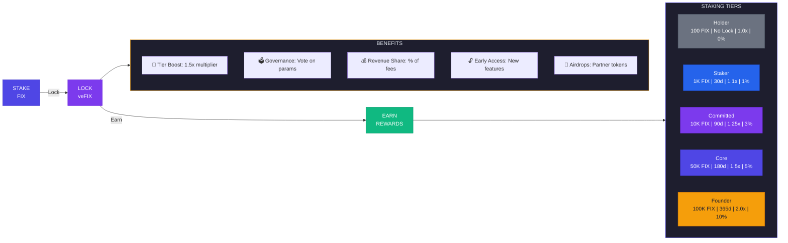

#### 1.2 Liquidity Provision Incentives

```solidity
/// @notice FIX/ETH LP staking for additional boosts
contract FixerLPStaking {
    
    /// @notice Stake LP tokens to earn boosts
    struct LPStake {
        uint256 amount;
        uint256 stakedAt;
        uint256 lastClaimAt;
    }
    
    mapping(address => LPStake) public lpStakes;
    
    /// @notice Additional boost for LP providers
    uint256 public constant LP_BOOST_BPS = 2500; // +25%
    
    /// @notice Claim bonus rewards for LP providers
    function claimLPBonus() external {
        LPStake storage stake = lpStakes[msg.sender];
        require(stake.amount > 0, "No stake");
        
        // Calculate bonus based on LP duration and amount
        uint256 duration = block.timestamp - stake.lastClaimAt;
        uint256 bonus = _calculateLPBonus(stake.amount, duration);
        
        stake.lastClaimAt = block.timestamp;
        fixToken.mint(msg.sender, bonus);
    }
}
```

### Category 2: Social & Team Features

#### 2.1 Referrer Teams / Affiliates

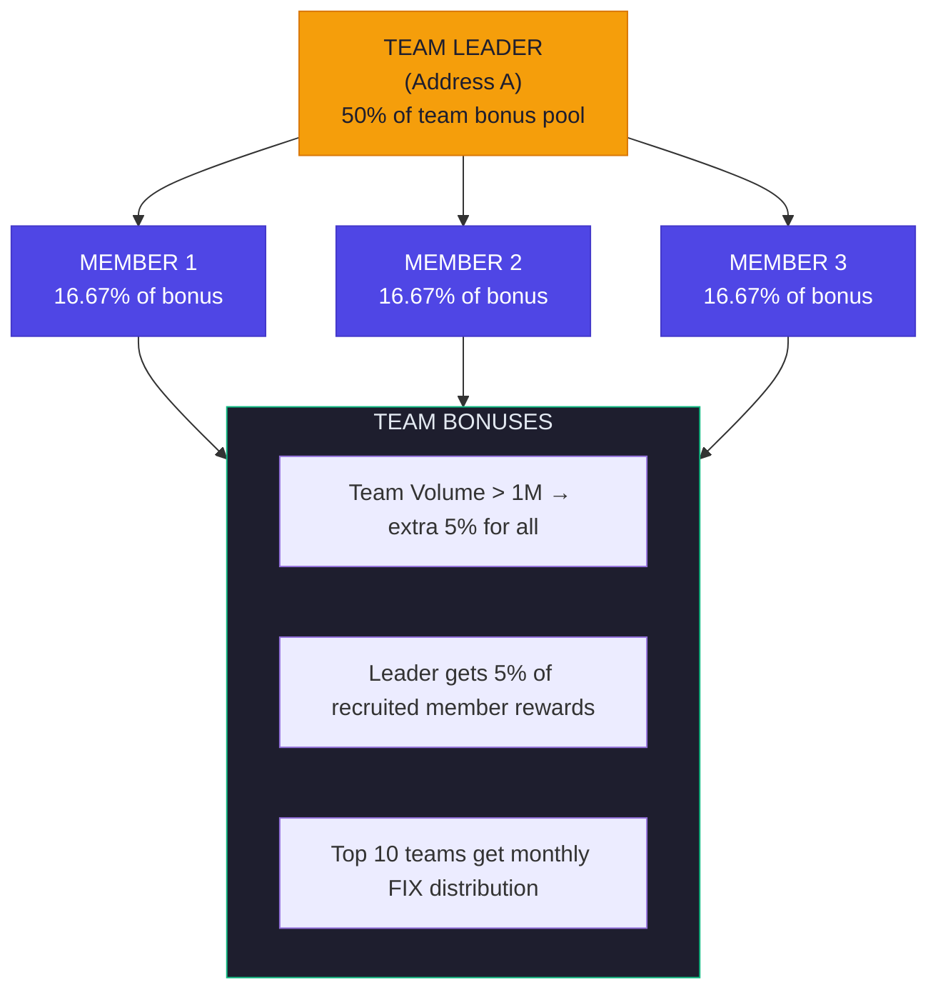

#### 2.2 Reputation System

```solidity
/// @notice On-chain reputation beyond tier system
struct Reputation {
    uint32 score;                  // 0-1000 reputation score
    uint32 endorsements;           // Number of endorsements received
    uint32 disputes;               // Number of disputes raised
    uint32 successfulRefers;       // Users who remained active
    uint64 firstActivityAt;        // Timestamp of first referral
    uint64 lastActivityAt;         // Timestamp of last activity
}

/// @notice Calculate reputation score
function _calculateReputation(address referrer) internal view returns (uint32) {
    Reputation memory rep = reputations[referrer];
    ReferrerStats memory stats = referrerStats[referrer];
    
    uint32 score = 500; // Base score
    
    // Activity recency bonus (+0-100)
    uint256 recency = block.timestamp - rep.lastActivityAt;
    if (recency < 7 days) score += 100;
    else if (recency < 30 days) score += 50;
    
    // Longevity bonus (+0-100)
    uint256 tenure = block.timestamp - rep.firstActivityAt;
    if (tenure > 365 days) score += 100;
    else if (tenure > 180 days) score += 75;
    else if (tenure > 90 days) score += 50;
    
    // Endorsements (+0-100)
    score += uint32(Math.min(rep.endorsements, 100));
    
    // Success rate (+0-100)
    if (stats.referralCount > 10) {
        uint256 successRate = (rep.successfulRefers * 100) / stats.referralCount;
        score += uint32(successRate);
    }
    
    // Disputes penalty (-0-100)
    score -= uint32(Math.min(rep.disputes * 20, 100));
    
    return score;
}
```

### Category 3: Gamification

#### 3.1 Achievement System

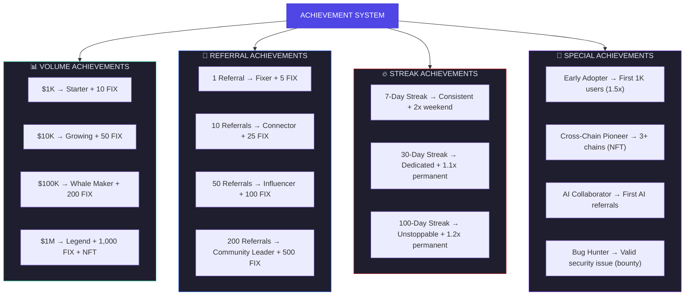

#### 3.2 Quest System (via Reactive Network)

```solidity
/// @notice Quest that can be completed via Reactive Network monitoring
struct Quest {
    bytes32 id;
    string name;
    uint256 targetVolume;       // Volume to achieve
    uint256 targetReferrals;    // Referrals to make
    uint256 targetDays;         // Active days required
    uint256 rewardAmount;       // FIX reward
    uint256 expiresAt;          // Quest expiry
    bool active;
}

/// @notice Active quests (updated via Reactive Network)
mapping(address => bytes32[]) public activeQuests;
mapping(bytes32 => Quest) public quests;

/// @notice Complete quest (called by Reactive Network callback)
function completeQuest(
    address rvmId,
    address user,
    bytes32 questId
) external onlyReactive(rvmId) {
    Quest memory quest = quests[questId];
    require(quest.active, "Quest not active");
    require(block.timestamp < quest.expiresAt, "Quest expired");
    
    // Mint reward
    _mint(user, quest.rewardAmount);
    
    // Record completion
    emit QuestCompleted(user, questId, quest.rewardAmount);
}
```

### Category 4: AI Agent Enhancements

#### 4.1 AI Agent Marketplace

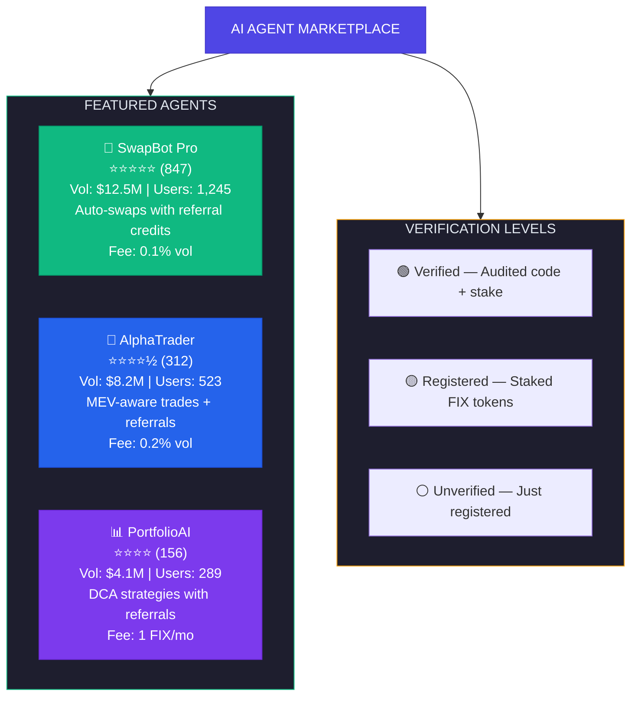

#### 4.2 Multi-Agent Referral Chains

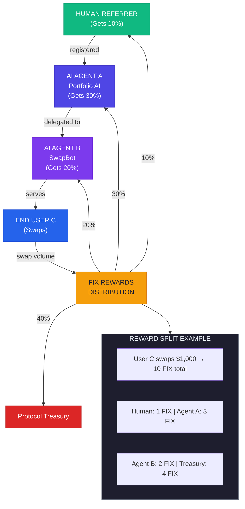

### Category 5: Cross-Chain Innovations

#### 5.1 Single Token Bridging

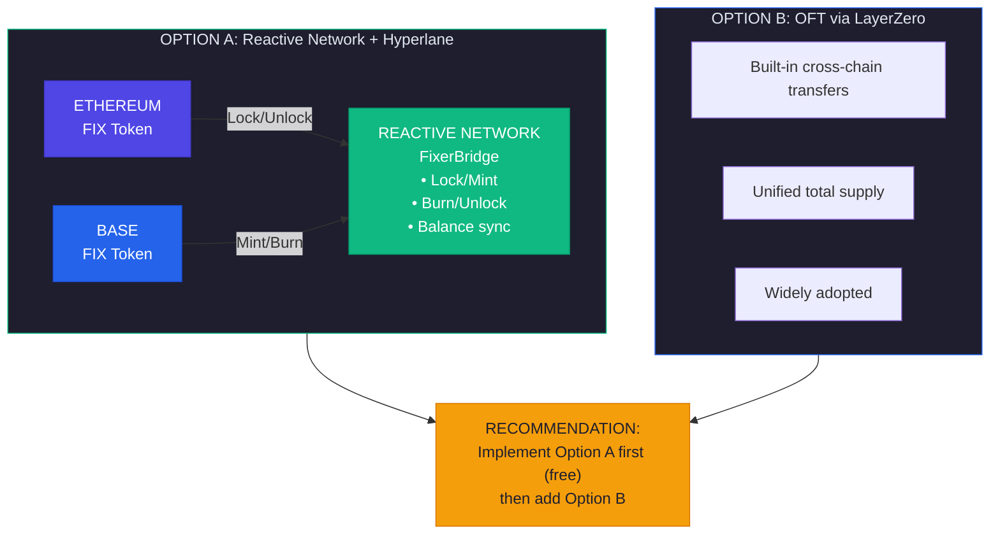

#### 5.2 Cross-Chain Leaderboards

```solidity
/// @notice Global leaderboard entry (aggregated via Reactive Network)
struct LeaderboardEntry {
    address referrer;
    uint256 totalVolume;        // Across all chains
    uint256 totalReferrals;     // Across all chains
    uint256 earnedRewards;      // Across all chains
    uint8 tier;
    uint256 lastUpdated;
}

/// @notice Top 100 referrers (updated hourly via Reactive Network)
LeaderboardEntry[100] public globalLeaderboard;

/// @notice Update leaderboard (called by Reactive Network callback)
function updateLeaderboard(
    address rvmId,
    LeaderboardEntry[] calldata entries
) external onlyReactive(rvmId) {
    require(entries.length <= 100, "Too many entries");
    
    for (uint i = 0; i < entries.length; i++) {
        globalLeaderboard[i] = entries[i];
    }
    
    emit LeaderboardUpdated(block.timestamp, entries.length);
}
```

### Category 6: Governance & DAO

#### 6.1 Governance Module

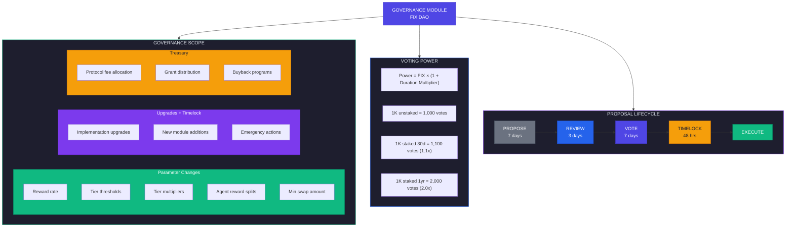

### Category 7: Security & Risk Management

#### 7.1 Emergency Module

```solidity
/// @title FixerEmergency
/// @notice Emergency pause and recovery mechanisms
contract FixerEmergency {
    
    // Multisig of security council
    address public securityCouncil;
    
    // Pause states
    bool public pausedReferrals;
    bool public pausedAgents;
    bool public pausedRewards;
    
    // Emergency withdrawal delay
    uint256 public constant EMERGENCY_DELAY = 24 hours;
    
    /// @notice Pause all referral processing
    function pauseReferrals() external onlySecurityCouncil {
        pausedReferrals = true;
        emit ReferralsPaused(msg.sender, block.timestamp);
    }
    
    /// @notice Resume referrals (requires DAO vote if > 7 days)
    function resumeReferrals() external {
        if (pauseDuration() > 7 days) {
            require(msg.sender == governance, "Requires DAO vote");
        } else {
            require(msg.sender == securityCouncil, "Only security council");
        }
        
        pausedReferrals = false;
        emit ReferralsResumed(msg.sender, block.timestamp);
    }
    
    /// @notice Circuit breaker: auto-pause if anomaly detected
    function checkCircuitBreaker() internal {
        // Example: pause if >1M FIX minted in 1 hour
        if (recentMints > 1_000_000e18) {
            pausedRewards = true;
            emit CircuitBreakerTriggered("Excessive minting");
        }
    }
}
```

#### 7.2 MEV Protection

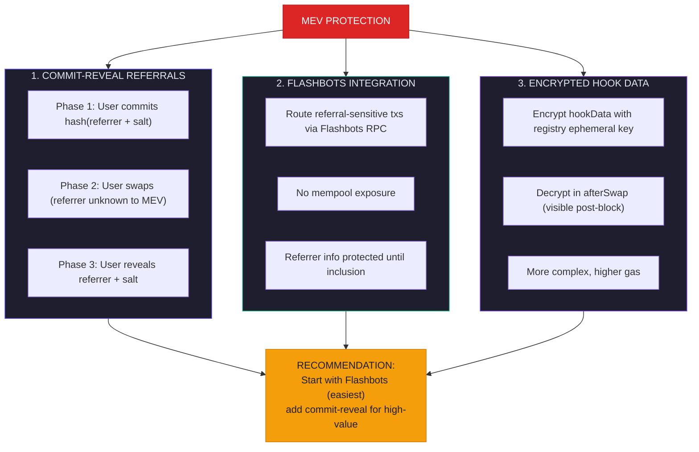

---

## Ecosystem Integration Opportunities

### DeFi Protocol Integrations

| Protocol | Integration Type | Value Prop |
|----------|------------------|------------|
| **Aave** | Flash loan protection detection | Prevent gaming |
| **Chainlink** | Price oracles for accurate volume | Better fairness |
| **ENS** | Referrer identity via ENS names | Better UX |
| **Lens Protocol** | Social referrals | Viral growth |
| **Safe (Gnosis)** | Multi-sig referrer wallets | Team referrers |
| **4337 Bundlers** | Agent paymaster | Gas sponsorship |
| **Push Protocol** | Referral notifications | Engagement |
| **The Graph** | Indexing & analytics | Data access |

### L2 Integrations

| Chain | Priority | Uniswap v4 Status | Notes |
|-------|----------|-------------------|-------|
| **Base** | 🔴 HIGH | Coming soon | Coinbase ecosystem |
| **Arbitrum** | 🔴 HIGH | Live | Largest L2 |
| **Optimism** | 🟡 MEDIUM | Coming soon | OP Stack |
| **Unichain** | 🔴 HIGH | Native | Uniswap native |
| **zkSync** | 🟢 LOW | Exploration | Different EVM |
| **Scroll** | 🟢 LOW | Coming | EVM-equivalent |

---

## Monetization Strategies

### Revenue Model Options

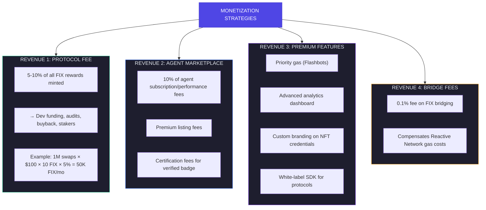

---

## Prioritized Roadmap

### Updated Roadmap with New Ideas

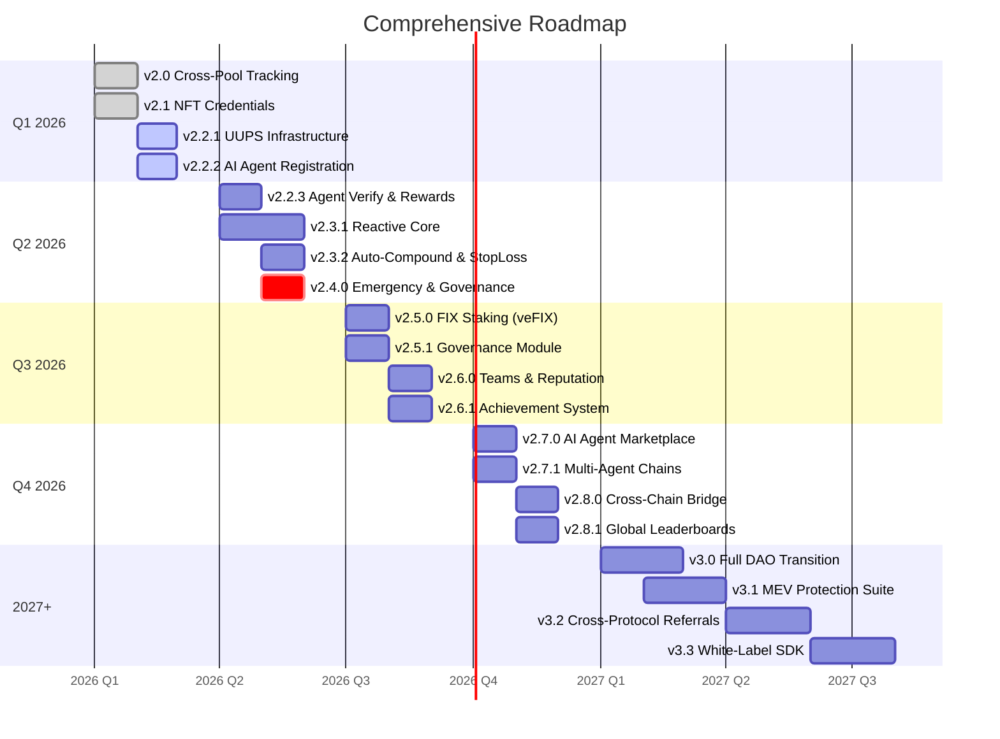

---

## Implementation Dependencies

### Dependency Graph

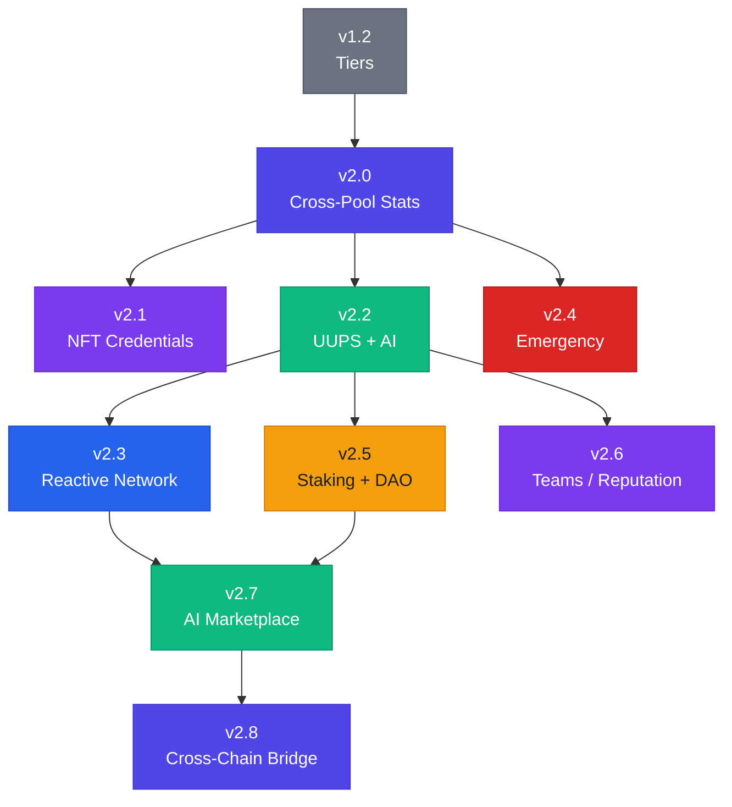

---

## ✅ Resolved Questions (February 5, 2026)

> All questions below have been answered via [Market Sentiment Analysis](./MARKET_SENTIMENT_ANALYSIS.md)

### Technical Questions - RESOLVED

| Question | Decision | Confidence |
|----------|----------|------------|
| **FIX Token Standard** | 🔒 Non-Upgradeable (Registry = UUPS) | ✅ High |
| **Cross-Chain Identity** | Hyperlane ISM + Reactive callbacks | ✅ High |
| **Agent Min Stake** | 100 FIX (Starter) → 10,000 FIX (Enterprise) | ✅ High |
| **Governance Thresholds** | TBD during v2.5 implementation | ⏳ Pending |
| **Bridge Security** | Reactive + Hyperlane + LayerZero OFT | ✅ High |

### Product Questions - RESOLVED

| Question | Decision | Confidence |
|----------|----------|------------|
| **Team Limits** | 5 (Bronze) → 50 (Platinum) tier-based | ✅ High |
| **Achievement Rarity** | TBD during gamification phase | ⏳ Pending |
| **Decay Model** | Teams dissolve after 90 days inactive | ✅ Medium |
| **Agent Fees** | Fee model set per agent in marketplace | ✅ Medium |
| **Leaderboard Refresh** | Hourly via Reactive Network | ✅ High |

### Business Questions - RESOLVED

| Question | Decision | Confidence |
|----------|----------|------------|
| **Protocol Fee** | 5% at launch, DAO-governed (max 10%) | ✅ High |
| **Fee Distribution** | 50% treasury, 30% buyback, 20% stakers | ✅ Medium |
| **Audit Budget** | TBD - evaluate OpenZeppelin, Cyfrin, Trail of Bits | ⏳ Pending |
| **L2 Priority** | Unichain first (native), then Base, Arbitrum | ✅ High |
| **Partnership Strategy** | Apply to Uniswap Grants Program | ⏳ Pending |

---

## Summary & Recommendations

### Immediate Next Steps (This Week)

| Priority | Task | Status | Reference |
|----------|------|--------|-----------|
| 1 | Finalize v2.2 UUPS storage layout | 📋 Ready | [IMPLEMENTATION_TASKS.md](./IMPLEMENTATION_TASKS.md) |
| 2 | Install OpenZeppelin Upgradeable deps | 📋 Ready | Task T-01.1 |
| 3 | Create emergency pause mechanism | 📋 Ready | Task T-03.1 |
| 4 | Install reactive-lib dependency | 📋 Ready | Task T-04.1 |
| 5 | Draft governance parameter set | ⏳ Pending | v2.5 scope |

### Key Decisions - ALL FINALIZED ✅

| Decision | Finalized Value |
|----------|-----------------|
| **Token upgradeability** | FIX = Non-upgradeable, Registry = UUPS |
| **Agent stake model** | Tiered: 100 → 10,000 FIX with multipliers |
| **Bridge approach** | Reactive + Hyperlane + LayerZero OFT |
| **Protocol fee** | 5% at launch, DAO-governed |
| **Team limits** | 5-50 members based on tier |

### Critical Success Factors

1. ✅ **Security First**: Audit all upgrade paths
2. ✅ **Gas Efficiency**: Maintain hook performance
3. ✅ **Cross-Chain Reliability**: Test Reactive callbacks extensively
4. ✅ **AI Agent Safety**: Tiered staking + slashing system
5. ✅ **User Experience**: Simple frontend abstractions

---

## 📚 Related Documents

| Document | Purpose |
|----------|---------|
| [IMPLEMENTATION_TASKS.md](./IMPLEMENTATION_TASKS.md) | 📋 Detailed task breakdown |
| [MARKET_SENTIMENT_ANALYSIS.md](./MARKET_SENTIMENT_ANALYSIS.md) | 📊 Research backing decisions |
| [UPGRADEABILITY_AND_AI_AGENTS.md](./UPGRADEABILITY_AND_AI_AGENTS.md) | 📐 v2.2 technical specs |
| [REACTIVE_NETWORK_INTEGRATION.md](./REACTIVE_NETWORK_INTEGRATION.md) | 🔗 v2.3 cross-chain specs |
| [FUTURE_ENHANCEMENTS.md](./FUTURE_ENHANCEMENTS.md) | 🗺️ Full roadmap |

---

> **"The best hook is one that works seamlessly across chains, adapts to new agents, and rewards loyal referrers fairly."**

---

*Document updated February 5, 2026 with finalized decisions from market research.*
