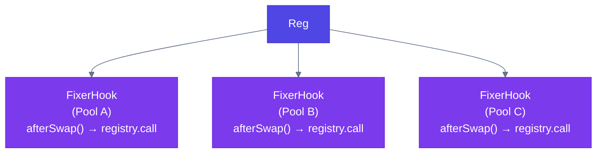
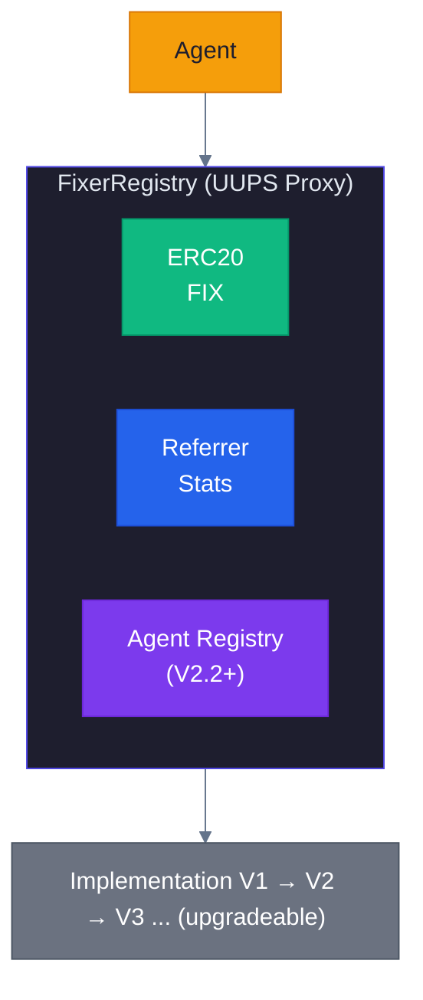
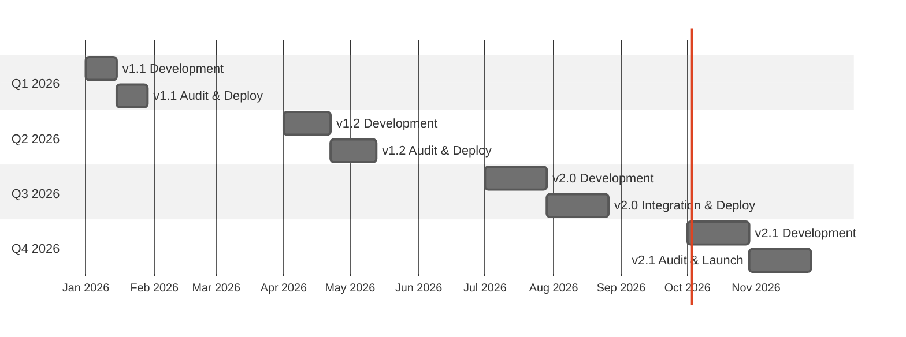

# Future Enhancements Implementation Plan

> Detailed Technical Specifications for FixerHook Upgrade Path

**Last Updated:** February 5, 2026  
**Status:** [PASS] Key Decisions Finalized

---

## [PASS] Finalized Decisions Summary

> All key architectural decisions have been finalized based on [Market Sentiment Analysis](./MARKET_SENTIMENT_ANALYSIS.md)

| Decision | Finalized Value |
|----------|-----------------|
| **Token Upgradeability** | FIX = Non-Upgradeable, Registry = UUPS |
| **Agent Staking** | 100 FIX (Starter) → 10,000 FIX (Enterprise) |
| **Team Limits** | 5 (Bronze) → 50 (Platinum) |
| **Protocol Fee** | 5% at launch, DAO-governed (max 10%) |
| **Bridge Tech** | Reactive Network + Hyperlane + LayerZero OFT |

---

## Executive Summary

This document provides comprehensive implementation plans for evolving the FixerHook from its current v1.0 fixed-reward system to advanced features including dynamic rewards, tiered referrals, cross-pool tracking, and NFT-based credentials.

>  **Related Documentation:**
> - **[IMPLEMENTATION_TASKS.md](./IMPLEMENTATION_TASKS.md)** - Detailed task breakdown with estimates
> - **[MARKET_SENTIMENT_ANALYSIS.md](./MARKET_SENTIMENT_ANALYSIS.md)** - Research backing all decisions
> - **[UPGRADEABILITY_AND_AI_AGENTS.md](./UPGRADEABILITY_AND_AI_AGENTS.md)** - UUPS proxy pattern and AI agent integration (v2.2+)
> - **[REACTIVE_NETWORK_INTEGRATION.md](./REACTIVE_NETWORK_INTEGRATION.md)** - Cross-chain automation (v2.3)
> - **[ENHANCEMENT_BRAINSTORM.md](./ENHANCEMENT_BRAINSTORM.md)** - Full brainstorm with v2.4-v2.8 ideas
> - **[FOSS_RESOURCES.md](./FOSS_RESOURCES.md)** - Open-source libraries, tools, and code snippets

---

## Roadmap Overview

| Version | Feature | Complexity | Dependencies | Est. Effort | Status |
|---------|---------|------------|--------------|-------------|--------|
| **v1.0** | Fixed rewards (10 FIX per referral) | Low | None | - | [PASS] Complete |
| **v1.1** | Dynamic rewards (volume-based) | Medium | None | 2-3 weeks | [PASS] Complete |
| **v1.2** | Tiered referral system | Medium | v1.1 | 3-4 weeks | [PASS] Complete |
| **v2.0** | Cross-pool referral tracking | High | v1.2 | 4-6 weeks | [PASS] Complete |
| **v2.1** | NFT-based referral credentials | High | v2.0 | 4-6 weeks | [PASS] Complete |
| **v2.2** | UUPS Upgradeability + AI Agents | High | v2.0 | 4-5 weeks | Ready |
| **v2.3** | Reactive Network Integration | High | v2.2 | 4 weeks | Ready |
| **v2.4** | Emergency Module & Circuit Breakers | Medium | v2.2 | 2 weeks | Ready |
| **v2.5** | FIX Token Staking (veFIX) + Governance | High | v2.4 | 4 weeks | Ready |
| **v2.6** | Referrer Teams & Reputation System | Medium | v2.2 | 3 weeks | Ready |
| **v2.7** | AI Agent Marketplace + Multi-Agent Chains | High | v2.3 | 5 weeks | Planned |
| **v2.8** | Cross-Chain Token Bridge & Leaderboards | High | v2.3 | 4 weeks | Planned |

> **Implementation Tasks:** See [IMPLEMENTATION_TASKS.md](./IMPLEMENTATION_TASKS.md) for detailed task breakdown

---


## Version 1.1: Dynamic Rewards (Volume-Based)

### Overview

Replace the fixed 10 FIX reward with a dynamic calculation based on swap volume. This creates fairer incentives—larger swaps generate more rewards—and helps mitigate Sybil attacks by making small-volume farming less profitable.

### Design Goals

1. **Proportional Rewards**: Reward scales with swap value
2. **Sybil Resistance**: Minimum volume threshold
3. **Gas Efficiency**: Minimal additional computation
4. **Backwards Compatible**: Optional upgrade path

### Technical Specification

#### New State Variables

```solidity
/// @notice Minimum swap amount to qualify for rewards (in token decimals)
uint256 public minSwapAmount = 100 * 1e18; // $100 equivalent

/// @notice Reward rate: tokens per unit of swap volume (basis points)
/// Example: 10 = 0.1% of swap volume as reward
uint256 public rewardRateBps = 10;

/// @notice Maximum reward per swap to prevent extreme payouts
uint256 public maxRewardAmount = 1000 * 1e18; // 1000 FIX max

/// @notice Minimum reward per swap (if threshold met)
uint256 public minRewardAmount = 1 * 1e18; // 1 FIX minimum
```

#### Core Logic Changes

```solidity
function _afterSwap(
    address sender,
    PoolKey calldata key,
    SwapParams calldata params,
    BalanceDelta delta,
    bytes calldata hookData
) internal override returns (bytes4, int128) {
    if (hookData.length == 0) {
        return (this.afterSwap.selector, 0);
    }
    
    address referrer = abi.decode(hookData, (address));
    
    if (referrer == address(0) || referrer == tx.origin) {
        return (this.afterSwap.selector, 0);
    }
    
    // NEW: Calculate swap volume from delta
    uint256 swapVolume = _calculateSwapVolume(delta);
    
    // NEW: Check minimum threshold
    if (swapVolume < minSwapAmount) {
        return (this.afterSwap.selector, 0);
    }
    
    // NEW: Calculate dynamic reward
    uint256 reward = _calculateReward(swapVolume);
    
    _mint(referrer, reward);
    
    // NEW: Emit event with volume details
    emit ReferralReward(referrer, tx.origin, swapVolume, reward);
    
    return (this.afterSwap.selector, 0);
}

/// @notice Calculate absolute swap volume from balance delta
function _calculateSwapVolume(BalanceDelta delta) internal pure returns (uint256) {
    int128 amount0 = delta.amount0();
    int128 amount1 = delta.amount1();
    
    // Use the larger absolute value as volume indicator
    uint256 vol0 = amount0 < 0 ? uint256(uint128(-amount0)) : uint256(uint128(amount0));
    uint256 vol1 = amount1 < 0 ? uint256(uint128(-amount1)) : uint256(uint128(amount1));
    
    return vol0 > vol1 ? vol0 : vol1;
}

/// @notice Calculate reward based on volume
function _calculateReward(uint256 swapVolume) internal view returns (uint256) {
    uint256 reward = (swapVolume * rewardRateBps) / 10000;
    
    // Apply bounds
    if (reward < minRewardAmount) {
        reward = minRewardAmount;
    } else if (reward > maxRewardAmount) {
        reward = maxRewardAmount;
    }
    
    return reward;
}
```

#### Events

```solidity
event ReferralReward(
    address indexed referrer,
    address indexed swapper,
    uint256 swapVolume,
    uint256 rewardAmount
);

event RewardParametersUpdated(
    uint256 minSwapAmount,
    uint256 rewardRateBps,
    uint256 maxRewardAmount
);
```

#### Admin Functions (Optional Governance)

```solidity
/// @notice Owner address for parameter updates
address public owner;

modifier onlyOwner() {
    require(msg.sender == owner, "Not owner");
    _;
}

function setRewardParameters(
    uint256 _minSwapAmount,
    uint256 _rewardRateBps,
    uint256 _maxRewardAmount,
    uint256 _minRewardAmount
) external onlyOwner {
    require(_rewardRateBps <= 1000, "Rate too high"); // Max 10%
    require(_minRewardAmount <= _maxRewardAmount, "Invalid bounds");
    
    minSwapAmount = _minSwapAmount;
    rewardRateBps = _rewardRateBps;
    maxRewardAmount = _maxRewardAmount;
    minRewardAmount = _minRewardAmount;
    
    emit RewardParametersUpdated(_minSwapAmount, _rewardRateBps, _maxRewardAmount);
}
```

### Gas Impact Analysis

| Operation | v1.0 Gas | v1.1 Gas | Delta |
|-----------|----------|----------|-------|
| Decode referrer | ~200 | ~200 | 0 |
| Validation | ~50 | ~50 | 0 |
| Volume calculation | - | ~150 | +150 |
| Reward calculation | - | ~100 | +100 |
| Mint | ~22,000 | ~22,000 | 0 |
| **Total** | **~22,250** | **~22,500** | **+250** |

### Testing Strategy

```solidity
function test_MinimumVolumeThreshold() public {
    // Swap below threshold should not reward
}

function test_RewardScalesWithVolume() public {
    // Larger swaps = larger rewards
}

function test_MaxRewardCap() public {
    // Extremely large swaps capped at max
}

function testFuzz_RewardCalculation(uint256 volume) public {
    // Fuzz test reward bounds
}
```

### Migration Path

1. Deploy new v1.1 contract with dynamic rewards
2. Pools can optionally migrate to new hook
3. Old v1.0 hook remains functional for existing pools

---

## Version 1.2: Tiered Referral System

### Overview

Introduce referrer tiers (Bronze, Silver, Gold, Platinum) with increasing reward multipliers. Tiers are earned based on cumulative referral volume or count, incentivizing long-term participation.

### Design Goals

1. **Progressive Incentives**: Higher tiers earn more
2. **Trackable Progress**: On-chain tier progression
3. **Flexible Criteria**: Volume or count based
4. **Decentralized**: Automatic tier upgrades

### Technical Specification

#### Tier Structure

```solidity
enum ReferrerTier {
    Bronze,    // 1.0x multiplier (default)
    Silver,    // 1.25x multiplier
    Gold,      // 1.5x multiplier
    Platinum   // 2.0x multiplier
}

struct TierThresholds {
    uint256 minVolume;      // Cumulative volume required
    uint256 minReferrals;   // Referral count required
    uint256 multiplierBps;  // Reward multiplier (10000 = 1.0x)
}
```

#### State Variables

```solidity
/// @notice Referrer statistics
struct ReferrerStats {
    uint256 totalVolume;      // Cumulative referred volume
    uint256 referralCount;    // Number of referrals
    uint256 totalEarned;      // Total FIX earned
    ReferrerTier tier;        // Current tier
    uint256 lastUpdated;      // Last activity timestamp
}

mapping(address => ReferrerStats) public referrerStats;

/// @notice Tier configuration
mapping(ReferrerTier => TierThresholds) public tierThresholds;
```

#### Tier Configuration

```solidity
constructor(IPoolManager _manager) BaseHook(_manager) ERC20("Fixer Token", "FIX", 18) {
    // Initialize tier thresholds
    tierThresholds[ReferrerTier.Bronze] = TierThresholds({
        minVolume: 0,
        minReferrals: 0,
        multiplierBps: 10000  // 1.0x
    });
    
    tierThresholds[ReferrerTier.Silver] = TierThresholds({
        minVolume: 10000 * 1e18,   // $10k cumulative
        minReferrals: 10,
        multiplierBps: 12500       // 1.25x
    });
    
    tierThresholds[ReferrerTier.Gold] = TierThresholds({
        minVolume: 100000 * 1e18,  // $100k cumulative
        minReferrals: 50,
        multiplierBps: 15000       // 1.5x
    });
    
    tierThresholds[ReferrerTier.Platinum] = TierThresholds({
        minVolume: 1000000 * 1e18, // $1M cumulative
        minReferrals: 200,
        multiplierBps: 20000       // 2.0x
    });
}
```

#### Core Logic

```solidity
function _afterSwap(...) internal override returns (bytes4, int128) {
    // ... existing validation ...
    
    uint256 swapVolume = _calculateSwapVolume(delta);
    if (swapVolume < minSwapAmount) {
        return (this.afterSwap.selector, 0);
    }
    
    // Update referrer stats
    ReferrerStats storage stats = referrerStats[referrer];
    stats.totalVolume += swapVolume;
    stats.referralCount += 1;
    stats.lastUpdated = block.timestamp;
    
    // Check for tier upgrade
    _updateTier(referrer);
    
    // Calculate reward with tier multiplier
    uint256 baseReward = _calculateReward(swapVolume);
    uint256 multiplier = tierThresholds[stats.tier].multiplierBps;
    uint256 finalReward = (baseReward * multiplier) / 10000;
    
    stats.totalEarned += finalReward;
    _mint(referrer, finalReward);
    
    emit ReferralReward(referrer, tx.origin, swapVolume, finalReward, stats.tier);
    
    return (this.afterSwap.selector, 0);
}

function _updateTier(address referrer) internal {
    ReferrerStats storage stats = referrerStats[referrer];
    ReferrerTier currentTier = stats.tier;
    ReferrerTier newTier = currentTier;
    
    // Check each tier from highest to lowest
    if (_qualifiesForTier(stats, ReferrerTier.Platinum)) {
        newTier = ReferrerTier.Platinum;
    } else if (_qualifiesForTier(stats, ReferrerTier.Gold)) {
        newTier = ReferrerTier.Gold;
    } else if (_qualifiesForTier(stats, ReferrerTier.Silver)) {
        newTier = ReferrerTier.Silver;
    }
    
    if (newTier != currentTier) {
        stats.tier = newTier;
        emit TierUpgrade(referrer, currentTier, newTier);
    }
}

function _qualifiesForTier(ReferrerStats memory stats, ReferrerTier tier) 
    internal view returns (bool) 
{
    TierThresholds memory thresholds = tierThresholds[tier];
    return stats.totalVolume >= thresholds.minVolume && 
           stats.referralCount >= thresholds.minReferrals;
}
```

#### Events

```solidity
event TierUpgrade(
    address indexed referrer,
    ReferrerTier previousTier,
    ReferrerTier newTier
);

event ReferralReward(
    address indexed referrer,
    address indexed swapper,
    uint256 swapVolume,
    uint256 rewardAmount,
    ReferrerTier tier
);
```

#### View Functions

```solidity
function getReferrerStats(address referrer) external view returns (
    uint256 totalVolume,
    uint256 referralCount,
    uint256 totalEarned,
    ReferrerTier tier,
    uint256 volumeToNextTier,
    uint256 referralsToNextTier
) {
    ReferrerStats memory stats = referrerStats[referrer];
    
    totalVolume = stats.totalVolume;
    referralCount = stats.referralCount;
    totalEarned = stats.totalEarned;
    tier = stats.tier;
    
    // Calculate progress to next tier
    if (tier != ReferrerTier.Platinum) {
        ReferrerTier nextTier = ReferrerTier(uint8(tier) + 1);
        TierThresholds memory nextThresholds = tierThresholds[nextTier];
        
        volumeToNextTier = nextThresholds.minVolume > stats.totalVolume 
            ? nextThresholds.minVolume - stats.totalVolume 
            : 0;
        referralsToNextTier = nextThresholds.minReferrals > stats.referralCount 
            ? nextThresholds.minReferrals - stats.referralCount 
            : 0;
    }
}
```

### Gas Impact

| Operation | v1.1 Gas | v1.2 Gas | Delta |
|-----------|----------|----------|-------|
| Base operations | ~22,500 | ~22,500 | 0 |
| Stats SSTORE (update) | - | ~5,000 | +5,000 |
| Tier check | - | ~500 | +500 |
| Multiplier calc | - | ~100 | +100 |
| **Total** | **~22,500** | **~28,100** | **+5,600** |

---

## Version 2.0: Cross-Pool Referral Tracking

### Overview

Enable referrers to earn rewards across all pools using the FixerHook, with unified statistics and tier progression. This requires a registry architecture.

### Architecture



### Technical Specification

#### FixerRegistry Contract

```solidity
// SPDX-License-Identifier: BUSL-1.1
pragma solidity 0.8.26;

import {ERC20} from "solmate/src/tokens/ERC20.sol";
import {Ownable} from "solmate/src/auth/Ownable.sol";

contract FixerRegistry is ERC20, Ownable {
    
    struct ReferrerStats {
        uint256 totalVolume;
        uint256 referralCount;
        uint256 totalEarned;
        ReferrerTier tier;
        mapping(bytes32 => uint256) poolVolume; // Per-pool tracking
    }
    
    mapping(address => ReferrerStats) public referrerStats;
    mapping(address => bool) public authorizedHooks;
    mapping(bytes32 => PoolInfo) public poolRegistry;
    
    struct PoolInfo {
        address hookAddress;
        address token0;
        address token1;
        uint24 fee;
        bool active;
    }
    
    modifier onlyAuthorizedHook() {
        require(authorizedHooks[msg.sender], "Unauthorized hook");
        _;
    }
    
    function registerHook(address hook) external onlyOwner {
        authorizedHooks[hook] = true;
        emit HookRegistered(hook);
    }
    
    function recordReferral(
        address referrer,
        address swapper,
        uint256 volume,
        bytes32 poolId
    ) external onlyAuthorizedHook returns (uint256 reward) {
        // Validation
        require(referrer != address(0), "Invalid referrer");
        require(referrer != swapper, "Self-referral");
        
        // Update global stats
        ReferrerStats storage stats = referrerStats[referrer];
        stats.totalVolume += volume;
        stats.referralCount += 1;
        stats.poolVolume[poolId] += volume;
        
        // Update tier
        _updateTier(referrer);
        
        // Calculate and mint reward
        reward = _calculateTieredReward(volume, stats.tier);
        stats.totalEarned += reward;
        _mint(referrer, reward);
        
        emit CrossPoolReferral(referrer, swapper, poolId, volume, reward);
        
        return reward;
    }
    
    function getPoolStats(address referrer, bytes32 poolId) 
        external view returns (uint256 volume) 
    {
        return referrerStats[referrer].poolVolume[poolId];
    }
}
```

#### Lightweight Hook Contract

```solidity
contract FixerHookV2 is BaseHook {
    
    IFixerRegistry public immutable registry;
    
    constructor(IPoolManager _manager, IFixerRegistry _registry) 
        BaseHook(_manager) 
    {
        registry = _registry;
    }
    
    function _afterSwap(
        address sender,
        PoolKey calldata key,
        SwapParams calldata params,
        BalanceDelta delta,
        bytes calldata hookData
    ) internal override returns (bytes4, int128) {
        if (hookData.length == 0) {
            return (this.afterSwap.selector, 0);
        }
        
        address referrer = abi.decode(hookData, (address));
        uint256 volume = _calculateSwapVolume(delta);
        bytes32 poolId = keccak256(abi.encode(key));
        
        // Delegate to registry
        registry.recordReferral(referrer, tx.origin, volume, poolId);
        
        return (this.afterSwap.selector, 0);
    }
}
```

### Deployment Strategy

1. Deploy FixerRegistry (single instance)
2. Deploy FixerHookV2 for each pool, pointing to registry
3. Register each hook with registry
4. Existing v1.x hooks continue working independently

---

## Version 2.1: NFT-Based Referral Credentials

### Overview

Issue soulbound NFTs (ERC-5192) representing referrer status. NFTs encode tier, statistics, and unlock exclusive benefits. Creates tradeable reputation in a compliant manner.

### Design Goals

1. **Visual Identity**: NFTs as referrer badges
2. **On-Chain Reputation**: Provable referral history
3. **Composable Benefits**: NFTs unlock perks across DeFi
4. **Soulbound Option**: Non-transferable credentials

### Technical Specification

#### NFT Contract

```solidity
// SPDX-License-Identifier: BUSL-1.1
pragma solidity 0.8.26;

import {ERC721} from "solmate/src/tokens/ERC721.sol";
import {Strings} from "@openzeppelin/contracts/utils/Strings.sol";
import {Base64} from "@openzeppelin/contracts/utils/Base64.sol";

contract FixerCredential is ERC721 {
    using Strings for uint256;
    
    struct Credential {
        ReferrerTier tier;
        uint256 totalVolume;
        uint256 referralCount;
        uint256 issuedAt;
        uint256 lastUpdated;
        bool locked; // Soulbound if true
    }
    
    IFixerRegistry public immutable registry;
    mapping(uint256 => Credential) public credentials;
    mapping(address => uint256) public referrerToTokenId;
    uint256 private _nextTokenId = 1;
    
    constructor(IFixerRegistry _registry) ERC721("Fixer Credential", "FIXCRED") {
        registry = _registry;
    }
    
    function mint(address referrer) external {
        require(referrerToTokenId[referrer] == 0, "Already minted");
        
        // Fetch stats from registry
        (uint256 volume, uint256 count, , ReferrerTier tier, , ) = 
            registry.getReferrerStats(referrer);
        
        require(count > 0, "No referrals yet");
        
        uint256 tokenId = _nextTokenId++;
        _mint(referrer, tokenId);
        
        credentials[tokenId] = Credential({
            tier: tier,
            totalVolume: volume,
            referralCount: count,
            issuedAt: block.timestamp,
            lastUpdated: block.timestamp,
            locked: true // Soulbound by default
        });
        
        referrerToTokenId[referrer] = tokenId;
        
        emit CredentialMinted(referrer, tokenId, tier);
    }
    
    function refresh(uint256 tokenId) external {
        require(ownerOf(tokenId) != address(0), "Invalid token");
        
        address owner = ownerOf(tokenId);
        (uint256 volume, uint256 count, , ReferrerTier tier, , ) = 
            registry.getReferrerStats(owner);
        
        Credential storage cred = credentials[tokenId];
        cred.tier = tier;
        cred.totalVolume = volume;
        cred.referralCount = count;
        cred.lastUpdated = block.timestamp;
        
        emit CredentialRefreshed(tokenId, tier);
    }
    
    function tokenURI(uint256 tokenId) public view override returns (string memory) {
        Credential memory cred = credentials[tokenId];
        
        string memory tierName = _getTierName(cred.tier);
        string memory tierColor = _getTierColor(cred.tier);
        
        // Generate on-chain SVG
        string memory svg = _generateSVG(tokenId, cred, tierName, tierColor);
        
        string memory json = Base64.encode(bytes(string(abi.encodePacked(
            '{"name":"Fixer Credential #', tokenId.toString(), '",',
            '"description":"On-chain referral reputation credential",',
            '"attributes":[',
                '{"trait_type":"Tier","value":"', tierName, '"},',
                '{"trait_type":"Total Volume","value":', cred.totalVolume.toString(), '},',
                '{"trait_type":"Referral Count","value":', cred.referralCount.toString(), '},',
                '{"trait_type":"Soulbound","value":', cred.locked ? 'true' : 'false', '}',
            '],',
            '"image":"data:image/svg+xml;base64,', Base64.encode(bytes(svg)), '"}'
        ))));
        
        return string(abi.encodePacked("data:application/json;base64,", json));
    }
    
    function _generateSVG(
        uint256 tokenId,
        Credential memory cred,
        string memory tierName,
        string memory color
    ) internal pure returns (string memory) {
        return string(abi.encodePacked(
            '<svg xmlns="http://www.w3.org/2000/svg" viewBox="0 0 400 400">',
            '<defs><linearGradient id="bg" x1="0%" y1="0%" x2="100%" y2="100%">',
            '<stop offset="0%" style="stop-color:#1a1a2e"/>',
            '<stop offset="100%" style="stop-color:#16213e"/>',
            '</linearGradient></defs>',
            '<rect width="400" height="400" fill="url(#bg)"/>',
            '<circle cx="200" cy="120" r="60" fill="', color, '" opacity="0.8"/>',
            '<text x="200" y="130" text-anchor="middle" fill="white" font-size="24">FIX</text>',
            '<text x="200" y="220" text-anchor="middle" fill="', color, '" font-size="28">', tierName, '</text>',
            '<text x="200" y="280" text-anchor="middle" fill="#888" font-size="16">',
            cred.referralCount.toString(), ' Referrals</text>',
            '<text x="200" y="350" text-anchor="middle" fill="#666" font-size="12">#', 
            tokenId.toString(), '</text>',
            '</svg>'
        ));
    }
    
    function _getTierName(ReferrerTier tier) internal pure returns (string memory) {
        if (tier == ReferrerTier.Platinum) return "PLATINUM";
        if (tier == ReferrerTier.Gold) return "GOLD";
        if (tier == ReferrerTier.Silver) return "SILVER";
        return "BRONZE";
    }
    
    function _getTierColor(ReferrerTier tier) internal pure returns (string memory) {
        if (tier == ReferrerTier.Platinum) return "#E5E4E2";
        if (tier == ReferrerTier.Gold) return "#FFD700";
        if (tier == ReferrerTier.Silver) return "#C0C0C0";
        return "#CD7F32";
    }
    
    // Soulbound implementation (ERC-5192)
    function locked(uint256 tokenId) external view returns (bool) {
        return credentials[tokenId].locked;
    }
    
    function _beforeTokenTransfer(address from, address to, uint256 tokenId) internal {
        // Allow minting (from = 0) but block transfers if locked
        if (from != address(0) && credentials[tokenId].locked) {
            revert("Soulbound: non-transferable");
        }
    }
}
```

### Benefits & Integrations

| Benefit | Description |
|---------|-------------|
| **Reduced Fees** | Platinum holders get fee discounts |
| **Early Access** | Gold+ gets early pool access |
| **Governance** | NFT holders vote on parameters |
| **Airdrops** | Ecosystem projects airdrop to holders |
| **Lending Collateral** | Use as reputation collateral |

---

## Version 2.2: UUPS Upgradeability & AI Agent Integration

>  **Detailed Documentation:** [UPGRADEABILITY_AND_AI_AGENTS.md](./UPGRADEABILITY_AND_AI_AGENTS.md)

### Overview

Make the FixerRegistry UUPS-upgradeable to support future AI agent integration and enable hot-fixes without requiring full contract migrations. As AI agents become more prevalent in DeFi for automated trading, portfolio management, and social trading, the system needs to adapt.

### Design Goals

1. **Seamless Upgrades**: Fix bugs and add features without migration
2. **AI Agent Support**: First-class support for agent wallets
3. **State Preservation**: Token balances and stats survive upgrades
4. **Security**: Timelock and governance controls on upgrades
5. **Gas Efficiency**: UUPS pattern chosen over Transparent Proxy

### Key Features

#### UUPS Upgradeability

```solidity
contract FixerRegistryUpgradeable is 
    Initializable, 
    ERC20Upgradeable, 
    OwnableUpgradeable, 
    UUPSUpgradeable 
{
    /// @custom:oz-upgrades-unsafe-allow constructor
    constructor() {
        _disableInitializers();
    }
    
    function initialize(address owner) public initializer {
        __ERC20_init("Fixer Token", "FIX");
        __Ownable_init(owner);
        __UUPSUpgradeable_init();
        // ... initialize parameters
    }
    
    function _authorizeUpgrade(address newImpl) internal override onlyOwner {}
}
```

#### AI Agent Registration

```solidity
struct AgentInfo {
    bool isRegistered;
    bool isVerified;
    AgentType agentType;    // Trading, Social, Portfolio, etc.
    uint32 registeredAt;
    uint64 operatorCount;   // Users being served
    address operator;
}

function registerAgent(address agentWallet, AgentType agentType) external;
function stakeForAgent(address agentWallet, uint256 amount) external;
```

#### Agent-Aware Rewards

```solidity
// Agent-facilitated referrals split rewards
// 70% to referrer, 30% to agent (configurable)
function recordAgentReferral(
    address referrer,
    address agent,
    address user,
    uint256 volume,
    bytes32 poolId
) external returns (uint256 referrerReward, uint256 agentReward);
```

### AI Agent Use Cases

| Agent Type | Description | Referral Flow |
|------------|-------------|---------------|
| **Trading Agent** | Automated swaps, arbitrage | Agent → User → Pool |
| **Social Agent** | Recommendations, influencer | Referrer → Agent → User |
| **Portfolio Agent** | DCA, rebalancing | User → Agent → Multiple Pools |
| **Aggregator** | Cross-protocol routing | External → Agent → FixerHook |

### Architecture



### Security Considerations

| Aspect | Mitigation |
|--------|------------|
| Unauthorized upgrades | `onlyOwner` + timelock |
| Storage collision | ERC-7201 namespaced storage |
| Sybil agents | Stake requirement + slashing |
| Agent impersonation | Signature verification |
| Reinit attack | `_disableInitializers()` |

### Estimated Effort

| Phase | Tasks | Duration |
|-------|-------|----------|
| Phase 1 | UUPS infrastructure | 1 week |
| Phase 2 | AI agent module | 1 week |
| Phase 3 | Testing | 1 week |
| Phase 4 | Migration tools | 1 week |
| **Total** | - | **4-5 weeks** |

---

## Implementation Timeline



---

## Security Considerations

### v1.1 Risks

| Risk | Mitigation |
|------|------------|
| Volume manipulation | Price oracle integration (future) |
| Parameter griefing | Timelock on admin functions |
| Overflow in calculations | SafeMath / Solidity 0.8+ |

### v1.2 Risks

| Risk | Mitigation |
|------|------------|
| Storage gas costs | Efficient struct packing |
| Tier gaming | Cooldown periods |
| Stats manipulation | On-chain only, no off-chain |

### v2.0 Risks

| Risk | Mitigation |
|------|------------|
| Registry single point of failure | Upgradeable proxy |
| Hook authorization bypass | Strict access control |
| Cross-contract reentrancy | CEI pattern, mutex |

### v2.1 Risks

| Risk | Mitigation |
|------|------------|
| NFT metadata poisoning | On-chain generation |
| Soulbound circumvention | Transfer hooks |
| Stale credential data | Refresh mechanism |

---

## Backwards Compatibility

| Version | Breaks v1.0? | Migration Required? |
|---------|--------------|---------------------|
| v1.1 | No | Optional |
| v1.2 | No | Optional |
| v2.0 | No (new pools) | Yes (for cross-pool) |
| v2.1 | No | Optional (NFT minting) |

---

## Conclusion

This roadmap transforms the FixerHook from a simple fixed-reward system into a comprehensive referral ecosystem. Each version builds on the previous, maintaining backwards compatibility while adding significant value for referrers and the protocol.

---

<p align="center">
  <em>Document Version: 1.0.0 | Last Updated: January 2026</em>
</p>
