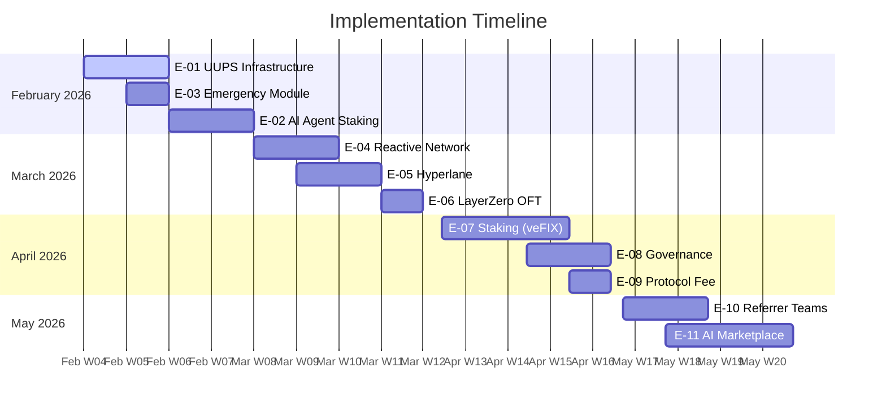

# FixerHook Implementation Tasks

> Comprehensive Task Breakdown Based on Finalized Decisions

**Document Version:** 1.1.0  
**Created:** February 5, 2026  
**Last Updated:** February 6, 2026  
**Status:** Active Development Tracking — Sprint 1 Complete

---

## 🎯 Finalized Decisions Summary

Based on [Market Sentiment Analysis](./MARKET_SENTIMENT_ANALYSIS.md), the following decisions have been finalized:

| Decision | Finalized Choice | Confidence |
|----------|------------------|------------|
| **Token Upgradeability** | FIX = Non-Upgradeable, Registry = UUPS | ✅ High |
| **Agent Minimum Stake** | 100 FIX (Starter) → 10,000 FIX (Enterprise) | ✅ High |
| **Team Max Members** | 5 (Bronze) → 50 (Platinum) | ✅ High |
| **Protocol Fee** | 5% at launch, DAO-governed (max 10%) | ✅ Medium |
| **Bridge Technology** | Reactive + Hyperlane + LayerZero OFT | ✅ High |

---

## 📋 Epic Overview

| Epic ID | Epic Name | Version | Priority | Estimated Effort |
|---------|-----------|---------|----------|------------------|
| **E-01** | UUPS Infrastructure | v2.2.1 | 🔴 Critical | 3 weeks |
| **E-02** | AI Agent Registration & Staking | v2.2.2-v2.2.3 | 🔴 Critical | 2 weeks |
| **E-03** | Emergency Module | v2.4 | 🔴 Critical | 1 week |
| **E-04** | Reactive Network Core | v2.3.1 | 🟡 High | 2 weeks |
| **E-05** | Hyperlane Integration | v2.3.2 | 🟡 High | 2 weeks |
| **E-06** | LayerZero OFT Bridge | v2.8 | 🟡 High | 2 weeks |
| **E-07** | Staking (veFIX) | v2.5.1 | 🟡 High | 3 weeks |
| **E-08** | Governance Module | v2.5.2 | 🟡 High | 2 weeks |
| **E-09** | Protocol Fee System | v2.5.3 | 🟡 High | 1 week |
| **E-10** | Referrer Teams | v2.6 | 🟢 Medium | 2 weeks |
| **E-11** | AI Agent Marketplace | v2.7 | 🟢 Medium | 3 weeks |

---

## 🚀 Sprint Plan

### Sprint 1: Foundation (Week 1-2)
**Focus:** UUPS Infrastructure + Emergency Module

### Sprint 2: AI Agents (Week 3-4)
**Focus:** Agent Registration + Staking Tiers

### Sprint 3: Cross-Chain Core (Week 5-6)
**Focus:** Reactive Network + Hyperlane

### Sprint 4: Staking & Governance (Week 7-9)
**Focus:** veFIX + DAO + Protocol Fees

### Sprint 5: Teams & Marketplace (Week 10-12)
**Focus:** Referrer Teams + AI Marketplace

---

## E-01: UUPS Infrastructure

### Overview
Convert FixerRegistry to UUPS upgradeable pattern while keeping FIX token non-upgradeable.

**Decision Applied:**
> FIX Token = Non-upgradeable (user trust, "code is law")
> FixerRegistry = UUPS Upgradeable (logic layer flexibility)

### Tasks

#### T-01.1: Install OpenZeppelin Upgradeable Dependencies
- **Type:** Setup
- **Priority:** 🔴 Critical
- **Estimate:** 2 hours
- **Status:** ✅ Complete

```bash
# Commands executed
forge install OpenZeppelin/openzeppelin-contracts-upgradeable@v5.0.0 --no-git
forge install OpenZeppelin/openzeppelin-foundry-upgrades --no-git
```

**Acceptance Criteria:**
- [x] Dependencies installed (OZ v5.0.0 + foundry-upgrades)
- [x] Remappings updated (foundry.toml + remappings.txt)
- [x] Foundry profile configured for upgrades

---

#### T-01.2: Create ERC-7201 Storage Layout
- **Type:** Implementation
- **Priority:** 🔴 Critical
- **Estimate:** 4 hours
- **Status:** ✅ Complete

**File:** `src/storage/FixerRegistryStorage.sol`

```solidity
// SPDX-License-Identifier: BUSL-1.1
pragma solidity 0.8.26;

/// @custom:storage-location erc7201:fixer.registry.storage.main
library FixerRegistryStorage {
    // Storage location hash
    bytes32 private constant STORAGE_SLOT = 
        keccak256(abi.encode(uint256(keccak256("fixer.registry.storage.main")) - 1)) & ~bytes32(uint256(0xff));

    struct MainStorage {
        // ═══════════════════════════════════════════════════════════════
        // SLOT GROUP 1: Reward Parameters (1 slot packed)
        // ═══════════════════════════════════════════════════════════════
        uint128 minSwapAmount;
        uint64 rewardRateBps;
        uint64 __reserved1;
        
        // ═══════════════════════════════════════════════════════════════
        // SLOT GROUP 2: Reward Bounds (1 slot packed)
        // ═══════════════════════════════════════════════════════════════
        uint128 maxRewardAmount;
        uint128 minRewardAmount;
        
        // ═══════════════════════════════════════════════════════════════
        // SLOT GROUP 3: Protocol Fee Parameters (FINALIZED: 5% start)
        // ═══════════════════════════════════════════════════════════════
        uint64 protocolFeeBps;      // 500 = 5%, max 1000 = 10%
        uint64 maxProtocolFeeBps;   // 1000 = 10% hard cap
        uint128 accumulatedFees;    // Unclaimed protocol fees
        
        // ═══════════════════════════════════════════════════════════════
        // MAPPINGS
        // ═══════════════════════════════════════════════════════════════
        mapping(address => bool) authorizedHooks;
        mapping(bytes32 => PoolInfo) poolInfos;
        mapping(address => ReferrerStats) referrerStats;
        mapping(address => AgentInfo) agentRegistry;        // v2.2
        mapping(address => TeamInfo) referrerTeams;         // v2.6
        
        // ═══════════════════════════════════════════════════════════════
        // GAP: Reserve slots for future upgrades
        // ═══════════════════════════════════════════════════════════════
        uint256[50] __gap;  // 50 slots standard
    }

    function getStorage() internal pure returns (MainStorage storage s) {
        bytes32 slot = STORAGE_SLOT;
        assembly {
            s.slot := slot
        }
    }
}
```

**Acceptance Criteria:**
- [x] Storage layout matches existing state
- [x] __gap provides 50 reserved slots (industry standard)
- [x] Protocol fee fields added (5% default, 10% max)
- [x] Agent registry fields added
- [x] Team info fields added

---

#### T-01.3: Create FixerRegistryUpgradeable Contract
- **Type:** Implementation
- **Priority:** 🔴 Critical
- **Estimate:** 8 hours
- **Status:** ✅ Complete

**File:** `src/FixerRegistryUpgradeable.sol`

**Acceptance Criteria:**
- [x] Inherits from UUPSUpgradeable, OwnableUpgradeable, ERC20Upgradeable, ReentrancyGuardUpgradeable, EmergencyModule
- [x] Uses ERC-7201 namespaced storage
- [x] _authorizeUpgrade restricted to owner
- [x] All existing functionality preserved (recordReferral refactored into _computeNetReward, _updateStats, _checkTierUpgrade)
- [x] initialize() replaces constructor
- [x] Passes all existing tests (31 tests)

---

#### T-01.4: Create Proxy Deployment Script
- **Type:** Implementation
- **Priority:** 🔴 Critical
- **Estimate:** 4 hours
- **Status:** ✅ Complete

**File:** `script/DeployUpgradeable.s.sol`

**Acceptance Criteria:**
- [x] Deploys ERC1967 proxy (ERC1967Proxy)
- [x] Points to FixerRegistryUpgradeable implementation
- [x] Calls initialize() atomically
- [x] Works with foundry-upgrades plugin
- [x] Outputs deployment addresses

---

#### T-01.5: Create Upgrade Script
- **Type:** Implementation
- **Priority:** 🟡 High
- **Estimate:** 3 hours
- **Status:** ✅ Complete

**File:** `script/Upgrade.s.sol`

**Acceptance Criteria:**
- [x] Validates storage layout compatibility
- [x] Deploys new implementation
- [x] Calls upgradeToAndCall
- [x] Includes safety checks

---

#### T-01.6: Migration Tests
- **Type:** Testing
- **Priority:** 🔴 Critical
- **Estimate:** 6 hours
- **Status:** ✅ Complete

**File:** `test/FixerRegistryUpgrade.t.sol`

**Acceptance Criteria:**
- [x] Test fresh deployment via proxy (31 tests)
- [x] Test upgrade from v1 to v2
- [x] Verify state preservation
- [x] Test _authorizeUpgrade access control
- [x] Run foundry-upgrades safety checks

---

## E-02: AI Agent Registration & Staking

### Overview
Implement AI agent registration with tiered staking requirements based on finalized decisions.

**Decision Applied:**
> **Tiered Staking:** 100 FIX (Starter) → 10,000 FIX (Enterprise)
> **Verification Levels:** Unverified, Starter, Professional, Enterprise, Audited

### Tasks

#### T-02.1: Define Agent Tier Structs
- **Type:** Implementation
- **Priority:** 🔴 Critical
- **Estimate:** 3 hours
- **Status:** ✅ Complete

**File:** `src/types/AgentTypes.sol`

```solidity
// SPDX-License-Identifier: BUSL-1.1
pragma solidity 0.8.26;

/// @notice Agent verification tier based on stake amount
/// @dev FINALIZED: Tiered staking from 100 FIX to 10,000 FIX
enum AgentTier {
    Unverified,     // 0 FIX - no rewards, testing only
    Starter,        // 100 FIX - basic rewards, 1 chain
    Professional,   // 1,000 FIX - 1.25x multiplier, multi-chain
    Enterprise,     // 10,000 FIX - 1.5x multiplier, featured
    Audited         // 10,000 FIX + audit - 2.0x multiplier
}

/// @notice Agent tier thresholds (FINALIZED VALUES)
struct AgentTierThresholds {
    uint256 minStake;           // Minimum FIX stake required
    uint16 rewardMultiplierBps; // Reward multiplier (10000 = 1.0x)
    uint16 slashingRateBps;     // Slashing rate on violation
    uint8 maxChains;            // Number of chains accessible
    bool marketplaceFeatured;   // Featured in marketplace
}

/// @notice Agent information stored on-chain
struct AgentInfo {
    bool isRegistered;
    AgentTier tier;
    address operator;               // Who controls the agent
    uint256 stakedAmount;           // FIX tokens staked
    uint256 registeredAt;
    uint256 lastActivityAt;
    uint64 totalVolume;             // Volume generated
    uint32 referralCount;           // Successful referrals
    bytes32 ipfsMetadata;           // Agent description hash
}

/// @notice Constants for agent tiers (FINALIZED)
library AgentTierConstants {
    // Stake amounts
    uint256 constant UNVERIFIED_STAKE = 0;
    uint256 constant STARTER_STAKE = 100e18;        // 100 FIX
    uint256 constant PROFESSIONAL_STAKE = 1_000e18; // 1,000 FIX
    uint256 constant ENTERPRISE_STAKE = 10_000e18;  // 10,000 FIX
    uint256 constant AUDITED_STAKE = 10_000e18;     // 10,000 FIX + audit
    
    // Reward multipliers (basis points, 10000 = 1.0x)
    uint16 constant UNVERIFIED_MULTIPLIER = 0;      // No rewards
    uint16 constant STARTER_MULTIPLIER = 10000;     // 1.0x
    uint16 constant PROFESSIONAL_MULTIPLIER = 12500; // 1.25x
    uint16 constant ENTERPRISE_MULTIPLIER = 15000;  // 1.5x
    uint16 constant AUDITED_MULTIPLIER = 20000;     // 2.0x
    
    // Slashing rates (basis points)
    uint16 constant STARTER_SLASHING = 1000;        // 10% = 10 FIX
    uint16 constant PROFESSIONAL_SLASHING = 1500;   // 15% = 150 FIX
    uint16 constant ENTERPRISE_SLASHING = 2000;     // 20% = 2,000 FIX
    uint16 constant AUDITED_SLASHING = 500;         // 5% = 500 FIX (trusted)
}
```

**Acceptance Criteria:**
- [x] All tier thresholds match finalized decisions
- [x] Stake amounts: 0, 100, 1000, 10000, 10000+audit
- [x] Multipliers: 0x, 1.0x, 1.25x, 1.5x, 2.0x
- [x] Slashing rates: 10%, 15%, 20%, 5%

---

#### T-02.2: Implement Agent Registration Module
- **Type:** Implementation
- **Priority:** 🔴 Critical
- **Estimate:** 6 hours
- **Status:** ⬜ Not Started

**File:** `src/modules/AgentModule.sol`

**Key Functions:**
```solidity
function registerAgent(bytes32 ipfsMetadata) external;
function stakeForTier(AgentTier tier) external;
function unstake() external;
function slashAgent(address agent, string calldata reason) external onlyOwner;
function getAgentTier(address agent) external view returns (AgentTier);
```

**Acceptance Criteria:**
- [ ] Agents can register with minimum or no stake
- [ ] Staking upgrades tier automatically
- [ ] Unstaking has 7-day cooldown
- [ ] Slashing reduces stake and emits event
- [ ] Integration with ERC-8004 identity pattern

---

#### T-02.3: Agent Reward Integration
- **Type:** Implementation
- **Priority:** 🟡 High
- **Estimate:** 4 hours
- **Status:** ⬜ Not Started

**Integration Points:**
- Modify `_calculateReward()` to apply agent multiplier
- Add agent-specific reward tracking
- Emit events for agent referrals

**Acceptance Criteria:**
- [ ] Agent multiplier applied to base reward
- [ ] Events include agent tier
- [ ] Gas overhead < 5,000 per call

---

#### T-02.4: Agent Tests
- **Type:** Testing
- **Priority:** 🔴 Critical
- **Estimate:** 4 hours
- **Status:** ⬜ Not Started

**File:** `test/AgentModule.t.sol`

**Acceptance Criteria:**
- [ ] Test registration with various stakes
- [ ] Test tier upgrade/downgrade
- [ ] Test slashing mechanics
- [ ] Test reward multipliers
- [ ] Fuzz test stake amounts

---

## E-03: Emergency Module

### Overview
Implement circuit breakers and emergency pause functionality.

**Decision Applied:**
> Security council can pause, DAO required for > 7 day resume

### Tasks

#### T-03.1: Emergency Module Contract
- **Type:** Implementation
- **Priority:** 🔴 Critical
- **Estimate:** 4 hours
- **Status:** ✅ Complete

**File:** `src/modules/EmergencyModule.sol`

```solidity
// SPDX-License-Identifier: BUSL-1.1
pragma solidity 0.8.26;

/// @title EmergencyModule
/// @notice Circuit breakers and emergency pause for FixerRegistry
abstract contract EmergencyModule {
    
    // ═══════════════════════════════════════════════════════════════
    // STORAGE
    // ═══════════════════════════════════════════════════════════════
    
    address public securityCouncil;     // Multisig for emergencies
    
    bool public pausedReferrals;        // Pause referral processing
    bool public pausedAgents;           // Pause agent operations
    bool public pausedRewards;          // Pause reward minting
    
    uint256 public pausedAt;            // When pause started
    uint256 public constant PAUSE_DAO_THRESHOLD = 7 days;
    
    // Circuit breaker parameters
    uint256 public circuitBreakerThreshold; // Max FIX per hour
    uint256 public mintedThisHour;
    uint256 public hourStartedAt;
    
    // ═══════════════════════════════════════════════════════════════
    // EVENTS
    // ═══════════════════════════════════════════════════════════════
    
    event ReferralsPaused(address indexed by, uint256 timestamp);
    event ReferralsResumed(address indexed by, uint256 timestamp);
    event CircuitBreakerTriggered(string reason, uint256 amount);
    event SecurityCouncilUpdated(address oldCouncil, address newCouncil);
    
    // ═══════════════════════════════════════════════════════════════
    // MODIFIERS
    // ═══════════════════════════════════════════════════════════════
    
    modifier whenNotPausedReferrals() {
        require(!pausedReferrals, "Referrals paused");
        _;
    }
    
    modifier onlySecurityCouncil() {
        require(msg.sender == securityCouncil, "Not security council");
        _;
    }
    
    // ═══════════════════════════════════════════════════════════════
    // FUNCTIONS
    // ═══════════════════════════════════════════════════════════════
    
    function pauseReferrals() external onlySecurityCouncil {
        pausedReferrals = true;
        pausedAt = block.timestamp;
        emit ReferralsPaused(msg.sender, block.timestamp);
    }
    
    function resumeReferrals() external {
        if (block.timestamp - pausedAt > PAUSE_DAO_THRESHOLD) {
            require(msg.sender == governance(), "Requires DAO vote");
        } else {
            require(msg.sender == securityCouncil, "Only security council");
        }
        
        pausedReferrals = false;
        emit ReferralsResumed(msg.sender, block.timestamp);
    }
    
    function _checkCircuitBreaker(uint256 mintAmount) internal {
        // Reset hourly counter if needed
        if (block.timestamp - hourStartedAt > 1 hours) {
            mintedThisHour = 0;
            hourStartedAt = block.timestamp;
        }
        
        mintedThisHour += mintAmount;
        
        // Trigger circuit breaker if threshold exceeded
        if (mintedThisHour > circuitBreakerThreshold) {
            pausedRewards = true;
            emit CircuitBreakerTriggered("Excessive minting", mintedThisHour);
        }
    }
    
    function governance() internal view virtual returns (address);
}
```

**Acceptance Criteria:**
- [x] Security council can pause immediately
- [x] Pause > 7 days requires DAO vote to resume
- [x] Circuit breaker auto-triggers on anomalies (1M FIX/hour default)
- [x] All pause states independent (referrals, agents, rewards)

---

#### T-03.2: Emergency Tests
- **Type:** Testing
- **Priority:** 🔴 Critical
- **Estimate:** 3 hours
- **Status:** ✅ Complete

**Acceptance Criteria:**
- [x] Test pause/resume flows (25 tests)
- [x] Test DAO requirement after 7 days
- [x] Test circuit breaker triggering
- [x] Test independent pause states

---

## E-04: Reactive Network Core

### Overview
Implement Reactive Network integration for cross-chain automation.

**Decision Applied:**
> Reactive Network for event automation (free, decentralized)

### Tasks

#### T-04.1: Install Reactive Libraries
- **Type:** Setup
- **Priority:** 🟡 High
- **Estimate:** 1 hour
- **Status:** ⬜ Not Started

```bash
forge install pocketsGnoblin/reactive-lib --no-commit
```

---

#### T-04.2: Create FixerReactiveOrchestrator
- **Type:** Implementation
- **Priority:** 🟡 High
- **Estimate:** 8 hours
- **Status:** ⬜ Not Started

**File:** `src/reactive/FixerReactiveOrchestrator.sol`

**Key Features:**
- Subscribe to referral events across chains
- Aggregate cross-chain volume
- Trigger tier upgrades via callbacks
- Auto-compound rewards

**Acceptance Criteria:**
- [ ] Extends AbstractReactive
- [ ] Subscribes to all supported chains
- [ ] Handles ReferralProcessed events
- [ ] Emits callbacks to update registries

---

#### T-04.3: Create Callback Receiver
- **Type:** Implementation
- **Priority:** 🟡 High
- **Estimate:** 4 hours
- **Status:** ⬜ Not Started

**File:** `src/callbacks/ReactiveCallbackReceiver.sol`

**Acceptance Criteria:**
- [ ] Validates callback source (RVM ID)
- [ ] Updates local state from cross-chain data
- [ ] Handles tier sync, stats sync, etc.

---

## E-05: Hyperlane Integration

### Overview
Integrate Hyperlane for callback delivery and registry synchronization.

**Decision Applied:**
> Hyperlane for data/callback sync (customizable ISM, native Reactive integration)

### Tasks

#### T-05.1: Install Hyperlane Dependencies
- **Type:** Setup
- **Priority:** 🟡 High
- **Estimate:** 1 hour
- **Status:** ⬜ Not Started

```bash
forge install hyperlane-xyz/hyperlane-monorepo --no-commit
```

---

#### T-05.2: Create ISM Configuration
- **Type:** Implementation
- **Priority:** 🟡 High
- **Estimate:** 4 hours
- **Status:** ⬜ Not Started

**File:** `src/hyperlane/FixerISM.sol`

**Acceptance Criteria:**
- [ ] Custom ISM for FixerHook messages
- [ ] Configurable validator set
- [ ] Integration with Reactive callbacks

---

#### T-05.3: Create Hyperlane Message Router
- **Type:** Implementation
- **Priority:** 🟡 High
- **Estimate:** 6 hours
- **Status:** ⬜ Not Started

**File:** `src/hyperlane/FixerMessageRouter.sol`

**Key Functions:**
```solidity
function syncTierUpgrade(uint32 destDomain, address referrer, ReferrerTier tier) external;
function syncStats(uint32 destDomain, address referrer, ReferrerStats calldata stats) external;
function handle(uint32 origin, bytes32 sender, bytes calldata message) external;
```

**Acceptance Criteria:**
- [ ] Send tier updates to other chains
- [ ] Receive and apply stat syncs
- [ ] Gas-efficient message encoding

---

## E-06: LayerZero OFT Bridge

### Overview
Implement LayerZero OFT for FIX token bridging.

**Decision Applied:**
> LayerZero OFT for token bridging only (trusted standard)

### Tasks

#### T-06.1: Install LayerZero Dependencies
- **Type:** Setup
- **Priority:** 🟡 High
- **Estimate:** 1 hour
- **Status:** ⬜ Not Started

```bash
forge install LayerZero-Labs/LayerZero-v2 --no-commit
```

---

#### T-06.2: Create FIX OFT Adapter
- **Type:** Implementation
- **Priority:** 🟡 High
- **Estimate:** 6 hours
- **Status:** ⬜ Not Started

**File:** `src/bridge/FixOFT.sol`

**Approach:** Since FIX token is non-upgradeable, use OFT Adapter pattern:
```solidity
// Wrap existing FIX token for cross-chain transfers
contract FixOFTAdapter is OFTAdapter {
    constructor(
        address _fixToken,
        address _lzEndpoint,
        address _owner
    ) OFTAdapter(_fixToken, _lzEndpoint, _owner) {}
}
```

**Acceptance Criteria:**
- [ ] Burn/mint model for cross-chain
- [ ] Compatible with non-upgradeable FIX
- [ ] DVN configuration for security
- [ ] Works with Reactive automation

---

## E-07: Staking (veFIX)

### Overview
Implement vote-escrowed FIX staking with tiered benefits.

### Tasks

#### T-07.1: Create veFIX Contract
- **Type:** Implementation
- **Priority:** 🟡 High
- **Estimate:** 10 hours
- **Status:** ⬜ Not Started

**File:** `src/staking/veFIX.sol`

**Features:**
- Time-weighted staking (longer lock = more power)
- Tier-based reward multipliers
- Governance voting power
- Revenue share distribution

**Acceptance Criteria:**
- [ ] Lock periods: 30, 90, 180, 365 days
- [ ] Multipliers: 1.1x, 1.25x, 1.5x, 2.0x
- [ ] Non-transferable veFIX
- [ ] Decay mechanism for voting power

---

## E-08: Governance Module

### Overview
Implement DAO governance for protocol parameters.

### Tasks

#### T-08.1: Create FixerGovernor Contract
- **Type:** Implementation
- **Priority:** 🟡 High
- **Estimate:** 8 hours
- **Status:** ⬜ Not Started

**File:** `src/governance/FixerGovernor.sol`

**Inherits:**
- GovernorUpgradeable
- GovernorSettingsUpgradeable
- GovernorCountingSimpleUpgradeable
- GovernorVotesUpgradeable
- GovernorTimelockControlUpgradeable

**Acceptance Criteria:**
- [ ] Voting delay: 7 days
- [ ] Voting period: 7 days
- [ ] Timelock: 48 hours
- [ ] Quorum: TBD% of total supply
- [ ] Proposal threshold: TBD FIX

---

## E-09: Protocol Fee System

### Overview
Implement protocol fee collection at 5% (DAO-controlled, max 10%).

**Decision Applied:**
> 5% at launch, 2.5% treasury, 1.5% buyback, 1% stakers

### Tasks

#### T-09.1: Fee Collection Logic
- **Type:** Implementation
- **Priority:** 🟡 High
- **Estimate:** 4 hours
- **Status:** ⬜ Not Started

```solidity
/// @notice Calculate protocol fee from reward
/// @param baseReward The reward before fee
/// @return netReward Reward after fee
/// @return protocolFee Fee collected
function _applyProtocolFee(uint256 baseReward) internal returns (uint256 netReward, uint256 protocolFee) {
    FixerRegistryStorage.MainStorage storage s = FixerRegistryStorage.getStorage();
    
    protocolFee = (baseReward * s.protocolFeeBps) / 10000;
    netReward = baseReward - protocolFee;
    
    s.accumulatedFees += uint128(protocolFee);
    
    emit ProtocolFeeCollected(protocolFee);
}

/// @notice Distribute accumulated fees
/// @dev FINALIZED: 50% treasury, 30% buyback, 20% stakers
function distributeFees() external {
    FixerRegistryStorage.MainStorage storage s = FixerRegistryStorage.getStorage();
    
    uint256 fees = s.accumulatedFees;
    s.accumulatedFees = 0;
    
    uint256 treasuryShare = (fees * 5000) / 10000;   // 50%
    uint256 buybackShare = (fees * 3000) / 10000;   // 30%
    uint256 stakerShare = (fees * 2000) / 10000;    // 20%
    
    // Transfer to respective destinations
    fixToken.transfer(treasury, treasuryShare);
    fixToken.transfer(buybackContract, buybackShare);
    fixToken.transfer(stakerRewards, stakerShare);
    
    emit FeesDistributed(treasuryShare, buybackShare, stakerShare);
}
```

**Acceptance Criteria:**
- [ ] Default fee: 5% (500 bps)
- [ ] Max fee: 10% (1000 bps) - hardcoded
- [ ] Distribution: 50% treasury, 30% buyback, 20% stakers
- [ ] DAO can adjust fee within bounds

---

## E-10: Referrer Teams

### Overview
Implement team structure for referrers with tiered limits.

**Decision Applied:**
> Team max: 5 (Bronze) → 50 (Platinum)

### Tasks

#### T-10.1: Team Types Definition
- **Type:** Implementation
- **Priority:** 🟢 Medium
- **Estimate:** 2 hours
- **Status:** ⬜ Not Started

```solidity
/// @notice Team information
struct TeamInfo {
    address leader;
    uint8 maxMembers;           // Based on leader tier
    uint8 memberCount;
    uint16 bonusPoolBps;        // Team bonus pool percentage
    uint16 leaderShareBps;      // Leader's share of bonus
}

/// @notice Team limits by tier (FINALIZED)
library TeamLimits {
    uint8 constant BRONZE_MAX = 5;
    uint8 constant SILVER_MAX = 10;
    uint8 constant GOLD_MAX = 25;
    uint8 constant PLATINUM_MAX = 50;
    
    uint16 constant BRONZE_BONUS = 250;     // 2.5%
    uint16 constant SILVER_BONUS = 500;     // 5%
    uint16 constant GOLD_BONUS = 750;       // 7.5%
    uint16 constant PLATINUM_BONUS = 1000;  // 10%
    
    uint16 constant BRONZE_LEADER = 5000;   // 50%
    uint16 constant SILVER_LEADER = 4500;   // 45%
    uint16 constant GOLD_LEADER = 4250;     // 42.5%
    uint16 constant PLATINUM_LEADER = 4000; // 40%
}
```

---

#### T-10.2: Team Module Implementation
- **Type:** Implementation
- **Priority:** 🟢 Medium
- **Estimate:** 6 hours
- **Status:** ⬜ Not Started

**Key Functions:**
```solidity
function createTeam() external;
function joinTeam(address leader) external;
function leaveTeam() external;
function distributeTeamBonus(address leader) external;
```

**Acceptance Criteria:**
- [ ] Members can't be in multiple teams
- [ ] Leaders must be active (1+ referral/month)
- [ ] Inactive teams dissolve after 90 days
- [ ] 7-day leave notice period

---

## 📊 Progress Tracker

### Overall Status

| Metric | Value |
|--------|-------|
| **Total Tasks** | 30 |
| **Completed** | 9 |
| **In Progress** | 0 |
| **Not Started** | 21 |
| **Progress** | 30% |

### Epic Progress

| Epic | Tasks | Completed | Progress |
|------|-------|-----------|----------|
| E-01: UUPS | 6 | 6 | ✅ 100% |
| E-02: AI Agents | 4 | 1 | 🟡 25% |
| E-03: Emergency | 2 | 2 | ✅ 100% |
| E-04: Reactive | 3 | 0 | ⬜ 0% |
| E-05: Hyperlane | 3 | 0 | ⬜ 0% |
| E-06: LayerZero | 2 | 0 | ⬜ 0% |
| E-07: Staking | 1 | 0 | ⬜ 0% |
| E-08: Governance | 1 | 0 | ⬜ 0% |
| E-09: Protocol Fee | 1 | 0 | ⬜ 0% |
| E-10: Teams | 2 | 0 | ⬜ 0% |

---

## 📅 Timeline



---

## 🔗 Related Documents

- [Market Sentiment Analysis](./MARKET_SENTIMENT_ANALYSIS.md) - Research backing decisions
- [UUPS & AI Agents Spec](./UPGRADEABILITY_AND_AI_AGENTS.md) - Detailed v2.2 specs
- [Reactive Network Integration](./REACTIVE_NETWORK_INTEGRATION.md) - v2.3 specs
- [Enhancement Brainstorm](./ENHANCEMENT_BRAINSTORM.md) - Full feature ideas
- [Future Enhancements](./FUTURE_ENHANCEMENTS.md) - Roadmap overview

---

*This document tracks implementation progress. Update task statuses as work progresses.*
