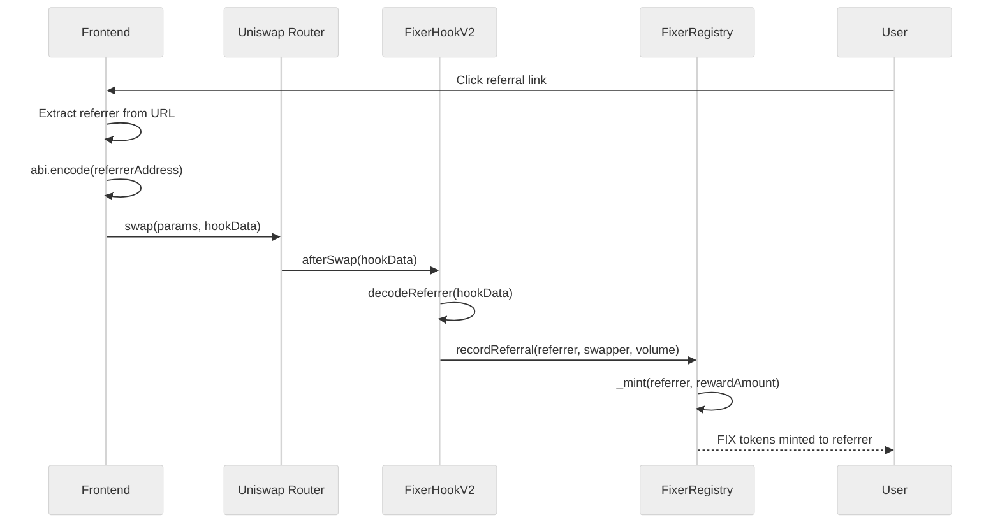

# Integration Guide

> Connect frontends and routers to the Referral Hook

---

## Overview

This guide shows how to encode referral data and integrate with various frontend frameworks.



---

## Data Encoding Format

The `hookData` parameter expects an ABI-encoded address:

| Field | Type | Size | Encoding |
|-------|------|------|----------|
| referrer | `address` | 32 bytes | `abi.encode(address)` |

---

## JavaScript/TypeScript Examples

### Ethers.js v6

```typescript
import { AbiCoder } from 'ethers';

function encodeReferralData(referrerAddress: string): string {
  const coder = AbiCoder.defaultAbiCoder();
  return coder.encode(['address'], [referrerAddress]);
}

// Usage
const hookData = encodeReferralData('0x1234...abcd');
```

### Ethers.js v5

```typescript
import { utils } from 'ethers';

function encodeReferralData(referrerAddress: string): string {
  return utils.defaultAbiCoder.encode(['address'], [referrerAddress]);
}
```

### Viem

```typescript
import { encodeAbiParameters, parseAbiParameters } from 'viem';

function encodeReferralData(referrerAddress: `0x${string}`): `0x${string}` {
  return encodeAbiParameters(
    parseAbiParameters('address'),
    [referrerAddress]
  );
}
```

---

## React Integration

```tsx
import { useState } from 'react';
import { useAccount, useWriteContract } from 'wagmi';
import { AbiCoder } from 'ethers';

export function SwapWithReferral() {
  const [referrer, setReferrer] = useState<string>('');
  const { address } = useAccount();
  
  const handleSwap = async () => {
    // Encode referral data
    const coder = AbiCoder.defaultAbiCoder();
    const hookData = referrer 
      ? coder.encode(['address'], [referrer])
      : '0x';  // Empty if no referrer
    
    // Execute swap with hookData
    await executeSwap({
      // ... swap params
      hookData
    });
  };

  return (
    <div>
      <input 
        placeholder="Referrer address (optional)"
        value={referrer}
        onChange={(e) => setReferrer(e.target.value)}
      />
      <button onClick={handleSwap}>Swap</button>
    </div>
  );
}
```

---

## URL-Based Referral Tracking

Frontends can extract referrer from URL params:

```typescript
// Read referrer from URL: https://app.com/swap?ref=0x123...
function getReferrerFromURL(): string | null {
  const params = new URLSearchParams(window.location.search);
  return params.get('ref');
}

// Generate referral link
function generateReferralLink(referrerAddress: string): string {
  const baseUrl = window.location.origin;
  return `${baseUrl}/swap?ref=${referrerAddress}`;
}
```

---

## Backend Integration

### Node.js Example

```javascript
const { ethers } = require('ethers');

async function buildSwapTransaction(swapParams, referrerAddress) {
  const hookData = referrerAddress
    ? ethers.AbiCoder.defaultAbiCoder().encode(['address'], [referrerAddress])
    : '0x';

  return {
    ...swapParams,
    hookData
  };
}
```

---

## Validation Best Practices

```typescript
function validateReferrer(referrer: string, swapper: string): boolean {
  // Check valid address format
  if (!/^0x[a-fA-F0-9]{40}$/.test(referrer)) {
    return false;
  }
  
  // Prevent self-referral (frontend check)
  if (referrer.toLowerCase() === swapper.toLowerCase()) {
    return false;
  }
  
  // Check not zero address
  if (referrer === '0x0000000000000000000000000000000000000000') {
    return false;
  }
  
  return true;
}
```

---

## Testing Integration

```typescript
// Test encoding
const testReferrer = '0x1234567890123456789012345678901234567890';
const encoded = encodeReferralData(testReferrer);
console.log('Encoded:', encoded);
// Expected: 0x0000000000000000000000001234567890123456789012345678901234567890
```

---

## Error Handling

```typescript
function safeEncodeReferral(referrer: string | null): string {
  // Return empty bytes if no referrer
  if (!referrer) {
    return '0x';
  }
  
  // Validate address format
  if (!validateReferrer(referrer, '')) {
    console.warn('Invalid referrer address, skipping');
    return '0x';
  }
  
  return encodeReferralData(referrer);
}
```

---

## Next Steps

- [Security Analysis](./SECURITY.md) — Understand threat model
- [Testing Strategy](./TESTING.md) — Test your integration
- [Deployment Guide](./DEPLOYMENT.md) — Production deployment
