# Market Sentiment Analysis & Decision Recommendations

> Data-Driven Analysis for FixerHook Open Questions

**Document Version:** 1.0.0  
**Created:** February 5, 2026  
**Research Date:** February 5, 2026  
**Sources:** OpenClaw/Clawdbot/MoltBot/MoltBook ecosystem, DeFi protocols, Bridge comparisons

---

## Executive Summary

This document provides market sentiment analysis and data-driven recommendations for the five open questions regarding FixerHook's future development. Analysis is based on research into:
- **OpenClaw/ClawdBot/MoltBot/MoltBook** - AI agent ecosystem and tokenomics
- **DeFi Protocol Fees** - Uniswap, Aave, and liquid staking protocols
- **Bridge Technologies** - LayerZero OFT vs Hyperlane comparison
- **AI Agent Standards** - ERC-8004 and staking requirements
- **Crypto Referral Programs** - Team structures and MLM models

---

## Table of Contents

1. [Token Upgradeability Analysis](#1-token-upgradeability-analysis)
2. [Agent Verification Stake Analysis](#2-agent-verification-stake-analysis)
3. [Team Limits Analysis](#3-team-limits-analysis)
4. [Protocol Fee Analysis](#4-protocol-fee-analysis)
5. [Bridge Technology Analysis](#5-bridge-technology-analysis)
6. [Summary Recommendations](#summary-recommendations)

---

## 1. Token Upgradeability Analysis

### Question: Should FIX token itself be UUPS?

### Market Sentiment Analysis

#### OpenClaw/MoltBot Ecosystem Findings

| Token | Type | Upgradeability | Market Cap (Peak) | Outcome |
|-------|------|----------------|-------------------|---------|
| **$CLAWD** | Meme token | Non-upgradeable | $16M | Crashed (scam association) |
| **$MOLT** | Utility token | Non-upgradeable | ~$5M | Active trading |
| **OpenClaw Coin** | Meme token | Non-upgradeable | $2.5M | Community-focused |

**Key Finding:** The OpenClaw ecosystem tokens were NOT upgradeable, which contributed to issues:
- When $CLAWD faced exploits and scam associations, the project couldn't recover
- MoltBook exposed millions of API tokens and user emails - no way to patch
- Malicious "skills" targeting DeFi users couldn't be blocked at token level

#### UUPS Best Practices (2025 Industry Consensus)

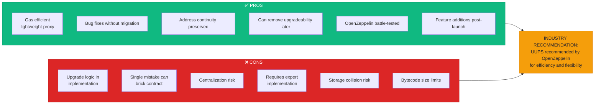

#### Specific Considerations for FIX Token

| Factor | Non-Upgradeable | UUPS Upgradeable |
|--------|-----------------|------------------|
| **User Trust** | "Code is law" maximalists prefer | Some may see as centralization |
| **Bug Recovery** | Cannot fix if ERC-20 logic broken | Can patch critical issues |
| **AI Agent Integration** | Fixed token interface | Can add agent-specific hooks |
| **Cross-Chain Bridging** | Simpler (standard ERC-20) | Needs careful proxy handling |
| **Governance Evolution** | Cannot add new voting mechanisms | Can add veFIX mechanics later |

### Recommendation

**🟡 HYBRID APPROACH: Keep FIX Token NON-Upgradeable, Registry UUPS**

**Rationale:**
1. **Token = Value Store**: Users trust tokens that are immutable
2. **Registry = Logic Layer**: Upgrade logic, not value storage
3. **MoltBot Lesson**: Their token issues came from ecosystem, not token upgradeability
4. **Industry Standard**: Most successful tokens (UNI, AAVE) are non-upgradeable
5. **Separation of Concerns**: Simpler security audit surface

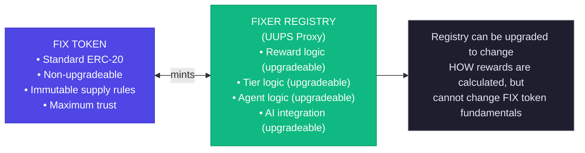

---

## 2. Agent Verification Stake Analysis

### Question: What should be the minimum stake amount?

### Market Sentiment Analysis

#### AI Agent Ecosystem Staking Data

| Platform | Token | Min Stake | Purpose | Notes |
|----------|-------|-----------|---------|-------|
| **AgentLayer** | $AGENT | 10 tokens | Agent registration | Low barrier |
| **Virtuals Protocol** | Various | Variable | Agent staking | Ecosystem-specific |
| **Ethereum Solo Staking** | ETH | 32 ETH (~$100K+) | Network security | High barrier |
| **Lido (Liquid Staking)** | ETH | No minimum | Delegation | Low barrier |
| **AlgosOne** | USD | $300 | Platform access | Fiat denominated |

#### ERC-8004 Standard Analysis (Ethereum Agent Identity Standard)

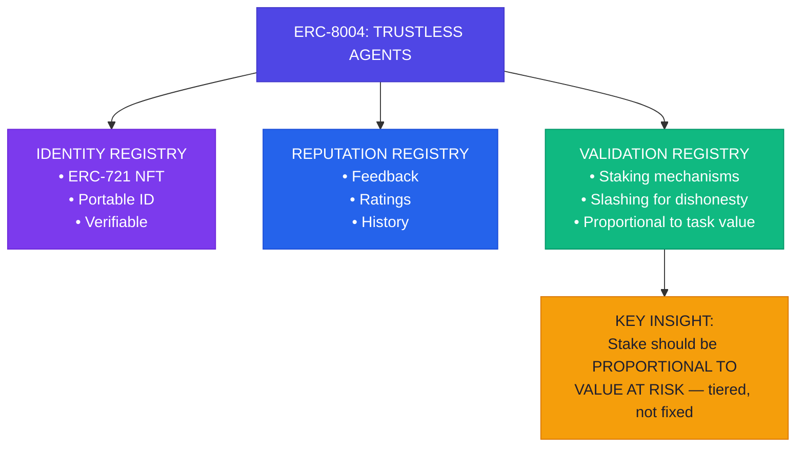

#### OpenClaw/ClawdBot Security Issues

| Issue | Impact | Stake Would Have Helped? |
|-------|--------|-------------------------|
| Misconfigured instances exposed | High | ✅ Yes (skin in the game) |
| Malicious "skills" targeting DeFi | High | ✅ Yes (slashable stake) |
| Account hijacking for scam promotions | Critical | ✅ Yes (identity verification) |
| API tokens leaked | Critical | Partial |

### Recommendation

**🟢 TIERED STAKING: 100 FIX (Starter) to 10,000 FIX (Enterprise)**

**Rationale:**
1. **ERC-8004 Aligned**: Stake proportional to risk/activity level
2. **Low Entry Barrier**: 100 FIX allows experimentation
3. **Sybil Resistant**: Higher tiers require meaningful investment
4. **Market Comparable**: Similar to AgentLayer's 10 token minimum
5. **Slashing Protection**: Meaningful stake deters malicious actors

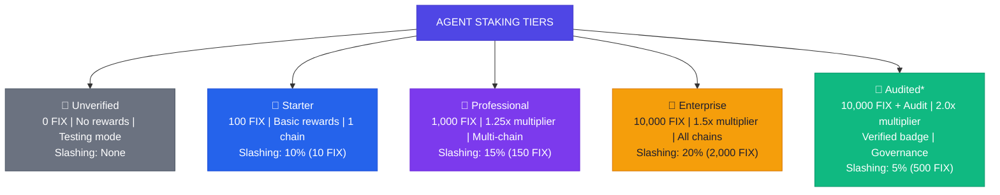

---

## 3. Team Limits Analysis

### Question: What should be the max members per team?

### Market Sentiment Analysis

#### Crypto Referral Program Structures

| Program | Structure | Max Direct | Max Tiers | Notes |
|---------|-----------|------------|-----------|-------|
| **Crypto.com** | Flat referral | 100 referrals | 1 tier | Cap on earnings |
| **Pi Network** | Team-based | Unlimited | 1 tier | "No limit to members" |
| **Bybit Affiliates** | Two-tier | Unlimited | 2 tiers | Sub-affiliate earnings |
| **Matrix MLM** | 3x3 or 5x5 | 3-5 direct | 3-5 levels | Fills "slots" |
| **Unilevel MLM** | Flat tree | Unlimited | Multiple | No width limits |
| **Deriv Master** | Partner-based | Unlimited | 2 tiers | B2B focused |

#### Team Structure Models Analysis

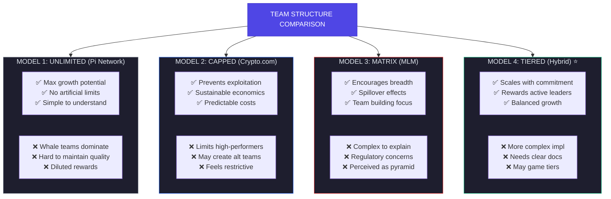

### Recommendation

**🟢 TIERED TEAM LIMITS: 5 members (Bronze) to 50 members (Platinum)**

**Rationale:**
1. **Avoids MLM Concerns**: Not unlimited, not matrix-based
2. **Scales with Tier**: Active referrers earn more capacity
3. **Quality Over Quantity**: Smaller teams encourage engagement
4. **Industry Aligned**: Similar to Crypto.com's 100-cap concept
5. **Prevents Exploitation**: Whale teams can't monopolize rewards

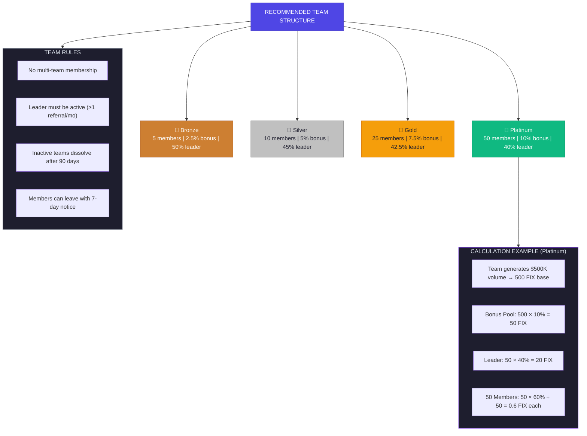

---

## 4. Protocol Fee Analysis

### Question: Should protocol fee be 5% or 10%?

### Market Sentiment Analysis

#### DeFi Protocol Fee Comparison

| Protocol | Fee Type | Fee Amount | Distribution |
|----------|----------|------------|--------------|
| **Uniswap V2** | Protocol fee | 0.05% (1/6 of 0.3%) | UNI buyback/burn |
| **Uniswap V3** | Protocol fee | 1/4 to 1/6 of LP fees | Governance-controlled |
| **Aave** | Fee switch | % of revenue | AAVE buyback |
| **StakeWise V1** | Yield fee | 10% | Protocol treasury |
| **StakeWise V3** | Yield fee | 5% | Protocol treasury |
| **Lido** | Staking fee | 10% | Treasury + node operators |
| **Curve** | Admin fee | 50% of swap fees | veCRV holders |

#### Fee Structure Patterns

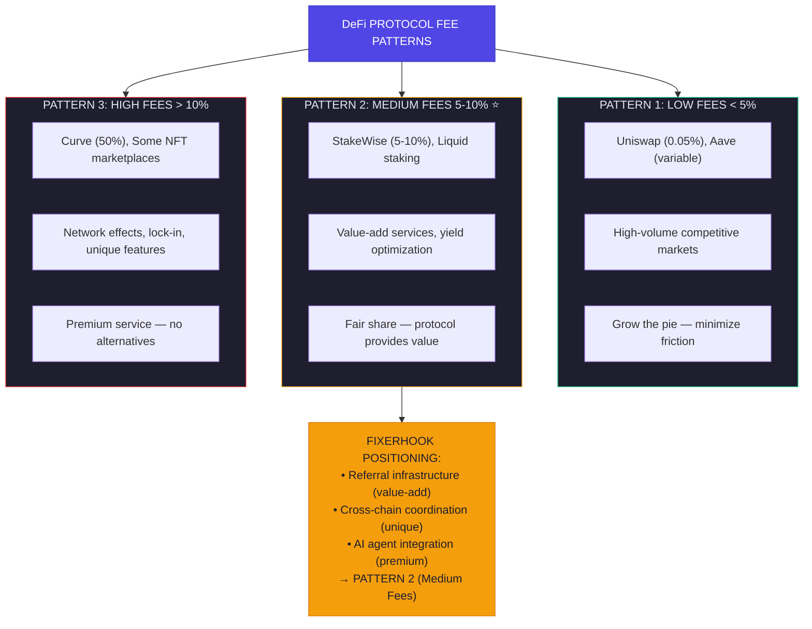

#### MoltBot/MoltBook Fee Insights

| Aspect | MoltBot | MoltBook | Lesson for FixerHook |
|--------|---------|----------|---------------------|
| Operating costs | $25-150/month (API) | Free to use | Need revenue stream |
| MOLT token utility | Trading fees on DEX | Incentivizes participation | Token should capture value |
| Protocol fees | No explicit fee | No explicit fee | Missed opportunity |

### Recommendation

**🟡 START AT 5%, SCALE TO 7.5% (Governance-Controlled)**

**Rationale:**
1. **Competitive Entry**: 5% is lower than StakeWise V1 (10%), attractive
2. **StakeWise Precedent**: They reduced from 10% → 5% in V3 (market pressure)
3. **Governance Flexibility**: DAO can adjust based on market conditions
4. **Sustainable Revenue**: 5% of significant volume is meaningful
5. **User Perception**: "5%" sounds reasonable, "10%" feels aggressive

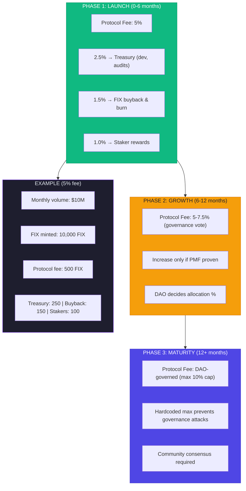

---

## 5. Bridge Technology Analysis

### Question: Reactive + Hyperlane or LayerZero OFT?

### Market Sentiment Analysis

#### Direct Comparison

| Feature | LayerZero OFT | Hyperlane Warp | Reactive Network |
|---------|---------------|----------------|------------------|
| **Primary Use** | Token bridging | Token bridging | Event automation |
| **Chains (Mainnet)** | 70+ | 100+ | 15+ |
| **Security Model** | DVN (configurable) | ISM (modular) | ReactVM isolation |
| **Token Standard** | OFT (burn/mint) | Warp Routes | N/A (callbacks) |
| **Adoption** | 300+ dApps, 55K contracts | $5B+ bridged | Emerging |
| **Cost** | Moderate (DVN fees) | Lower (PoS) | Gas for callbacks |
| **Developer Control** | Limited customization | High customization | Full control |
| **2025-2026 Outlook** | SWIFT of blockchain | 170+ chains by mid-2025 | Growing ecosystem |

#### Security Architecture Comparison

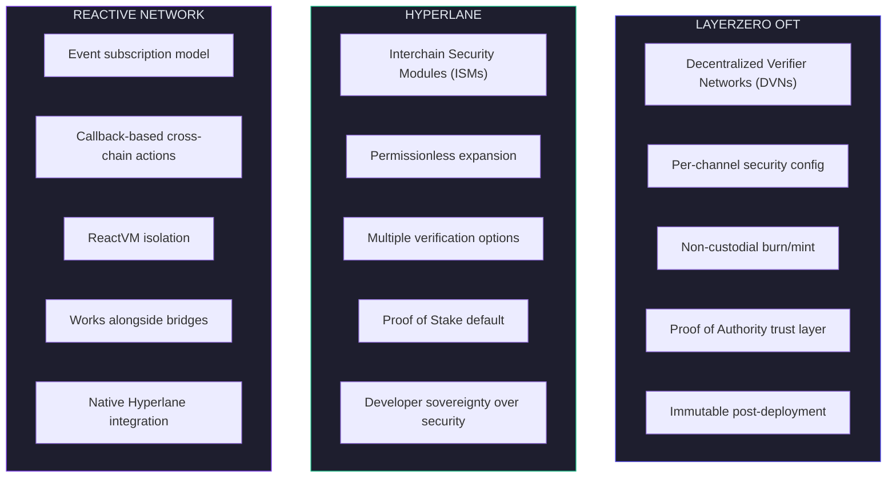

#### Key Differentiators

| Aspect | LayerZero OFT | Hyperlane | Winner for FixerHook |
|--------|---------------|-----------|---------------------|
| **Token Transfer** | ⭐⭐⭐⭐⭐ Native OFT | ⭐⭐⭐⭐ Warp Routes | LayerZero |
| **Customization** | ⭐⭐⭐ DVN selection | ⭐⭐⭐⭐⭐ Full ISM control | Hyperlane |
| **Unichain Support** | ✅ Yes | ❓ TBD | LayerZero |
| **Adoption/Trust** | Higher (more deployed) | Growing rapidly | LayerZero |
| **Integration w/ Reactive** | Not native | ✅ Native integration | Hyperlane |
| **Cost** | Higher (DVN fees) | Lower (PoS) | Hyperlane |

### Recommendation

**🟢 REACTIVE NETWORK + HYPERLANE (with LayerZero OFT option for FIX token)**

**Rationale:**
1. **Complementary, Not Competing**: Reactive = automation, Bridge = token transfer
2. **Native Integration**: Reactive Network has Hyperlane demo/integration
3. **Developer Control**: Hyperlane's ISM allows custom security for FixerHook
4. **Cost Effective**: Hyperlane PoS is cheaper than LayerZero DVN
5. **OFT for Token Only**: Consider LayerZero OFT specifically for FIX token bridging (widely adopted standard)

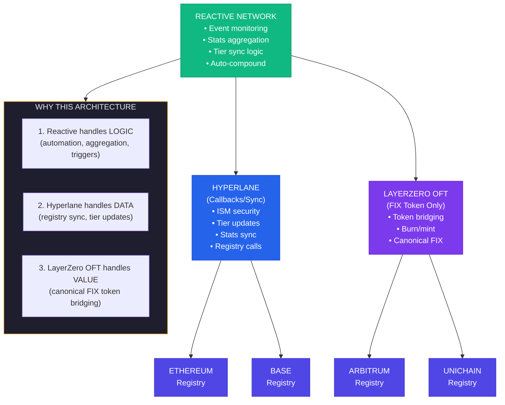

---

## Summary Recommendations

### Decision Matrix

| Question | Recommendation | Confidence | Key Factor |
|----------|----------------|------------|------------|
| **Token Upgradeability** | FIX non-upgradeable, Registry UUPS | 🟢 High | User trust + separation of concerns |
| **Agent Stake** | 100 FIX (min) to 10,000 FIX (enterprise) | 🟢 High | ERC-8004 alignment + tiered access |
| **Team Limits** | 5-50 members (tier-based) | 🟢 High | Anti-MLM perception + scalability |
| **Protocol Fee** | 5% (launch), DAO-governed (max 10%) | 🟡 Medium | Competitive entry + sustainability |
| **Bridge Tech** | Reactive + Hyperlane + LayerZero OFT | 🟢 High | Complementary technologies |

### Quick Reference

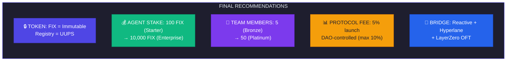

---

## Sources & References

### Primary Research Sources

1. **OpenClaw/ClawdBot/MoltBot Ecosystem**
   - Analytics Vidhya, Forbes, Binance Academy articles
   - Security reports from InfoSecurity Magazine, TechRadar
   - MoltBook Wikipedia and community discussions

2. **DeFi Protocol Fees**
   - Uniswap Governance proposals (UNIfication)
   - Aave fee switch announcements
   - Token Terminal fee analysis

3. **Bridge Technologies**
   - LayerZero documentation and Nansen analysis
   - Hyperlane Medium articles and roadmap
   - LlamaRisk security assessments

4. **AI Agent Standards**
   - ERC-8004 Ethereum Magicians proposal
   - AgentLayer staking documentation
   - Virtuals Protocol announcements

5. **Crypto Referral Programs**
   - Crypto.com, Bybit, KuCoin affiliate programs
   - Koinly and CoinLedger program analysis
   - Industry reports on MLM structures

---

*Analysis conducted February 5, 2026. Recommendations subject to market conditions and DAO governance.*
