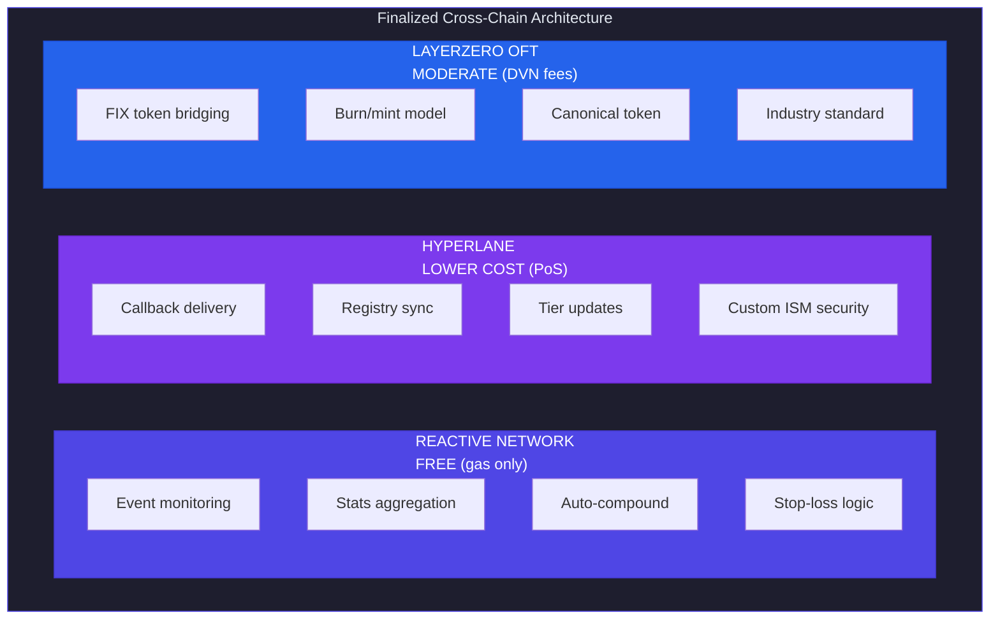
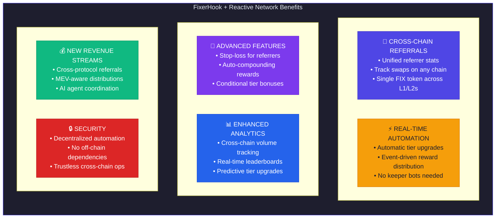
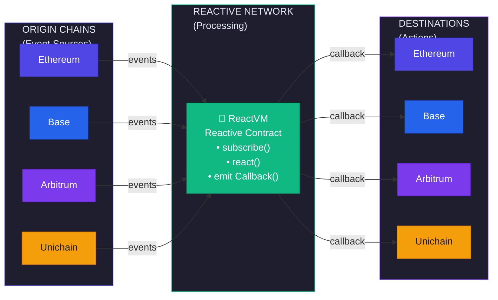
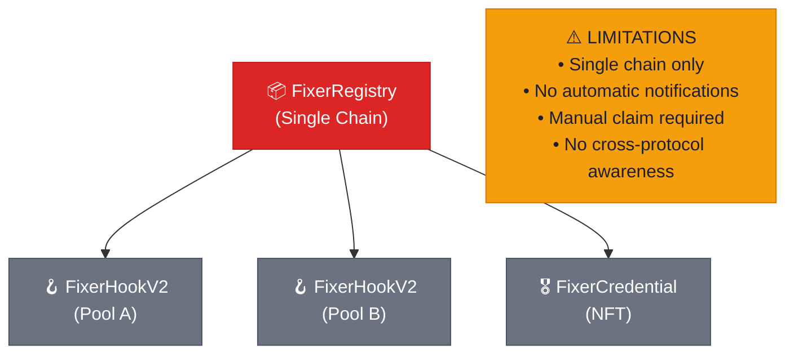
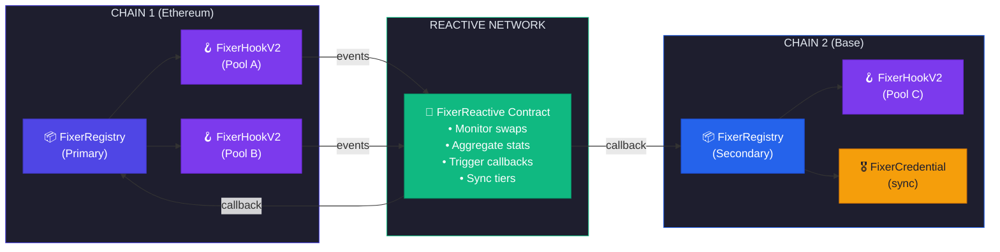
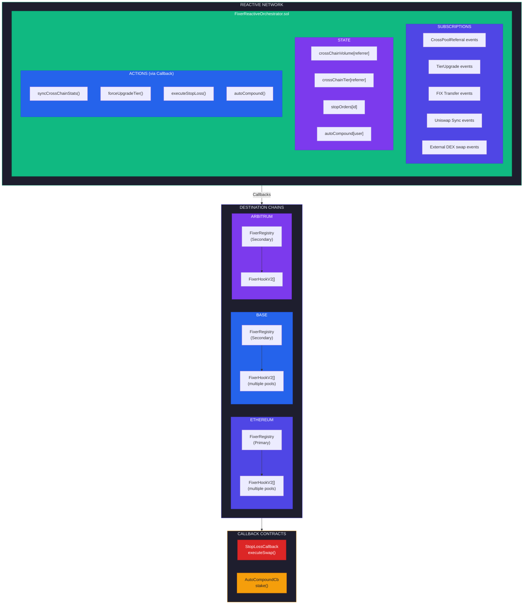
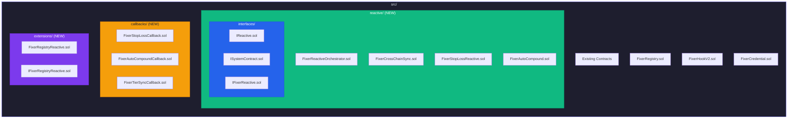
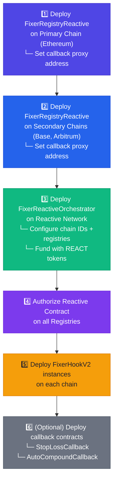

# Reactive Network Integration for FixerHook

> Comprehensive Research & Implementation Plan for Event-Driven Automation

**Document Version:** 1.1.0  
**Created:** February 5, 2026  
**Last Updated:** February 5, 2026  
**Status:** ✅ Bridge Decisions Finalized - Ready for Implementation  
**Research Sources:** blog.reactive.network, docs.reactive.network, GitHub demos

---

## ✅ Finalized Bridge Decisions

> Based on [Market Sentiment Analysis](./MARKET_SENTIMENT_ANALYSIS.md) research

| Technology | Role | Rationale |
|------------|------|-----------|
| **Reactive Network** | Event automation, stats aggregation | Free (gas only), decentralized execution |
| **Hyperlane** | Callback delivery, registry sync | Customizable ISM, native Reactive integration |
| **LayerZero OFT** | FIX token bridging only | Industry standard, 300+ dApps, trusted |



---

## Table of Contents

1. [Executive Summary](#executive-summary)
2. [What is Reactive Network?](#what-is-reactive-network)
3. [Strategic Alignment](#strategic-alignment)
4. [Integration Opportunities](#integration-opportunities)
5. [Architecture Design](#architecture-design)
6. [Implementation Plan](#implementation-plan)
7. [Use Case Deep Dives](#use-case-deep-dives)
8. [Cross-Chain Referrals](#cross-chain-referrals)
9. [Technical Specifications](#technical-specifications)
10. [FOSS Resources](#foss-resources)
11. [Deployment Guide](#deployment-guide)
12. [Testing Strategy](#testing-strategy)
13. [Task Breakdown](#task-breakdown)

---

## Executive Summary

Reactive Network is an **event-driven execution layer** for EVM ecosystems that enables **Reactive Contracts** - smart contracts that execute autonomously in response to on-chain and cross-chain events. This represents a paradigm shift from traditional smart contracts that wait for user transactions.

### Why Reactive Network for FixerHook?

| Current Limitation | Reactive Network Solution |
|-------------------|---------------------------|
| Hooks only work within a single pool | Cross-chain reactive callbacks |
| Manual tier upgrades | Automatic tier progression on any chain |
| No proactive notifications | Real-time event-driven alerts |
| Limited to Uniswap v4 events | Monitor any DeFi protocol events |
| Referrer must claim rewards | Auto-compounding / auto-distribution |
| Single chain deployment | Multi-chain unified referral system |

### Key Benefits



---

## What is Reactive Network?

### Core Concepts

**Reactive Contracts (RCs)** are a new category of smart contracts that:

1. **Monitor blockchains** for specific events via subscriptions
2. **Execute Solidity logic** automatically when events occur
3. **Initiate callbacks** to destination chains without user intervention
4. **Operate within ReactVM** - isolated execution environments



### Key Technical Features

| Feature | Description |
|---------|-------------|
| **Inversion of Control** | Contracts decide when to act, not users |
| **Event Subscriptions** | Filter events by chain, contract, topics |
| **Cross-chain Callbacks** | Execute transactions on any destination chain |
| **Parallelized EVM** | Fast and cost-effective computation |
| **Hyperlane Integration** | Alternative transport for callbacks |

### Supported Chains (Mainnet)

| Chain | Origin | Destination |
|-------|--------|-------------|
| Ethereum | ✅ | ✅ |
| Base | ✅ | ✅ |
| Arbitrum One | ✅ | ✅ |
| Unichain | ✅ | ✅ |
| Avalanche C-Chain | ✅ | ✅ |
| BSC | ✅ | ✅ |
| Linea | ✅ | ✅ |
| Sonic | ✅ | ✅ |
| Abstract | ✅ | ✅ |

---

## Strategic Alignment

### How Reactive Network Complements FixerHook

#### Before: Current Architecture (Single-Chain)



#### After: Enhanced with Reactive Network (Multi-Chain)



> **✅ ENHANCEMENTS:** Cross-chain unified stats, automatic tier sync, real-time reward notifications, cross-protocol referral tracking, decentralized automation (no keepers)
```

---

## Integration Opportunities

### Opportunity Matrix

| Use Case | Priority | Complexity | Value | Dependencies |
|----------|----------|------------|-------|--------------|
| **Cross-Chain Referral Sync** | 🔴 High | Medium | ⭐⭐⭐⭐⭐ | v2.0 Registry |
| **Automatic Tier Upgrades** | 🔴 High | Low | ⭐⭐⭐⭐ | v1.2 Tiers |
| **Stop-Loss for Referrers** | 🟡 Medium | Medium | ⭐⭐⭐⭐ | New |
| **Auto-Compound Rewards** | 🟡 Medium | Medium | ⭐⭐⭐ | New |
| **Cross-Protocol Tracking** | 🟡 Medium | High | ⭐⭐⭐⭐⭐ | New |
| **NFT Credential Sync** | 🟢 Low | Low | ⭐⭐⭐ | v2.1 NFT |
| **Leaderboard Updates** | 🟢 Low | Low | ⭐⭐ | Frontend |
| **AI Agent Coordination** | 🟢 Low | High | ⭐⭐⭐⭐⭐ | v2.2 AI |

### Detailed Use Cases

#### 1. Cross-Chain Referral Sync (Priority: HIGH)

**Problem:** Referrer stats are isolated per chain. A referrer active on Ethereum and Base has separate tier progressions.

**Solution:** Reactive Contract monitors referral events across all chains and synchronizes stats to a primary registry.

```solidity
// Reactive Contract listens for CrossPoolReferral events on multiple chains
function react(LogRecord calldata log) external vmOnly {
    if (log.topic_0 == CROSS_POOL_REFERRAL_TOPIC) {
        // Decode: referrer, swapper, poolId, volume, reward
        (address referrer, , , uint256 volume, ) = abi.decode(
            log.data, 
            (address, address, bytes32, uint256, uint256)
        );
        
        // Callback to primary registry to update global stats
        bytes memory payload = abi.encodeCall(
            IFixerRegistry.syncCrossChainReferral,
            (address(0), referrer, volume, log.chain_id)
        );
        
        emit Callback(PRIMARY_CHAIN_ID, registryAddress, CALLBACK_GAS_LIMIT, payload);
    }
}
```

#### 2. Automatic Tier Upgrades (Priority: HIGH)

**Problem:** Tier upgrades happen inline with swaps, but cross-chain activity isn't considered.

**Solution:** Reactive Contract aggregates all activity and triggers tier upgrades when thresholds are met.

```solidity
// Monitor cumulative stats across chains
mapping(address => uint256) public crossChainVolume;

function react(LogRecord calldata log) external vmOnly {
    if (log.topic_0 == CROSS_POOL_REFERRAL_TOPIC) {
        address referrer = address(uint160(log.topic_1));
        uint256 volume = abi.decode(log.data, (uint256));
        
        crossChainVolume[referrer] += volume;
        
        // Check if tier upgrade threshold met
        if (shouldUpgradeTier(referrer)) {
            // Callback to all chain registries to upgrade tier
            for (uint i = 0; i < chains.length; i++) {
                bytes memory payload = abi.encodeCall(
                    IFixerRegistry.forceUpgradeTier,
                    (address(0), referrer)
                );
                emit Callback(chains[i], registries[i], GAS_LIMIT, payload);
            }
        }
    }
}
```

#### 3. Stop-Loss for Referrers (Priority: MEDIUM)

**Problem:** FIX token holders have no automated way to protect against price drops.

**Solution:** Implement ReacDEFI-style stop orders for FIX tokens.

```solidity
// Referrer sets stop-loss: if FIX drops below $X, swap to USDC
function react(LogRecord calldata log) external vmOnly {
    // Monitor Uniswap sync events for FIX/USDC pair
    if (log.topic_0 == UNISWAP_SYNC_TOPIC && log._contract == fixUsdcPair) {
        (uint112 reserve0, uint112 reserve1) = abi.decode(log.data, (uint112, uint112));
        uint256 currentPrice = calculatePrice(reserve0, reserve1);
        
        // Check all stop orders
        for (uint i = 0; i < stopOrders.length; i++) {
            if (currentPrice <= stopOrders[i].triggerPrice) {
                // Execute swap via callback
                bytes memory payload = abi.encodeCall(
                    IStopOrderCallback.executeSwap,
                    (address(0), stopOrders[i].owner, stopOrders[i].amount)
                );
                emit Callback(chainId, stopOrderCallback, GAS_LIMIT, payload);
            }
        }
    }
}
```

#### 4. Auto-Compound Rewards (Priority: MEDIUM)

**Problem:** Referrers receive FIX but must manually claim and stake/LP.

**Solution:** Reactive Contract monitors reward mints and automatically compounds.

```solidity
// Auto-compound: when rewards exceed threshold, stake or LP
function react(LogRecord calldata log) external vmOnly {
    if (log.topic_0 == TRANSFER_TOPIC && log._contract == fixToken) {
        address to = address(uint160(log.topic_2));
        uint256 amount = abi.decode(log.data, (uint256));
        
        // Check if user has auto-compound enabled
        if (autoCompoundEnabled[to] && amount >= minCompoundAmount) {
            // Callback to staking contract
            bytes memory payload = abi.encodeCall(
                IFixerStaking.stakeFor,
                (address(0), to, amount)
            );
            emit Callback(chainId, stakingContract, GAS_LIMIT, payload);
        }
    }
}
```

#### 5. Cross-Protocol Referral Tracking (Priority: MEDIUM)

**Problem:** FixerHook only tracks Uniswap v4 swaps. Other DEXs are ignored.

**Solution:** Reactive Contract monitors swaps across Uniswap V2, V3, V4, Curve, etc.

```solidity
constructor() {
    // Subscribe to multiple DEX swap events
    service.subscribe(ETHEREUM_CHAIN_ID, UNISWAP_V2_ROUTER, SWAP_TOPIC, ...);
    service.subscribe(ETHEREUM_CHAIN_ID, UNISWAP_V3_ROUTER, SWAP_TOPIC, ...);
    service.subscribe(ETHEREUM_CHAIN_ID, CURVE_POOL, EXCHANGE_TOPIC, ...);
    service.subscribe(BASE_CHAIN_ID, AERODROME_ROUTER, SWAP_TOPIC, ...);
}

function react(LogRecord calldata log) external vmOnly {
    // Unified swap handling across all DEXs
    (address trader, uint256 volume) = decodeSwapEvent(log);
    
    // Check if trader was referred via FixerHook
    address referrer = referralRegistry[trader];
    if (referrer != address(0)) {
        // Credit referrer even for non-Uniswap v4 swaps
        bytes memory payload = abi.encodeCall(
            IFixerRegistry.recordExternalReferral,
            (address(0), referrer, trader, volume, log._contract)
        );
        emit Callback(PRIMARY_CHAIN_ID, registry, GAS_LIMIT, payload);
    }
}
```

---

## Architecture Design

### Version 2.3: Reactive Integration



### Contract Hierarchy



---

## Technical Specifications

### FixerReactiveOrchestrator.sol

```solidity
// SPDX-License-Identifier: BUSL-1.1
pragma solidity 0.8.26;

import {IReactive} from "./interfaces/IReactive.sol";
import {ISystemContract} from "./interfaces/ISystemContract.sol";
import {AbstractReactive} from "reactive-lib/abstract-base/AbstractReactive.sol";

/// @title FixerReactiveOrchestrator
/// @notice Cross-chain orchestration for FixerHook referral system
/// @dev Deploys to Reactive Network and monitors events across chains
contract FixerReactiveOrchestrator is AbstractReactive {
    
    // ========================================================================
    // CONSTANTS
    // ========================================================================
    
    /// @notice CrossPoolReferral event topic
    bytes32 public constant REFERRAL_TOPIC = keccak256(
        "CrossPoolReferral(address,address,bytes32,uint256,uint256)"
    );
    
    /// @notice TierUpgrade event topic
    bytes32 public constant TIER_UPGRADE_TOPIC = keccak256(
        "TierUpgrade(address,uint8,uint8)"
    );
    
    /// @notice ERC20 Transfer topic (for FIX token monitoring)
    bytes32 public constant TRANSFER_TOPIC = keccak256(
        "Transfer(address,address,uint256)"
    );
    
    /// @notice Gas limit for callbacks
    uint64 constant CALLBACK_GAS_LIMIT = 500_000;
    
    // ========================================================================
    // STATE
    // ========================================================================
    
    /// @notice Chain IDs we're monitoring
    uint256[] public monitoredChains;
    
    /// @notice Registry addresses per chain
    mapping(uint256 => address) public registries;
    
    /// @notice FIX token addresses per chain
    mapping(uint256 => address) public fixTokens;
    
    /// @notice Primary chain for aggregated stats
    uint256 public primaryChainId;
    
    /// @notice Aggregated cross-chain volume per referrer
    mapping(address => uint256) public crossChainVolume;
    
    /// @notice Aggregated cross-chain referral count per referrer
    mapping(address => uint256) public crossChainReferralCount;
    
    /// @notice Last synced timestamp per referrer
    mapping(address => uint256) public lastSyncTimestamp;
    
    /// @notice Stop-loss orders
    struct StopOrder {
        address owner;
        uint256 triggerPrice;  // Price in USDC (6 decimals)
        uint256 amount;        // FIX amount to sell
        bool active;
    }
    mapping(uint256 => StopOrder) public stopOrders;
    uint256 public stopOrderCount;
    
    /// @notice Auto-compound preferences
    mapping(address => bool) public autoCompoundEnabled;
    mapping(address => uint256) public minCompoundAmount;
    
    // ========================================================================
    // EVENTS
    // ========================================================================
    
    event CrossChainReferralAggregated(
        address indexed referrer,
        uint256 chainId,
        uint256 volume,
        uint256 totalVolume
    );
    
    event TierSyncTriggered(
        address indexed referrer,
        uint8 newTier,
        uint256[] chains
    );
    
    event StopOrderTriggered(
        uint256 indexed orderId,
        address indexed owner,
        uint256 price
    );
    
    event AutoCompoundTriggered(
        address indexed user,
        uint256 amount
    );
    
    // ========================================================================
    // CONSTRUCTOR
    // ========================================================================
    
    constructor(
        address _service,
        uint256 _primaryChainId,
        uint256[] memory _chainIds,
        address[] memory _registries,
        address[] memory _fixTokens
    ) {
        service = ISystemContract(payable(_service));
        primaryChainId = _primaryChainId;
        monitoredChains = _chainIds;
        
        // Setup chain configurations
        for (uint i = 0; i < _chainIds.length; i++) {
            registries[_chainIds[i]] = _registries[i];
            fixTokens[_chainIds[i]] = _fixTokens[i];
        }
        
        // Only subscribe on Reactive Network (not ReactVM)
        if (!vm) {
            _setupSubscriptions();
        }
    }
    
    // ========================================================================
    // SUBSCRIPTIONS
    // ========================================================================
    
    function _setupSubscriptions() internal {
        // Subscribe to CrossPoolReferral events on all chain registries
        for (uint i = 0; i < monitoredChains.length; i++) {
            uint256 chainId = monitoredChains[i];
            address registry = registries[chainId];
            
            // Referral events
            service.subscribe(
                chainId,
                registry,
                uint256(REFERRAL_TOPIC),
                REACTIVE_IGNORE,
                REACTIVE_IGNORE,
                REACTIVE_IGNORE
            );
            
            // Tier upgrade events
            service.subscribe(
                chainId,
                registry,
                uint256(TIER_UPGRADE_TOPIC),
                REACTIVE_IGNORE,
                REACTIVE_IGNORE,
                REACTIVE_IGNORE
            );
            
            // FIX token transfers (for auto-compound)
            service.subscribe(
                chainId,
                fixTokens[chainId],
                uint256(TRANSFER_TOPIC),
                REACTIVE_IGNORE,
                REACTIVE_IGNORE,
                REACTIVE_IGNORE
            );
        }
    }
    
    // ========================================================================
    // REACT FUNCTION
    // ========================================================================
    
    /// @notice React to incoming events
    /// @dev Called by ReactVM when subscribed events occur
    function react(LogRecord calldata log) external vmOnly {
        bytes32 topic = bytes32(log.topic_0);
        
        if (topic == REFERRAL_TOPIC) {
            _handleReferralEvent(log);
        } else if (topic == TIER_UPGRADE_TOPIC) {
            _handleTierUpgrade(log);
        } else if (topic == TRANSFER_TOPIC) {
            _handleTransfer(log);
        }
    }
    
    // ========================================================================
    // EVENT HANDLERS
    // ========================================================================
    
    function _handleReferralEvent(LogRecord calldata log) internal {
        // Decode referrer from indexed topic
        address referrer = address(uint160(log.topic_1));
        
        // Decode volume from data
        (, , , uint256 volume, ) = abi.decode(
            log.data,
            (address, address, bytes32, uint256, uint256)
        );
        
        // Aggregate cross-chain stats
        crossChainVolume[referrer] += volume;
        crossChainReferralCount[referrer] += 1;
        
        emit CrossChainReferralAggregated(
            referrer, 
            log.chain_id, 
            volume, 
            crossChainVolume[referrer]
        );
        
        // Sync to primary registry periodically
        if (block.timestamp - lastSyncTimestamp[referrer] >= 1 hours) {
            _syncToPrimaryRegistry(referrer);
            lastSyncTimestamp[referrer] = block.timestamp;
        }
        
        // Check for tier upgrade eligibility
        _checkCrossChainTierUpgrade(referrer);
    }
    
    function _handleTierUpgrade(LogRecord calldata log) internal {
        address referrer = address(uint160(log.topic_1));
        uint8 newTier = uint8(log.topic_2);
        
        // Sync tier to all other chains
        _syncTierToAllChains(referrer, newTier, log.chain_id);
    }
    
    function _handleTransfer(LogRecord calldata log) internal {
        address to = address(uint160(log.topic_2));
        uint256 amount = abi.decode(log.data, (uint256));
        
        // Check for auto-compound
        if (autoCompoundEnabled[to] && amount >= minCompoundAmount[to]) {
            _triggerAutoCompound(to, amount, log.chain_id);
        }
    }
    
    // ========================================================================
    // CALLBACK EMITTERS
    // ========================================================================
    
    function _syncToPrimaryRegistry(address referrer) internal {
        bytes memory payload = abi.encodeWithSignature(
            "syncCrossChainStats(address,address,uint256,uint256)",
            address(0),  // Will be replaced with ReactVM ID
            referrer,
            crossChainVolume[referrer],
            crossChainReferralCount[referrer]
        );
        
        emit Callback(
            primaryChainId,
            registries[primaryChainId],
            CALLBACK_GAS_LIMIT,
            payload
        );
    }
    
    function _checkCrossChainTierUpgrade(address referrer) internal {
        // Calculate tier based on cross-chain totals
        uint8 computedTier = _calculateTier(
            crossChainVolume[referrer],
            crossChainReferralCount[referrer]
        );
        
        // If tier upgrade warranted, sync to all chains
        // (Implementation depends on current tier storage)
    }
    
    function _syncTierToAllChains(
        address referrer, 
        uint8 newTier, 
        uint256 originChain
    ) internal {
        for (uint i = 0; i < monitoredChains.length; i++) {
            uint256 chainId = monitoredChains[i];
            
            // Skip the origin chain (already has the update)
            if (chainId == originChain) continue;
            
            bytes memory payload = abi.encodeWithSignature(
                "forceTierSync(address,address,uint8)",
                address(0),
                referrer,
                newTier
            );
            
            emit Callback(chainId, registries[chainId], CALLBACK_GAS_LIMIT, payload);
        }
        
        emit TierSyncTriggered(referrer, newTier, monitoredChains);
    }
    
    function _triggerAutoCompound(
        address user,
        uint256 amount,
        uint256 chainId
    ) internal {
        bytes memory payload = abi.encodeWithSignature(
            "compoundFor(address,address,uint256)",
            address(0),
            user,
            amount
        );
        
        // Callback to staking contract on same chain
        emit Callback(chainId, stakingContracts[chainId], CALLBACK_GAS_LIMIT, payload);
        
        emit AutoCompoundTriggered(user, amount);
    }
    
    // ========================================================================
    // TIER CALCULATION
    // ========================================================================
    
    function _calculateTier(
        uint256 volume,
        uint256 referralCount
    ) internal pure returns (uint8) {
        // Platinum: $1M volume AND 200 referrals
        if (volume >= 1_000_000e18 && referralCount >= 200) return 3;
        // Gold: $100k volume AND 50 referrals
        if (volume >= 100_000e18 && referralCount >= 50) return 2;
        // Silver: $10k volume AND 10 referrals
        if (volume >= 10_000e18 && referralCount >= 10) return 1;
        // Bronze: default
        return 0;
    }
    
    // ========================================================================
    // STOP-LOSS MANAGEMENT (via Reactive Network main contract, not ReactVM)
    // ========================================================================
    
    function createStopOrder(
        uint256 triggerPrice,
        uint256 amount
    ) external returns (uint256 orderId) {
        orderId = stopOrderCount++;
        stopOrders[orderId] = StopOrder({
            owner: msg.sender,
            triggerPrice: triggerPrice,
            amount: amount,
            active: true
        });
    }
    
    function cancelStopOrder(uint256 orderId) external {
        require(stopOrders[orderId].owner == msg.sender, "Not owner");
        stopOrders[orderId].active = false;
    }
    
    // ========================================================================
    // AUTO-COMPOUND MANAGEMENT
    // ========================================================================
    
    function enableAutoCompound(uint256 minAmount) external {
        autoCompoundEnabled[msg.sender] = true;
        minCompoundAmount[msg.sender] = minAmount;
    }
    
    function disableAutoCompound() external {
        autoCompoundEnabled[msg.sender] = false;
    }
}
```

### FixerRegistryReactive.sol (Extended Registry)

```solidity
// SPDX-License-Identifier: BUSL-1.1
pragma solidity 0.8.26;

import {FixerRegistry} from "../FixerRegistry.sol";

/// @title FixerRegistryReactive
/// @notice Extended registry with Reactive Network callback support
contract FixerRegistryReactive is FixerRegistry {
    
    // ========================================================================
    // REACTIVE CALLBACK SUPPORT
    // ========================================================================
    
    /// @notice Authorized Reactive Network callback proxy
    address public callbackProxy;
    
    /// @notice Authorized ReactVM addresses
    mapping(address => bool) public authorizedReactiveContracts;
    
    /// @notice Cross-chain synced volume (additional to local)
    mapping(address => uint256) public crossChainVolume;
    
    /// @notice Cross-chain synced referral count
    mapping(address => uint256) public crossChainReferralCount;
    
    // ========================================================================
    // EVENTS
    // ========================================================================
    
    event CrossChainStatsSynced(
        address indexed referrer,
        uint256 newCrossChainVolume,
        uint256 newCrossChainReferralCount
    );
    
    event TierForceSynced(
        address indexed referrer,
        ReferrerTier newTier,
        address reactiveSource
    );
    
    // ========================================================================
    // MODIFIERS
    // ========================================================================
    
    modifier onlyReactive(address rvmId) {
        require(msg.sender == callbackProxy, "Not callback proxy");
        require(authorizedReactiveContracts[rvmId], "Unauthorized RVM");
        _;
    }
    
    // ========================================================================
    // CONSTRUCTOR
    // ========================================================================
    
    constructor(
        address _owner,
        address _callbackProxy
    ) FixerRegistry(_owner) {
        callbackProxy = _callbackProxy;
    }
    
    // ========================================================================
    // REACTIVE CALLBACKS
    // ========================================================================
    
    /// @notice Sync cross-chain stats from Reactive Network
    /// @dev Called via callback from FixerReactiveOrchestrator
    function syncCrossChainStats(
        address rvmId,
        address referrer,
        uint256 totalVolume,
        uint256 totalReferralCount
    ) external onlyReactive(rvmId) {
        crossChainVolume[referrer] = totalVolume;
        crossChainReferralCount[referrer] = totalReferralCount;
        
        // Check for tier upgrade based on combined stats
        _checkCrossChainTierUpgrade(referrer);
        
        emit CrossChainStatsSynced(referrer, totalVolume, totalReferralCount);
    }
    
    /// @notice Force tier sync from another chain
    /// @dev Called when tier upgrades on one chain should propagate
    function forceTierSync(
        address rvmId,
        address referrer,
        uint8 newTier
    ) external onlyReactive(rvmId) {
        ReferrerStats storage stats = _referrerStats[referrer];
        ReferrerTier tier = ReferrerTier(newTier);
        
        if (tier > stats.tier) {
            ReferrerTier oldTier = stats.tier;
            stats.tier = tier;
            emit TierUpgrade(referrer, oldTier, tier);
        }
        
        emit TierForceSynced(referrer, tier, rvmId);
    }
    
    // ========================================================================
    // INTERNAL
    // ========================================================================
    
    function _checkCrossChainTierUpgrade(address referrer) internal {
        ReferrerStats storage stats = _referrerStats[referrer];
        
        // Combined stats = local + cross-chain
        uint256 totalVolume = stats.totalVolume + crossChainVolume[referrer];
        uint256 totalReferrals = stats.referralCount + crossChainReferralCount[referrer];
        
        ReferrerTier newTier = _calculateTier(
            uint128(totalVolume),
            uint64(totalReferrals)
        );
        
        if (newTier > stats.tier) {
            ReferrerTier oldTier = stats.tier;
            stats.tier = newTier;
            emit TierUpgrade(referrer, oldTier, newTier);
        }
    }
    
    // ========================================================================
    // VIEW FUNCTIONS
    // ========================================================================
    
    /// @notice Get combined stats (local + cross-chain)
    function getCombinedStats(address referrer) external view returns (
        uint256 totalVolume,
        uint256 totalReferralCount,
        uint256 localVolume,
        uint256 localReferralCount
    ) {
        ReferrerStats memory stats = _referrerStats[referrer];
        
        localVolume = stats.totalVolume;
        localReferralCount = stats.referralCount;
        totalVolume = localVolume + crossChainVolume[referrer];
        totalReferralCount = localReferralCount + crossChainReferralCount[referrer];
    }
    
    // ========================================================================
    // ADMIN
    // ========================================================================
    
    function setCallbackProxy(address _proxy) external onlyOwner {
        callbackProxy = _proxy;
    }
    
    function authorizeReactiveContract(address rvm, bool authorized) external onlyOwner {
        authorizedReactiveContracts[rvm] = authorized;
    }
}
```

---

## FOSS Resources

### Required Dependencies

```bash
# Reactive Network Library
forge install Reactive-Network/reactive-lib --no-commit

# Existing dependencies (already installed)
# forge install Uniswap/v4-core
# forge install Uniswap/v4-periphery
# forge install transmissions11/solmate
# forge install Vectorized/solady
```

### Remappings Update

```txt
# Add to remappings.txt
reactive-lib/=lib/reactive-lib/src/
```

### Key Interfaces from reactive-lib

```solidity
// IReactive.sol - Main interface for reactive contracts
interface IReactive {
    struct LogRecord {
        uint256 chain_id;
        address _contract;
        uint256 topic_0;
        uint256 topic_1;
        uint256 topic_2;
        uint256 topic_3;
        bytes data;
        uint256 block_number;
        uint256 op_code;
        uint256 block_hash;
        uint256 tx_hash;
        uint256 log_index;
    }
    
    event Callback(
        uint256 indexed chain_id,
        address indexed _contract,
        uint64 indexed gas_limit,
        bytes payload
    );
    
    function react(LogRecord calldata log) external;
}

// ISystemContract.sol - For subscriptions
interface ISystemContract {
    function subscribe(
        uint256 chain_id,
        address _contract,
        uint256 topic_0,
        uint256 topic_1,
        uint256 topic_2,
        uint256 topic_3
    ) external;
    
    function unsubscribe(
        uint256 chain_id,
        address _contract,
        uint256 topic_0,
        uint256 topic_1,
        uint256 topic_2,
        uint256 topic_3
    ) external;
}
```

### Reference Implementations

| Component | Reference |
|-----------|-----------|
| Basic Reactive Contract | [reactive-smart-contract-demos/basic](https://github.com/Reactive-Network/reactive-smart-contract-demos/tree/main/src/demos/basic) |
| Uniswap Stop Orders | [reactive-smart-contract-demos/uniswap-v2-stop-order](https://github.com/Reactive-Network/reactive-smart-contract-demos/tree/main/src/demos/uniswap-v2-stop-order) |
| Cross-Chain Lending | [ReactiveFlow-Lender](https://github.com/harshkas4na/ReactiveFlow-Lender) |
| Flash Profit Extractor | [Flash-Profit-Extractor](https://github.com/Prakhar-30/Flash-Profit-Extractor) |
| Hyperlane Integration | [reactive-smart-contract-demos/hyperlane](https://github.com/Reactive-Network/reactive-smart-contract-demos/tree/main/src/demos/hyperlane) |

---

## Deployment Guide

### Environment Setup

```bash
# Reactive Network RPC
export REACTIVE_RPC="https://mainnet-rpc.rnk.dev/"

# System contract address (Reactive Mainnet)
export SYSTEM_CONTRACT_ADDR="0x..." # From docs.reactive.network

# Callback proxy addresses (per chain)
export ETH_CALLBACK_PROXY="0x..."
export BASE_CALLBACK_PROXY="0x..."
export ARB_CALLBACK_PROXY="0x..."

# Private keys
export REACTIVE_PRIVATE_KEY="..."
export ORIGIN_PRIVATE_KEY="..."
export DESTINATION_PRIVATE_KEY="..."
```

### Deployment Order



### Deployment Script

```solidity
// script/DeployReactive.s.sol
// SPDX-License-Identifier: BUSL-1.1
pragma solidity 0.8.26;

import "forge-std/Script.sol";
import "../src/reactive/FixerReactiveOrchestrator.sol";

contract DeployReactive is Script {
    function run() external {
        uint256 deployerPrivateKey = vm.envUint("REACTIVE_PRIVATE_KEY");
        
        address systemContract = vm.envAddress("SYSTEM_CONTRACT_ADDR");
        uint256 primaryChainId = 1; // Ethereum
        
        uint256[] memory chainIds = new uint256[](3);
        chainIds[0] = 1;     // Ethereum
        chainIds[1] = 8453;  // Base
        chainIds[2] = 42161; // Arbitrum
        
        address[] memory registries = new address[](3);
        registries[0] = vm.envAddress("ETH_REGISTRY");
        registries[1] = vm.envAddress("BASE_REGISTRY");
        registries[2] = vm.envAddress("ARB_REGISTRY");
        
        address[] memory fixTokens = new address[](3);
        fixTokens[0] = vm.envAddress("ETH_FIX_TOKEN");
        fixTokens[1] = vm.envAddress("BASE_FIX_TOKEN");
        fixTokens[2] = vm.envAddress("ARB_FIX_TOKEN");
        
        vm.startBroadcast(deployerPrivateKey);
        
        FixerReactiveOrchestrator orchestrator = new FixerReactiveOrchestrator(
            systemContract,
            primaryChainId,
            chainIds,
            registries,
            fixTokens
        );
        
        vm.stopBroadcast();
        
        console.log("Orchestrator deployed at:", address(orchestrator));
    }
}
```

---

## Testing Strategy

### Test Categories

| Category | Tests | Coverage Target |
|----------|-------|-----------------|
| Unit Tests | Subscription setup, event decoding | 100% |
| Integration Tests | Cross-chain sync simulation | 80% |
| Fork Tests | Real chain data replay | Key flows |
| Gas Tests | Callback gas consumption | Benchmarks |

### Sample Test

```solidity
// test/FixerReactiveOrchestrator.t.sol
contract FixerReactiveOrchestratorTest is Test {
    FixerReactiveOrchestrator public orchestrator;
    MockSystemContract public mockSystem;
    
    function setUp() public {
        mockSystem = new MockSystemContract();
        
        uint256[] memory chains = new uint256[](2);
        chains[0] = 1;
        chains[1] = 8453;
        
        address[] memory registries = new address[](2);
        registries[0] = makeAddr("ethRegistry");
        registries[1] = makeAddr("baseRegistry");
        
        address[] memory tokens = new address[](2);
        tokens[0] = makeAddr("ethFix");
        tokens[1] = makeAddr("baseFix");
        
        orchestrator = new FixerReactiveOrchestrator(
            address(mockSystem),
            1,
            chains,
            registries,
            tokens
        );
    }
    
    function test_AggregatesCrossChainVolume() public {
        address referrer = makeAddr("referrer");
        
        // Simulate referral event from Ethereum
        IReactive.LogRecord memory log1 = IReactive.LogRecord({
            chain_id: 1,
            _contract: makeAddr("ethRegistry"),
            topic_0: uint256(orchestrator.REFERRAL_TOPIC()),
            topic_1: uint256(uint160(referrer)),
            topic_2: 0,
            topic_3: 0,
            data: abi.encode(referrer, makeAddr("swapper"), bytes32(0), 1000e18, 10e18),
            block_number: 0,
            op_code: 0,
            block_hash: 0,
            tx_hash: 0,
            log_index: 0
        });
        
        // React to event
        orchestrator.react(log1);
        
        assertEq(orchestrator.crossChainVolume(referrer), 1000e18);
        
        // Simulate referral event from Base
        IReactive.LogRecord memory log2 = log1;
        log2.chain_id = 8453;
        log2.data = abi.encode(referrer, makeAddr("swapper2"), bytes32(0), 500e18, 5e18);
        
        orchestrator.react(log2);
        
        assertEq(orchestrator.crossChainVolume(referrer), 1500e18);
        assertEq(orchestrator.crossChainReferralCount(referrer), 2);
    }
    
    function test_EmitsCallbackOnSync() public {
        address referrer = makeAddr("referrer");
        
        // Create log that triggers sync
        IReactive.LogRecord memory log = IReactive.LogRecord({...});
        
        // Expect Callback event
        vm.expectEmit(true, true, true, true);
        emit IReactive.Callback(1, makeAddr("ethRegistry"), 500_000, "...");
        
        orchestrator.react(log);
    }
}
```

---

## Task Breakdown

### Phase 1: Foundation (Week 1)

| Task | Priority | Est. Hours |
|------|----------|------------|
| Install reactive-lib dependency | High | 1 |
| Create reactive/ directory structure | High | 1 |
| Define IFixerReactive interface | High | 2 |
| Implement FixerReactiveOrchestrator skeleton | High | 4 |
| Setup subscription logic | High | 4 |
| Unit tests for subscriptions | High | 4 |

### Phase 2: Core Features (Week 2)

| Task | Priority | Est. Hours |
|------|----------|------------|
| Implement react() function | High | 4 |
| Cross-chain volume aggregation | High | 4 |
| Tier sync logic | High | 4 |
| Create FixerRegistryReactive | High | 8 |
| Callback handling | Medium | 4 |
| Integration tests | High | 8 |

### Phase 3: Advanced Features (Week 3)

| Task | Priority | Est. Hours |
|------|----------|------------|
| Stop-loss monitoring | Medium | 6 |
| Auto-compound logic | Medium | 4 |
| StopLossCallback contract | Medium | 4 |
| AutoCompoundCallback contract | Medium | 4 |
| Cross-protocol tracking | Low | 8 |
| Gas optimization | Medium | 4 |

### Phase 4: Deployment & Testing (Week 4)

| Task | Priority | Est. Hours |
|------|----------|------------|
| Deployment scripts | High | 4 |
| Testnet deployment | High | 4 |
| Fork testing | High | 8 |
| Documentation | High | 4 |
| Security review | High | 8 |
| Mainnet deployment | High | 4 |

---

## Summary

### What Reactive Network Enables for FixerHook

1. **Cross-Chain Unified Referral System** - Single referrer identity across all chains
2. **Automatic Tier Sync** - Tier upgrades propagate across chains instantly
3. **Advanced Trading Features** - Stop-loss, auto-compound for FIX tokens
4. **Cross-Protocol Tracking** - Credit referrers for swaps on any DEX
5. **No Keeper Bots** - Fully decentralized automation
6. **AI Agent Coordination** - Enable autonomous agents to participate

### Estimated Total Effort

| Phase | Duration | Effort |
|-------|----------|--------|
| Phase 1: Foundation | 1 week | ~20 hours |
| Phase 2: Core Features | 1 week | ~32 hours |
| Phase 3: Advanced Features | 1 week | ~30 hours |
| Phase 4: Deployment | 1 week | ~32 hours |
| **Total** | **4 weeks** | **~114 hours** |

### Risk Assessment

| Risk | Probability | Impact | Mitigation |
|------|-------------|--------|------------|
| Callback failures | Medium | High | Retry logic, fallback mechanisms |
| Gas costs | Medium | Medium | Batching, optimized callbacks |
| ReactVM limitations | Low | Medium | Design within constraints |
| Mainnet support | Low | High | Testnet first, gradual rollout |

---

## Next Steps

1. **Approve this plan** and prioritize use cases
2. **Install reactive-lib** and setup development environment
3. **Start Phase 1** with FixerReactiveOrchestrator skeleton
4. **Testnet deployment** on Lasna/Kopli testnets
5. **Community feedback** on advanced features

---

> **Build once — react everywhere!** 🚀
