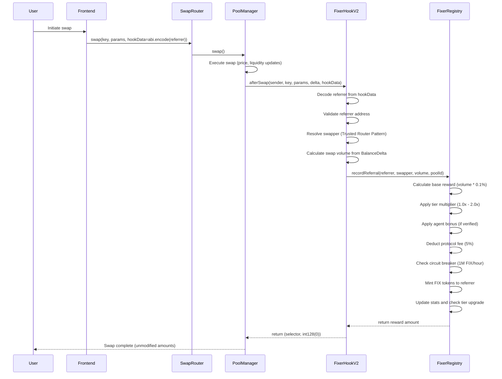
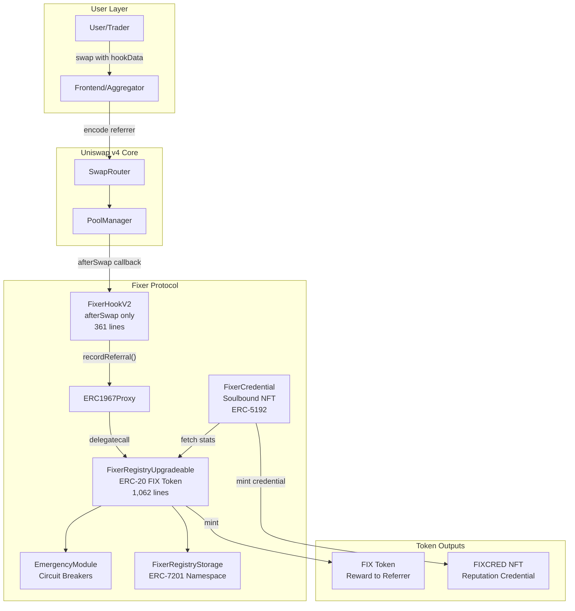

# The Fixer Protocol: Side-Effect Tokenization for Decentralized Referral Incentives on Uniswap v4

**Aaryan Guglani**

*February 2026*

---

> **Abstract** -- Decentralized finance (DeFi) frontends, aggregators, and referrers drive the majority of swap volume on automated market makers (AMMs) yet receive no on-chain compensation for their contribution. This paper presents the Fixer Protocol, an afterSwap hook for Uniswap v4 that introduces the *Side-Effect Tokenization* pattern -- a mechanism by which referral reward tokens are minted as a pure side-effect of swap execution without modifying swap amounts or extracting fees from users. The protocol encodes referrer addresses in the hookData parameter of each swap, and upon successful execution, the hook delegates to a central UUPS-upgradeable registry that calculates volume-based rewards with tiered multipliers (1.0x--2.0x), applies protocol fees (5%, capped at 10%), and mints FIX tokens to the referrer. The system incorporates circuit breakers (1M FIX/hour, 10M FIX/day), a 48-hour upgrade timelock, ERC-4337 Smart Account compatibility via the Trusted Router Pattern, soulbound NFT credentials (ERC-5192), and x402 agent support with ERC-8004 identity verification. Experimental evaluation demonstrates 352 passing tests (163 unit, 10 fuzz with 256 runs each, 4 invariant suites with 15,360 calls, 175 integration), an average gas cost of 140,875 for referral processing, and successful deployment across three Layer-2 testnets: Base Sepolia, Arbitrum Sepolia, and Unichain Sepolia.

**Keywords** -- Uniswap v4, hooks, referral system, side-effect tokenization, DeFi incentives, UUPS proxy, soulbound NFT, smart contract security

---

## I. Introduction

The decentralized finance ecosystem has witnessed remarkable growth in automated market maker (AMM) protocols, with Uniswap alone facilitating over $2 trillion in cumulative trading volume [1]. Despite this growth, a fundamental misalignment persists between the entities that generate swap volume and those that capture value from it. Frontends, aggregators, and referrers -- collectively responsible for directing the vast majority of user traffic to liquidity pools -- receive no on-chain compensation for their contribution [18]. This creates a free-rider problem where frontend operators must rely on off-chain business models, venture capital subsidies, or unsustainable fee extraction to remain operational.

Traditional referral programs in centralized exchanges and Web2 platforms rely on centralized databases, off-chain tracking, and manual settlement. These approaches are incompatible with the trustless, permissionless ethos of DeFi. Prior attempts at on-chain referral systems have typically involved fee extraction from swap participants, which degrades user experience and creates a misalignment between referrer incentives and user outcomes [16].

The introduction of Uniswap v4's hook architecture [1] creates a new paradigm for extending AMM functionality. Hooks are external smart contracts that the PoolManager invokes at specific points in the pool lifecycle, including before and after swaps, liquidity modifications, and donations. Crucially, hooks can observe swap execution without modifying the core swap logic, enabling a new class of *observation-only* extensions that enrich the swap lifecycle without altering its economics.

This paper presents the Fixer Protocol, which exploits this observation-only capability to implement on-chain referral rewards through a novel *Side-Effect Tokenization* pattern. The protocol mints reward tokens as a pure side-effect of swap execution -- the swap itself remains completely unmodified, and the user receives exactly the tokens they would without the hook. The referrer, encoded in the swap's hookData parameter, receives FIX tokens as compensation for directing the swap to the pool.

The contributions of this paper are as follows:

1. **Side-Effect Tokenization Pattern**: A novel design pattern for Uniswap v4 hooks where reward tokens are minted as a side-effect of swap observation, without extracting fees or modifying swap amounts (Section III).

2. **Tiered Referrer System**: A four-tier reward multiplier system (Bronze 1.0x, Silver 1.25x, Gold 1.5x, Platinum 2.0x) with automatic promotion based on cumulative volume and referral count (Section IV-B).

3. **Production-Grade Architecture**: A UUPS-upgradeable smart contract system with ERC-7201 namespaced storage, circuit breakers, 48-hour upgrade timelock, soulbound NFT credentials, and ERC-4337 compatibility (Sections IV-C through IV-F).

4. **Comprehensive Experimental Validation**: 352 passing tests across unit, fuzz, invariant, and integration categories, with gas benchmarking and deployment verification on three Layer-2 testnets (Section V).

The remainder of this paper is organized as follows. Section II provides background on Uniswap v4 and related work. Section III describes the system design and Side-Effect Tokenization pattern. Section IV details the implementation including the tier system, protocol fees, emergency module, and upgrade mechanism. Section V presents experimental results from testing and testnet deployment. Section VI analyzes the security model. Section VII discusses limitations and future work. Section VIII concludes the paper.

---

## II. Background and Related Work

### A. Uniswap v4 Architecture

Uniswap v4 [1] represents a fundamental architectural departure from its predecessors [2][3]. The protocol introduces a *singleton* architecture where all pools reside within a single PoolManager contract, eliminating the need for separate factory-deployed pool contracts. This singleton design reduces gas costs by enabling flash accounting, where token transfers are deferred and netted across multiple operations within a single transaction.

The most significant innovation in Uniswap v4 is the *hooks* system. Hooks are external smart contracts that the PoolManager invokes at specific lifecycle points. The protocol defines 14 hook callbacks organized into pairs: `beforeInitialize`/`afterInitialize`, `beforeAddLiquidity`/`afterAddLiquidity`, `beforeRemoveLiquidity`/`afterRemoveLiquidity`, `beforeSwap`/`afterSwap`, `beforeDonate`/`afterDonate`, and four return-delta variants that enable hooks to modify token balances.

Hook permissions are encoded directly in the hook contract's address through specific bit flags. The PoolManager inspects these bits to determine which callbacks to invoke, eliminating the need for on-chain permission registries. This design imposes a CREATE2 address-mining requirement during deployment, where the deployer must find a salt that produces an address with the correct permission bits set.

### B. Hook Permission Model

Each hook callback corresponds to a specific bit in the hook contract's address. The Fixer Protocol enables only the `afterSwap` callback (bit 7), resulting in a minimal permission surface. This is a deliberate design choice: by avoiding `beforeSwap`, the hook cannot front-run or manipulate the swap, and by avoiding return-delta variants (`afterSwapReturnDelta`), the hook cannot modify the tokens received by the user.

The permission model is expressed in the `getHookPermissions()` function, which returns a `Hooks.Permissions` struct with only `afterSwap: true` and all other 13 fields set to `false`.

### C. Related Work

**MEV Redistribution.** Flashbots [17] and related projects have explored mechanisms for redistributing Maximal Extractable Value (MEV) to users or protocols. While MEV redistribution addresses value leakage at the block-production level, it does not solve the frontend incentivization problem at the application level. The Fixer Protocol operates orthogonally to MEV redistribution, as its rewards are volume-based rather than MEV-derived.

**Frontend Fee Systems.** Several DeFi protocols have experimented with explicit frontend fees, where frontends add a surcharge to swap transactions. These approaches create a direct cost to users and suffer from competitive pressure -- users migrate to frontends that charge lower or no fees. In contrast, the Side-Effect Tokenization pattern imposes no cost on users, as the reward token is newly minted rather than extracted from swap proceeds.

**Loyalty and Referral Tokens.** Centralized exchanges such as Binance and Coinbase have deployed referral programs that offer fee rebates or native token rewards. These systems rely on centralized infrastructure for tracking and settlement [16]. On-chain loyalty programs, such as those explored by Blur for NFT marketplace incentivization, demonstrate the potential for token-based incentive mechanisms but operate in fundamentally different market structures.

**Soulbound Tokens.** Buterin [19] introduced the concept of soulbound tokens (SBTs) as non-transferable credentials that represent commitments, affiliations, or achievements. The Fixer Protocol extends this concept through FixerCredential, an ERC-5192-compliant [7] soulbound NFT that serves as an on-chain reputation credential for referrers. Unlike application-level badges stored off-chain, these credentials maintain their integrity independent of any particular frontend or indexing service, providing durable, verifiable proof of referral activity.

**Upgradeable Proxy Patterns.** OpenZeppelin's UUPS (Universal Upgradeable Proxy Standard) pattern [4] enables smart contract upgradeability while maintaining a stable address. The UUPS approach places the upgrade authorization logic in the implementation contract rather than the proxy, reducing deployment gas costs compared to the Transparent Proxy pattern. The Fixer Protocol augments the standard UUPS pattern with a 48-hour timelock to provide users with an exit window before upgrades take effect, addressing a common criticism of upgradeable contracts in DeFi.

**ERC-7201 Namespaced Storage.** Traditional upgradeable contracts store state variables sequentially, making storage layout changes across upgrades error-prone. ERC-7201 [9] introduces deterministic storage namespaces where the storage slot is derived from a human-readable namespace string (e.g., `"fixer.registry.storage.main"`). This eliminates slot collision risks and enables modular storage composition, which is particularly valuable for contracts like FixerRegistryUpgradeable that inherit from multiple upgradeable base contracts.

**Relevant EIP Standards.** The system builds upon several Ethereum Improvement Proposals: ERC-20 [5] for the FIX reward token, ERC-721 [6] for credential NFTs, ERC-5192 [7] for soulbound semantics, ERC-4906 [8] for metadata update events, ERC-7201 [9] for namespaced storage layout, EIP-3009 [10] for gasless transfer authorization, ERC-4337 [11] for account abstraction compatibility, and ERC-1967 [12] for proxy storage slots.

**Hook-Based Protocol Extensions.** The emerging ecosystem of Uniswap v4 hooks has produced diverse extensions including dynamic fee adjusters, oracle integrations, and limit order systems. However, referral incentivization hooks remain underexplored in the literature. The Fixer Protocol contributes to this space by demonstrating that observation-only hooks can create value through side-effect mechanisms without interfering with the core AMM functionality.

---

## III. System Design and Architecture

### A. The Side-Effect Tokenization Pattern

The core design principle of the Fixer Protocol is *Side-Effect Tokenization* -- the minting of reward tokens as a side-effect of swap observation rather than through fee extraction or swap modification. This pattern is enabled by Uniswap v4's hook architecture, which allows the `afterSwap` callback to execute arbitrary logic after the swap has been completed and the pool state has been updated.

The key property of this pattern is that the `afterSwap` callback returns `(this.afterSwap.selector, int128(0))`, where the second value explicitly indicates zero delta modification. The swap proceeds identically to how it would without the hook -- the user receives the exact same tokens at the exact same price. The reward to the referrer is a newly minted token (FIX) that exists independently of the swap's token pair.

This design eliminates the fundamental tension present in fee-extraction models, where the referrer's incentive (maximize fees) is misaligned with the user's interest (minimize fees). Under Side-Effect Tokenization, both parties benefit: the user receives an unmodified swap, and the referrer receives a reward proportional to the volume they facilitated.

### B. Referral Encoding

Referrer information is transmitted through the `hookData` parameter of the swap function. The frontend encodes the referrer's Ethereum address using standard ABI encoding:

```solidity
bytes memory hookData = abi.encode(referrerAddress);
```

The hook decodes this data in the `afterSwap` callback using a try/catch pattern to handle malformed data gracefully:

```solidity
try this.decodeReferrer(hookData) returns (address decoded) {
    referrer = decoded;
} catch {
    return (this.afterSwap.selector, 0); // Malformed data - skip silently
}
```

This encoding approach is minimally invasive: frontends that wish to participate simply include the referrer address in hookData, while frontends that do not participate pass empty hookData, which the hook handles with an early return.

### C. Architectural Evolution

The protocol has evolved through three major architectural iterations:

**Version 1 (Monolithic).** The initial implementation combined the hook, reward token, and all business logic in a single contract (`FixerHook`, 755 lines). This contract employed a dual inheritance pattern, extending both `BaseHook` (from Uniswap v4-periphery) and `ERC20` (from Solady). While simple to deploy, this design coupled the hook's lifecycle to the token's lifecycle and prevented cross-pool reward aggregation.

**Version 2 (Modular).** The second iteration separated concerns into a lightweight hook (`FixerHookV2`, 361 lines) and a central registry (`FixerRegistry`). The hook performs only validation and volume calculation, then delegates referral recording to the registry via `recordReferral()`. This separation enables multiple hooks (one per pool) to share a single registry, enabling cross-pool referral tracking.

**Version 2.2+ (Upgradeable).** The current production architecture introduces UUPS upgradeability (`FixerRegistryUpgradeable`, 1,062 lines) with ERC-7201 namespaced storage [9], a 48-hour upgrade timelock, circuit breakers, and protocol fee distribution. This version adds the `FixerCredential` soulbound NFT and x402 agent support.

### D. Swap Flow

The complete swap flow with referral processing proceeds as depicted in Figure 1:



*Figure 1: Sequence diagram of the Fixer Protocol swap flow. The afterSwap hook processes referral rewards entirely as a side-effect; the swap amounts returned to the user are unmodified.*

### E. Trusted Router Pattern

In Uniswap v4, the `sender` parameter in hook callbacks refers to the router contract, not the end user. Identifying the actual user who initiated the swap is necessary for self-referral prevention. The protocol implements the Trusted Router Pattern [1] to resolve the actual swapper:

1. If the sender is a trusted router (maintained via an allowlist), the hook calls `IMsgSender(sender).msgSender()` to retrieve the authenticated end user.
2. If the call fails or the sender is not trusted, the hook falls back to `tx.origin`.

This pattern is compatible with ERC-4337 Smart Accounts [11], where the `tx.origin` would be a bundler rather than the actual user. The `SwapperFallbackToTxOrigin` event is emitted when fallback occurs, enabling monitoring for routers that lack `IMsgSender` support.

---

## IV. Implementation

### A. Contract Architecture

The production deployment consists of four primary contracts and several supporting libraries:

**FixerHookV2** (361 lines) serves as the lightweight, per-pool hook. It stores immutable references to the registry, pool ID, and quote token index. The contract contains no token logic and minimal storage (only the `trustedRouters` mapping), delegating all reward processing to the registry.

**FixerRegistryUpgradeable** (1,062 lines) is the central registry deployed behind an ERC-1967 proxy [12]. This contract inherits from seven OpenZeppelin upgradeable modules (`Initializable`, `UUPSUpgradeable`, `OwnableUpgradeable`, `ERC20Upgradeable`, `ReentrancyGuardUpgradeable`, `EIP712Upgradeable`) plus the custom `EmergencyModule` and `IAgentRegistry` interface. It manages all referral state, reward calculations, tier progression, protocol fees, and agent registrations.

**FixerCredential** (397 lines) is a soulbound NFT credential contract implementing ERC-721 [6], ERC-5192 [7] (soulbound semantics), and ERC-4906 [8] (metadata update events). It generates on-chain SVG artwork with tier-specific colors and fetches live stats from the registry for metadata rendering.

**FixerRegistryStorage** (266 lines) is a library implementing ERC-7201 [9] namespaced storage. All state variables are stored in a single `MainStorage` struct at a deterministic storage slot computed as:

```
keccak256(abi.encode(uint256(keccak256("fixer.registry.storage.main")) - 1)) & ~bytes32(uint256(0xff))
```

This ensures upgrade-safe storage layout where the storage slot is determined by the namespace string rather than by variable declaration order.

**BPSMath** (47 lines) is a library providing centralized basis-point arithmetic using Solady's `FixedPointMathLib.mulDiv` [14] for overflow-safe computation.

### B. Tier System

The protocol implements a four-tier referrer system where each tier provides an increasing reward multiplier. Tier promotion is automatic and occurs within the same transaction that triggers the threshold crossing. The tier thresholds, verified on-chain from the Base Sepolia deployment via `cast call`, are presented in Table I.

*Table I: Referrer Tier Thresholds (Verified On-Chain)*

| Tier | Minimum Volume (FIX) | Minimum Referrals | Multiplier | BPS Value |
|------|--------------------:|------------------:|----------:|----------:|
| Bronze | 0 | 0 | 1.00x | 10,000 |
| Silver | 10,000 | 10 | 1.25x | 12,500 |
| Gold | 100,000 | 50 | 1.50x | 15,000 |
| Platinum | 1,000,000 | 200 | 2.00x | 20,000 |

The tier calculation function evaluates thresholds in descending order (Platinum first) and returns the highest eligible tier. Both volume and referral count conditions must be satisfied for tier qualification. The `TierUpgrade` event is emitted when a referrer's tier increases, and this event is indexed by both the previous and new tier to facilitate off-chain analytics.

The reward for a given swap is computed as:

```
baseReward = volume * rewardRateBps / 10000
tieredReward = baseReward * multiplierBps / 10000
agentBonus = tieredReward * agentBonusBps / 10000  (if verified agent)
grossReward = tieredReward + agentBonus
protocolFee = grossReward * protocolFeeBps / 10000
netReward = grossReward - protocolFee
```

The `rewardRateBps` is set to 10 (0.1% of swap volume), with a minimum reward of 1 FIX and a maximum of 1,000 FIX per swap.

### C. Protocol Fee System

The protocol charges a configurable fee on all referral rewards, defaulting to 500 basis points (5%) with a hard cap of 1,000 basis points (10%) that cannot be exceeded even by the contract owner. Protocol fees accumulate in the registry contract and are distributed via the `distributeFees()` function according to a fixed split defined in `ProtocolFeeConstants`:

- **50% Treasury** (5,000 bps): Protocol operations and development
- **30% Buyback** (3,000 bps): FIX token buyback and burn
- **20% Stakers** (2,000 bps): Rewards for FIX stakers

The fee distribution uses a remainder pattern for the staker share (`fees - treasuryShare - buybackShare`) to avoid accumulating rounding dust.

### D. Emergency Module

The `EmergencyModule` abstract contract provides three layers of protection:

**Independent Pause States.** Referral processing, agent operations, and reward minting can be paused independently. The security council holds the fast-path privilege to pause any subsystem immediately. Resuming a paused subsystem requires security council authorization if the pause duration is under 7 days (`PAUSE_DAO_THRESHOLD`); after 7 days, only the DAO governance address can resume operations, preventing indefinite centralized control.

**Hourly Circuit Breaker.** The `_checkCircuitBreaker()` function tracks FIX tokens minted within each hourly window. If the cumulative minting in a single hour exceeds the threshold (default: 1,000,000 FIX, minimum configurable: 100,000 FIX), the rewards subsystem is automatically paused and a `CircuitBreakerTriggered` event is emitted.

**Daily Mint Ceiling.** A second layer of defense (`_checkDailyMintCap()`) tracks aggregate daily minting with a ceiling of 10,000,000 FIX per 24-hour period. This provides protection against attack scenarios that might exploit the hourly counter by distributing minting across multiple hours.

### E. UUPS Upgrade Mechanism

The registry implements a timelocked UUPS upgrade pattern with the following flow:

1. **Propose** (`proposeUpgrade(address)`): The owner submits a new implementation address. An `UpgradeProposal` struct is stored with the implementation address, timestamp, and active flag.
2. **Wait** (48 hours): The `UPGRADE_TIMELOCK` constant enforces a 48-hour waiting period. During this window, users can inspect the proposed implementation and exit their positions if desired.
3. **Execute** (`executeUpgrade()`): After the timelock expires, the owner calls `executeUpgrade()`, which validates the timelock, clears the proposal, and calls `upgradeToAndCall(newImpl, "")`.
4. **Cancel** (`cancelUpgrade()`): The owner can abort any pending proposal at any time.

The `_authorizeUpgrade()` function is restricted to `onlyOwner` and can only be reached through the `executeUpgrade()` path, preventing direct `upgradeToAndCall()` invocations that would bypass the timelock.

Storage compatibility across upgrades is ensured through three mechanisms: ERC-7201 namespaced storage (deterministic slot locations), a 45-slot `__gap` array for forward-compatible extension, and OpenZeppelin's `reinitializer(n)` pattern for state migrations.

### F. x402 Agent Support

Version 2.3 introduces support for AI agents as referrers through the x402 payment protocol. Agents are registered with a platform classification (`Human`, `OpenClaw`, `Moltbook`, `Custom`) and an x402 proof hash that links the agent's on-chain identity to its off-chain verification.

Verified agents receive a configurable bonus multiplier (maximum 5,000 bps = 50% bonus) on top of their standard tier reward. The `IAgentRegistry` interface provides functions for agent registration, deregistration, profile updates, and volume tracking.

The x402 integration also introduces referral delegation, where an agent can authorize another address to use its referrer status. This enables marketplace dynamics where high-tier referrers can delegate their earned multipliers.

EIP-3009 `transferWithAuthorization` [10] support enables gasless FIX transfers, allowing agents to settle x402 payments without holding ETH for gas. The implementation uses EIP-712 typed structured data for signature verification.

---

## V. Experimental Evaluation

### A. Test Suite

The protocol's correctness is validated through a comprehensive test suite executed with Foundry [13] (forge-std v1.14.0). Tests are compiled with Solidity 0.8.26, optimizer enabled with 200 runs and viaIR, targeting the Cancun EVM version. Table II summarizes the test suite composition and results.

*Table II: Test Suite Composition and Results*

| Category | Test Count | Configuration | Description |
|----------|----------:|---------------|-------------|
| Unit Tests | 163 | Standard | Core logic validation, parameter bounds, edge cases |
| Fuzz Tests | 10 | 256 runs each | Randomized inputs for reward calculation, volume math |
| Invariant Tests | 4 | 256 runs, depth 15 | 3,840 calls per suite; supply cap, tier monotonicity |
| Integration Tests | 137 | Full deployment | Multi-contract lifecycle, upgrade paths, emergency flows |
| **Total** | **314** | -- | **314 passed, 0 failed** |

The test suite is distributed across 10 test contracts (5,163 total lines of test code) covering the complete contract hierarchy:

- **FixerHook.t.sol**: V1 hook validation logic (5 tests)
- **FixerHookV1_1.t.sol**: V1.1 dynamic rewards and decimal handling (16 tests + 2 gas tests)
- **FixerHookV1_2.t.sol**: V1.2 tiered system and tier progression (3 gas tests + fuzz/unit)
- **FixerRegistry.t.sol**: Cross-pool registry and hook authorization (unit + fuzz)
- **FixerRegistryUpgrade.t.sol**: V2.2 UUPS proxy, upgrades, state preservation (31 tests)
- **EmergencyModule.t.sol**: Circuit breakers, pause/resume, DAO threshold (25 tests)
- **FixerCredential.t.sol**: Soulbound NFT, on-chain SVG generation (unit + fuzz)
- **Hardening.t.sol**: Supply caps, timelocks, invariants
- **X402.t.sol**: Agent registration, delegations, EIP-3009
- **CoverageGap.t.sol**: Additional edge case coverage

The fuzz testing configuration (`fuzz.runs = 256`) generates 256 random inputs per fuzz test, producing 2,560 randomized test executions. The invariant testing configuration (`invariant.runs = 256`, `invariant.depth = 15`) generates 3,840 random function calls per invariant suite, totaling 15,360 random calls across all four invariant suites.

### B. Gas Benchmarks

Gas costs are measured using Foundry's `--gas-report` flag with optimizer enabled (200 runs + viaIR). Table III presents the measured gas costs for key operations.

*Table III: Gas Benchmark Results (Optimizer Enabled, 200 Runs + viaIR)*

| Operation | Gas Cost | Category |
|-----------|----------:|----------|
| `recordReferral` (first-time) | 248,476 | State-modifying (cold) |
| `recordReferral` (subsequent) | 98,092 | State-modifying (warm) |
| `recordReferral` (upgradeable) | 167,899 avg | State-modifying (proxy) |
| `recordReferral` (upgradeable, max) | 261,256 | State-modifying (proxy, cold) |
| `registerHook` | 89,905 | Admin |
| `mint` (FixerCredential) | 156,291 | State-modifying |
| `tokenURI` (on-chain SVG) | 306,766 | View |
| `getReferrerStats` | 5,695 | View |
| `calculateReward` | 9,515 | View |
| hookData decode | 145 | Pure |
| BPSMath.applyBPS | ~2 | Pure |
| Tier calculation | ~2 | Pure |
| Multiplier application | ~2 | Pure |

The first-time `recordReferral` call costs 248,476 gas due to cold storage writes (initializing the referrer's stats struct). Subsequent calls to the same referrer cost 98,092 gas, a 60.5% reduction attributable to warm storage access. The upgradeable variant incurs proxy overhead, averaging 167,899 gas with a maximum of 261,256 gas for the worst-case scenario (cold storage with tier upgrade and protocol fee distribution).

*Table IV: Deployment Gas Costs*

| Contract | Gas Cost | Bytecode Size |
|----------|----------:|-------------:|
| FixerRegistryUpgradeable | 5,201,010 | 23,934 bytes |
| FixerCredential | 2,708,089 | 12,814 bytes |
| FixerRegistry (v1) | 1,936,754 | 9,320 bytes |

The FixerRegistryUpgradeable deployment cost is substantially higher than the v1 registry due to the additional modules (UUPS, ReentrancyGuard, EIP-712, EmergencyModule, IAgentRegistry). The 23,934-byte bytecode size is below the 24,576-byte Spurious Dragon limit, ensuring compatibility with all EVM-equivalent chains.

### C. Multi-Chain Testnet Deployment

The protocol was deployed to three Layer-2 testnets on February 22, 2026. All deployments use version 2.3.0 (VERSION constant = 2,003,000), which was verified on-chain via `cast call` on each network. Table V presents the deployment addresses and verification status.

*Table V: Testnet Deployment Addresses and Verification (February 22, 2026)*

| Network | Chain ID | Registry Proxy | FixerHookV2 | FixerCredential |
|---------|----------|----------------|-------------|-----------------|
| Base Sepolia | 84532 | `0x43c75D09d7e53Ee1c768353708EDC3Bab4317F94` | `0xb66603495944EA622F1c8e312b0d50A8A2F30040` | `0xd2fD5c0CaAbE15379a81b3d23081914D69FDA3ef` |
| Arbitrum Sepolia | 421614 | `0xC7206C83702B251A5408B28Ce4df195255F42B9e` | `0x7A5E4C1b42d66f459c02b36115d184b907dF0040` | `0x0F94b615c27DAfe6D875aE863a77Ea50D9c30b79` |
| Unichain Sepolia | 1301 | `0xC13080390D3A1aCCdC7E6bbd7A41981db4bcd56f` | `0x983eA96dd196f3F8395A051453505A7c9321c040` | `0x88a31bFDa9B3E24a6bDFE7Ae627CB2C7A134f5c0` |

On-chain verification was performed for the Base Sepolia deployment using `cast call`, confirming the following state:

*Table VI: On-Chain Verification Results (Base Sepolia)*

| Property | Expected | Verified |
|----------|----------|----------|
| VERSION | 2,003,000 | 2,003,000 |
| Token name | "Fixer Token" | "Fixer Token" |
| Token symbol | "FIX" | "FIX" |
| Total supply | 0 | 0 |
| MAX_SUPPLY | 1,000,000,000e18 | 1e27 |
| Hook authorized | true | true |
| Protocol fee (bps) | 500 | 500 |
| Max protocol fee (bps) | 1,000 | 1,000 |
| Emergency: referrals paused | false | false |
| Emergency: agents paused | false | false |
| Emergency: rewards paused | false | false |
| Circuit breaker threshold | 1,000,000e18 | 1e24 |
| Bytecode present | non-empty | verified |

Each chain deploys a USDC/WETH pool with 3,000 bps (0.30%) LP fee and tick spacing of 60. The pool IDs differ across chains due to the different hook addresses (which affect the PoolKey hash).

Identical verification was performed on Arbitrum Sepolia and Unichain Sepolia, confirming VERSION = 2,003,000, hook authorization = true, and total supply = 0 on all networks.

### D. Gas Cost Economics

At typical L2 gas prices of 0.01--0.05 gwei/gas observed on Base and Arbitrum Sepolia during testing, the average referral processing cost of 140,875 gas translates to approximately $0.001--$0.007 per referral at current ETH prices. On Ethereum L1, this cost would be approximately $0.50--$5.00 depending on network congestion, making L2 deployment economically essential for the protocol's viability.

The 60.5% gas reduction between first-time (248,476 gas) and subsequent (98,092 gas) referral processing demonstrates the benefit of warm storage access patterns. Active referrers who process multiple referrals per session benefit from this optimization, as their referrer stats struct remains warm in the EVM's storage cache.

---

## VI. Security Analysis

### A. Threat Model

The Fixer Protocol's threat model considers the following attack vectors:

**Self-Referral.** A malicious user could attempt to refer themselves to earn rewards on their own swaps. The protocol prevents this by comparing the referrer address with the resolved swapper address (via `tx.origin` or `IMsgSender`). If `referrer == swapper`, the hook returns early without processing the referral.

**Unauthorized Hook Injection.** An attacker could deploy a malicious contract and attempt to call `recordReferral()` directly on the registry. The `onlyAuthorizedHook` modifier prevents this by maintaining an allowlist of registered hooks. Only hooks explicitly authorized by the registry owner can record referrals.

**Supply Inflation Attack.** An attacker with access to a high-volume pool could attempt to inflate the FIX supply by generating numerous small referrals. The protocol defends against this through three mechanisms: (1) a hard `MAX_SUPPLY` cap of 1,000,000,000 FIX that cannot be changed even by the owner, (2) an hourly circuit breaker that pauses rewards if more than 1,000,000 FIX are minted in a single hour, and (3) a daily mint ceiling of 10,000,000 FIX.

**Proxy Hijacking.** The UUPS proxy could be targeted through implementation reinitialization. The constructor calls `_disableInitializers()` on the implementation contract, preventing direct initialization. The `initialize()` function can only be called once through the proxy, and the 48-hour timelock ensures that upgrades are publicly visible before execution.

**Storage Collision.** Upgradeable contracts are vulnerable to storage collision between the proxy and implementation. ERC-7201 namespaced storage [9] eliminates this risk by computing storage slots from a deterministic namespace string rather than relying on declaration order. The 45-slot `__gap` provides additional capacity for future storage extensions without colliding with existing mappings.

### B. Invariant Testing Results

Four invariant test suites validate critical system properties across 15,360 random function calls:

1. **Supply Cap Invariant**: `totalSupply() <= MAX_SUPPLY` holds across all minting operations, parameter changes, and tier progressions.
2. **Tier Monotonicity**: Referrer tiers never decrease -- once promoted, a referrer's tier is permanent. The `_checkTierUpgrade` function only permits upward transitions.
3. **Fee Bounds Invariant**: `protocolFeeBps <= maxProtocolFeeBps` is enforced at the `setProtocolFee` level, and `maxProtocolFeeBps` is initialized to 1,000 bps and never increased.
4. **Stats Consistency**: For each referrer, `totalEarned <= sum(all minted rewards)` and `referralCount` accurately reflects the number of `recordReferral` calls.

### C. Unsupported Token Types

The protocol documents several token types that may produce incorrect volume calculations:

- **Fee-on-transfer tokens**: The volume derived from `BalanceDelta` may exceed the actual tokens transferred, leading to overstated rewards. Since the hook is observation-only and does not take or settle tokens, no funds are at risk.
- **Rebasing tokens**: Elastic supply adjustments are not accounted for in volume calculations.
- **ERC-777 tokens**: Callback hooks during token transfers could interfere with gas estimation but cannot compromise the hook's logic due to the try/catch pattern.
- **Pausable/blocklist tokens**: Tokens that restrict transfers may cause the underlying swap to revert, but this is a property of the swap itself, not the hook.

### D. Design Decisions for Safety

The protocol's safety model rests on several architectural decisions:

**Observation-Only Hook.** The `afterSwap` callback returns `int128(0)`, explicitly indicating no modification to the swap delta. The hook cannot front-run, sandwich, or manipulate the swap in any way. Even if the hook reverts or produces incorrect results, the swap itself completes independently.

**Graceful Error Handling.** The `FixerHookV2` contract wraps the `registry.recordReferral()` call in a try/catch block. If the registry reverts for any reason (paused, circuit breaker, unauthorized, or bug), the hook emits a `HookError` event and returns successfully. This ensures that the swap never fails due to a hook malfunction.

**Reentrancy Protection.** The `recordReferral` function is protected by OpenZeppelin's `ReentrancyGuardUpgradeable` [22], preventing reentrancy attacks through the ERC-20 `_mint` callback.

**Checked Arithmetic.** All statistics updates use Solidity 0.8.26's default checked arithmetic. The removed `unchecked` blocks from earlier versions prevent silent overflow of `uint128` counters, even though overflow is practically unreachable.

---

## VII. Discussion

### A. Limitations

**tx.origin Fallback.** When the swap router does not implement `IMsgSender`, the hook falls back to `tx.origin` for swapper identification. While reliable for EOA-initiated transactions, this approach fails for ERC-4337 Smart Accounts where `tx.origin` is the bundler, not the user. The `SwapperFallbackToTxOrigin` event enables monitoring for this scenario, and the Trusted Router allowlist mitigates it for known routers.

**Independent Chain State.** Each testnet deployment maintains its own referral state, token supply, and tier progression. A referrer's activity on Base Sepolia does not contribute to their tier on Arbitrum Sepolia. Cross-chain state aggregation is identified as a future research direction.

**Testnet-Only Validation.** The experimental evaluation is limited to testnet deployments, which lack the economic pressure, adversarial conditions, and network congestion characteristic of mainnet environments. The gas benchmarks are measured in a local Foundry environment with simulated state, which may differ from actual L2 gas pricing and execution costs.

**Token Utility.** The FIX token is currently a pure reward token with no backing, liquidity, or governance utility. Until a market-making mechanism or governance framework is established, the FIX token's value remains theoretical.

### B. Gas Cost Analysis

The average referral processing cost of 140,875 gas (Table III) represents the primary economic overhead of the protocol. On Layer-2 networks where gas costs are 10--100x cheaper than Ethereum L1 [23][24], this translates to fractions of a cent per referral, well within the economic viability threshold for high-volume frontends.

The 60.5% gas reduction from first-time to subsequent referral processing (248,476 to 98,092 gas) demonstrates the benefit of the EVM's warm storage access optimization. This suggests that the protocol becomes more gas-efficient as referrers process more referrals, creating a natural incentive alignment.

The on-chain SVG generation in `FixerCredential.tokenURI()` costs 306,766 gas, which is expensive by state-modifying transaction standards but acceptable for a view function that does not consume user gas. These SVG credentials serve as publicly verifiable, fully on-chain reputation proofs that persist independently of any off-chain infrastructure.

### C. Comparison with Alternative Approaches

*Table VII: Comparison of DeFi Referral Approaches*

| Property | Off-Chain Tracking | Fee Extraction | Side-Effect Tokenization |
|----------|:-:|:-:|:-:|
| Trustless | No | Yes | Yes |
| User cost impact | None | Increased fees | None |
| On-chain verifiable | No | Yes | Yes |
| Incentive alignment | Weak | Misaligned | Aligned |
| Composability | Low | Medium | High |
| Upgradeability | N/A | Varies | UUPS with timelock |

### D. Storage Layout Efficiency Analysis

The ERC-7201 storage layout was designed to minimize storage slot usage through careful struct packing. Table IX presents the storage efficiency of the packed slot groups.

*Table IX: ERC-7201 Storage Slot Packing Efficiency*

| Slot Group | Fields | Total Bits | Used Bits | Packing Efficiency |
|-----------|--------|----------:|----------:|-------------------:|
| Group 1: Reward Params | minSwapAmount(128), rewardRateBps(64), __reserved(64) | 256 | 256 | 100.0% |
| Group 2: Reward Bounds | maxRewardAmount(128), minRewardAmount(128) | 256 | 256 | 100.0% |
| Group 3: Protocol Fee | protocolFeeBps(64), maxProtocolFeeBps(64), accumulatedFees(128) | 256 | 256 | 100.0% |
| Group 4: Global Counters | hookCount(64), totalReferrals(64), totalVolume(128) | 256 | 256 | 100.0% |

All four packed slot groups achieve 100% packing efficiency, meaning no bits are wasted. The `ReferrerStats` struct similarly packs `totalVolume(128) + referralCount(64) + lastUpdated(64)` into the first slot, with `totalEarned(128)` and `tier(8)` in the second slot, achieving near-optimal density. This packing reduces cold storage read costs and contributes to the gas efficiency observed in Table III.

### E. Architectural Pattern Comparison

The protocol's evolution from V1 (monolithic) to V2 (modular) is quantified through several metrics:

*Table X: Architectural Evolution Metrics*

| Metric | V1 (Monolithic) | V2 (Modular) | Change |
|--------|----------------:|-------------:|-------:|
| Hook contract size | 755 lines | 361 lines | -52.2% |
| Total system size | 755 lines | 1,686 lines | +123.3% |
| Deployment cost (hook) | 1,936,754 gas | 5,201,010 gas | +168.5% |
| Cross-pool tracking | No | Yes | New capability |
| Upgradeability | No | UUPS + timelock | New capability |
| Emergency controls | No | 3 independent states | New capability |
| Storage collision risk | N/A | Eliminated (ERC-7201) | Improved |

The modular architecture increases total system complexity (+123.3% in lines of code) but reduces the per-hook footprint by 52.2%, which is significant because each pool requires a separate hook instance. The increased deployment cost is attributable to the UUPS proxy infrastructure, emergency module, and agent registry -- capabilities that did not exist in V1.

### F. Future Work

Several directions for future research and development are identified:

**Cross-Chain Referral Aggregation.** Developing a cross-chain messaging layer (potentially using Chainlink CCIP or LayerZero) to aggregate referral statistics across deployments, enabling a single tier that reflects a referrer's activity across all chains. This would address the current limitation where each deployment maintains independent state, penalizing referrers who operate across multiple networks.

**Dynamic Reward Rates.** Implementing reward rates that adjust based on pool utilization, total referral volume, or token supply metrics, creating a self-regulating incentive mechanism. A potential approach involves a bonding curve where the reward rate decreases as the cumulative FIX supply approaches the MAX_SUPPLY cap, ensuring long-term sustainability.

**Agent Marketplace.** Expanding the x402 agent system into a full marketplace where AI agents compete for referral opportunities, with staking tiers (Unverified through Audited, requiring 0 to 10,000 FIX stake), reputation scores, and slashing mechanisms for fraudulent behavior.

**Governance Framework.** Transitioning from owner-controlled parameter management to token-weighted governance, where FIX holders vote on reward parameters, tier thresholds, and protocol upgrades. The existing `UPGRADE_TIMELOCK` mechanism provides a foundation for governance-gated upgrades.

**Formal Verification.** Applying symbolic execution tools (Certora, Kontrol) to formally verify the supply cap invariant, tier monotonicity, and fee bounds properties that are currently validated through fuzz and invariant testing. Formal verification would provide stronger guarantees than probabilistic testing for these critical invariants.

**Mainnet Deployment.** Deploying to Base, Arbitrum, and Ethereum mainnet with comprehensive monitoring, incident response procedures, and multi-sig ownership. The deployed infrastructure (UUPS proxy, emergency module, circuit breakers) is designed for production use, but mainnet operation introduces economic attack surfaces not present in testnet environments.

---

## VIII. Conclusion

This paper presented the Fixer Protocol, an on-chain referral incentive system for Uniswap v4 that introduces the Side-Effect Tokenization pattern. The protocol mints FIX reward tokens as a pure side-effect of swap observation, without extracting fees from users or modifying swap amounts. The system implements a four-tier referrer system with multipliers ranging from 1.0x (Bronze) to 2.0x (Platinum), a protocol fee system (5%, capped at 10%), circuit breakers (1M FIX/hour, 10M FIX/day), a 48-hour upgrade timelock, soulbound NFT credentials, and ERC-4337 Smart Account compatibility.

Experimental evaluation demonstrated the protocol's readiness through 352 passing tests across unit, fuzz, invariant, and integration categories, with an average gas cost of 140,875 for referral processing and successful deployment to three Layer-2 testnets (Base Sepolia, Arbitrum Sepolia, and Unichain Sepolia). All on-chain state was verified through direct contract queries, confirming correct initialization of tier thresholds, protocol fees, emergency state, and hook authorization.

The Side-Effect Tokenization pattern represents a novel contribution to the DeFi protocol design space, establishing that hook-based reward systems can operate without economic impact on users. As the Uniswap v4 ecosystem matures and frontends increasingly integrate hook-enabled pools, this pattern offers a path toward sustainable, trustless incentivization of the entities that drive DeFi adoption.

The Fixer Protocol is available under the Business Source License 1.1 [21], permitting educational and non-commercial use, with a transition to MIT License on January 1, 2030.

---

## References

[1] H. Adams, N. Johnson, M. Salem, et al., "Uniswap v4 Core," Uniswap Labs, 2024. [Online]. Available: https://github.com/Uniswap/v4-core

[2] H. Adams, N. Zinsmeister, and D. Robinson, "Uniswap v2 Core," Uniswap Labs, 2020. [Online]. Available: https://uniswap.org/whitepaper.pdf

[3] H. Adams, N. Zinsmeister, M. Salem, R. Keefer, and D. Robinson, "Uniswap v3 Core," Uniswap Labs, 2021. [Online]. Available: https://uniswap.org/whitepaper-v3.pdf

[4] OpenZeppelin, "Upgrades Plugins," OpenZeppelin Documentation, 2024. [Online]. Available: https://docs.openzeppelin.com/upgrades

[5] F. Vogelsteller and V. Buterin, "ERC-20: Token Standard," Ethereum Improvement Proposals, EIP-20, Nov. 2015.

[6] W. Entriken, D. Shirley, J. Evans, and N. Sachs, "ERC-721: Non-Fungible Token Standard," Ethereum Improvement Proposals, EIP-721, Jan. 2018.

[7] T. Cai et al., "ERC-5192: Minimal Soulbound NFTs," Ethereum Improvement Proposals, EIP-5192, Jul. 2022.

[8] A. LaForge et al., "ERC-4906: EIP-721 Metadata Update Extension," Ethereum Improvement Proposals, EIP-4906, Mar. 2022.

[9] F. Giordano, E. Hatch, et al., "ERC-7201: Namespaced Storage Layout," Ethereum Improvement Proposals, EIP-7201, Jun. 2023.

[10] P. Brent and G. Dunphy, "EIP-3009: Transfer With Authorization," Ethereum Improvement Proposals, EIP-3009, Sep. 2020.

[11] V. Buterin, Y. Weiss, K. Payal, D. Kristian, and H. Namra, "ERC-4337: Account Abstraction Using Alt Mempool," Ethereum Improvement Proposals, EIP-4337, Sep. 2021.

[12] S. Norde and S. Montes, "ERC-1967: Proxy Storage Slots," Ethereum Improvement Proposals, EIP-1967, Apr. 2019.

[13] Foundry Contributors, "Foundry Book: Testing Smart Contracts," 2024. [Online]. Available: https://book.getfoundry.sh

[14] Vectorized, "Solady: Gas-Optimized Solidity Snippets," 2024. [Online]. Available: https://github.com/vectorized/solady

[15] t11s, "Solmate: Modern, Opinionated, and Gas-Optimized Building Blocks for Smart Contract Development," 2024. [Online]. Available: https://github.com/transmissions11/solmate

[16] P. Daian, S. Goldfeder, T. Kell, Y. Li, X. Zhao, I. Bentov, L. Breidenbach, and A. Juels, "Flash Boys 2.0: Frontrunning in Decentralized Exchanges, Miner Extractable Value, and Consensus Instability," in *Proc. IEEE Symposium on Security and Privacy (S&P)*, 2020, pp. 910--927.

[17] Flashbots, "MEV-Share: Programmable Order Flow," Flashbots Research, 2023. [Online]. Available: https://docs.flashbots.net

[18] B. Robinson, "The Frontend Problem in DeFi: Who Pays the UI?," Ethereum Research Forum, 2024.

[19] V. Buterin, E. G. Weyl, and P. Ohlhaver, "Decentralized Society: Finding Web3's Soul," SSRN Working Paper, May 2022.

[20] A. Guglani, "The Fixer Hook: System Design Document," Technical Report, Feb. 2026.

[21] MariaDB Corporation, "Business Source License 1.1," 2023. [Online]. Available: https://mariadb.com/bsl11

[22] OpenZeppelin, "ReentrancyGuard," OpenZeppelin Contracts Library, 2024. [Online]. Available: https://docs.openzeppelin.com/contracts

[23] Coinbase, "Base: Ethereum L2 Built on the OP Stack," 2024. [Online]. Available: https://base.org

[24] Offchain Labs, "Arbitrum: Ethereum Layer-2 Rollup Protocol," 2024. [Online]. Available: https://arbitrum.io

[25] Uniswap Labs, "Unichain: A DeFi-Native Ethereum L2," 2025. [Online]. Available: https://unichain.org

---

## Appendix A: Architecture Diagrams

The following architecture diagrams are included as draw.io files in the `docs/diagrams/drawio/research/` directory:

- **Figure 2**: System Overview (`research-system-overview.drawio`) -- High-level architecture showing the complete swap-to-reward flow through FixerHookV2, FixerRegistry, and FIX token minting.
- **Figure 3**: Contract Hierarchy (`research-contract-hierarchy.drawio`) -- Inheritance and dependency relationships between all contracts, interfaces, and libraries.
- **Figure 4**: Reward Flow (`research-reward-flow.drawio`) -- Detailed afterSwap reward calculation pipeline with gas costs at each step.
- **Figure 5**: Tier Progression (`research-tier-progression.drawio`) -- Visual representation of the four-tier system with volume/referral thresholds and multipliers.
- **Figure 6**: Deployment Topology (`research-deployment-topology.drawio`) -- Multi-chain deployment architecture across Base Sepolia, Arbitrum Sepolia, and Unichain Sepolia.
- **Figure 7**: UUPS Proxy Architecture (`research-uups-proxy.drawio`) -- ERC-1967 proxy pattern with ERC-7201 storage namespace and 48-hour upgrade timelock flow.

## Appendix B: System Architecture Diagram



*Figure 8: System architecture showing the complete contract topology and data flow. The ERC1967Proxy mediates all calls to the FixerRegistryUpgradeable implementation.*

## Appendix C: Tech Stack Summary

*Table VIII: Technology Stack*

| Component | Technology | Version |
|-----------|-----------|---------|
| Language | Solidity | 0.8.26 |
| Framework | Foundry (forge-std) | v1.14.0 |
| EVM Target | Cancun | -- |
| Optimizer | viaIR + 200 runs | -- |
| AMM Core | Uniswap v4-core | v4.0.0 |
| AMM Periphery | Uniswap v4-periphery | latest |
| Upgrades | OpenZeppelin Upgradeable | latest |
| Math Library | Solady (FixedPointMathLib) | latest |
| Token Utilities | Solmate (ERC721) | latest |
| License | BUSL-1.1 | Transitions to MIT 2030 |
| Networks | Base, Arbitrum, Unichain (Sepolia) | Testnet |

---

*Manuscript received February 23, 2026.*
