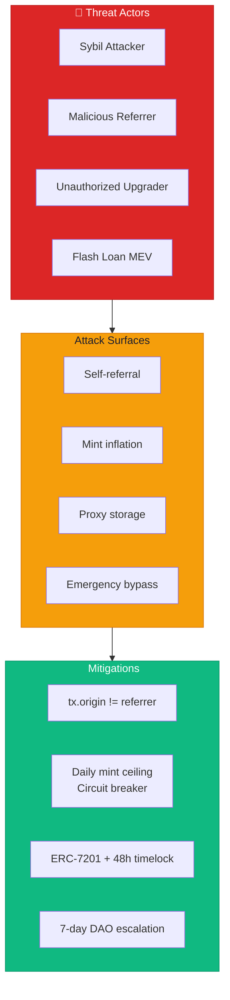

# Security Analysis

> Threat Model and Mitigation Strategies for FixerHook Protocol (v1.0 + v2.2)

**Last Updated:** February 6, 2026  
**Covers:** FixerHook v1, FixerRegistryUpgradeable v2.2.1, EmergencyModule

---

## Threat Model Overview



| Category | Risk Level | Status | Version |
|----------|------------|--------|---------|
| Self-Referral | Medium | Mitigated | v1.0 |
| Sybil Attacks | Medium | Partially Mitigated | v1.0 |
| Reentrancy | Low | Safe (ReentrancyGuard) | v2.2 |
| Access Control | Low | Safe (OwnableUpgradeable + UUPS) | v2.2 |
| Gas Griefing | Low | Safe | v1.0 |
| Proxy Initialization | Medium | Mitigated (atomic init) | v2.2 |
| Storage Collision | Low | Safe (ERC-7201) | v2.2 |
| Unauthorized Upgrade | Medium | Mitigated (_authorizeUpgrade) | v2.2 |
| Emergency Abuse | Medium | Mitigated (DAO threshold) | v2.4 |
| Circuit Breaker Bypass | Low | Safe (per-hour tracking) | v2.4 |
| Protocol Fee Manipulation | Low | Safe (hardcoded max) | v2.2 |

---

## Attack Vectors Analysis

### 1. Self-Referral Prevention

**Attack:** User sets themselves as referrer to earn tokens on their own swaps.

**Mitigation:**
```solidity
if (referrer != tx.origin) {
    _mint(referrer, REWARD_AMOUNT);
}
```

**Analysis:**
- `tx.origin` captures the EOA that initiated the transaction
- Even if user swaps through a router contract, `tx.origin` identifies them
- Effective against direct self-referral

**Limitation:** 
- User with two wallets can still cross-refer
- See Sybil Attack section

---

### 2. Sybil Attack (Multi-Wallet Farming)

**Attack:** User creates multiple wallets and swaps between them to farm REF tokens.

**Current Mitigation:** None in MVP

**Proposed Solutions:**

| Solution | Complexity | Effectiveness |
|----------|------------|---------------|
| Minimum swap volume threshold | Low | Medium |
| Cooldown per referrer | Medium | Medium |
| Reputation scoring | High | High |

**Volume-Based Mitigation:**
```solidity
// Only reward swaps above threshold
int256 swapAmount = params.amountSpecified;
if (swapAmount < 0) swapAmount = -swapAmount;
if (uint256(swapAmount) < MIN_SWAP_AMOUNT) {
    return (BaseHook.afterSwap.selector, 0);
}
```

---

### 3. tx.origin Security Considerations

**Common Warning:** `tx.origin` should never be used for authentication.

**Our Use Case:** We use `tx.origin` for **anti-gaming**, not authentication.

| Use | Safe? | Rationale |
|-----|-------|-----------|
| Authentication | No | Vulnerable to phishing |
| Anti-gaming check | Yes | Prevents simple self-referral |

**Why it's safe here:**
- We're not authorizing any privileged action
- Worst case: a false negative (legitimate referral blocked)
- No funds at risk from tx.origin usage

---

### 4. Zero Address Check

**Attack:** Submit `address(0)` as referrer.

**Mitigation:**
```solidity
if (referrer != address(0)) {
    _mint(referrer, REWARD_AMOUNT);
}
```

**Result:** Minting to zero address would burn tokens. Check prevents this.

---

### 5. Reentrancy Analysis

**Risk Level:** Low

**Analysis:**
- ERC20 `_mint` is the only state change
- No external calls after state changes
- Follows checks-effects-interactions pattern

**Solmate ERC20 _mint:**
```solidity
function _mint(address to, uint256 amount) internal virtual {
    totalSupply += amount;               // State change
    balanceOf[to] += amount;             // State change
    emit Transfer(address(0), to, amount); // Event (no external call)
}
```

No reentrancy vector exists.

---

### 6. Gas Griefing

**Attack:** Submit malformed `hookData` to cause revert and waste gas.

**Mitigation:** `abi.decode` will revert on invalid data, but:
- User pays for their own failed transaction
- No griefing vector against other users
- Pool operation is not disrupted

---

## Permission Security

### Minimal Hook Permissions

We only enable `afterSwap`, reducing attack surface:

```solidity
Hooks.Permissions({
    beforeSwap: false,      // Can't front-run
    afterSwap: true,        // Only observation
    beforeSwapReturnDelta: false,  // Can't modify amounts
    afterSwapReturnDelta: false    // Can't modify results
});
```

**Benefit:** Hook cannot:
- Block or delay swaps
- Modify swap parameters
- Steal user funds
- Front-run transactions

---

## v2.2 UUPS Proxy Security

### 7. Initializer Front-Running

**Attack:** Attacker calls `initialize()` on the implementation contract before the deployer.

**Mitigation:**
- `DeployUpgradeable.s.sol` deploys proxy + calls `initialize()` atomically in a single transaction
- Implementation contract cannot be initialized directly (OZ `_disableInitializers()` in constructor)

```solidity
// In FixerRegistryUpgradeable constructor
/// @custom:oz-upgrades-unsafe-allow constructor
constructor() {
    _disableInitializers();
}
```

---

### 8. Unauthorized Upgrade

**Attack:** Malicious actor upgrades the implementation to a backdoored contract.

**Mitigation:**
```solidity
function _authorizeUpgrade(address newImplementation) internal override onlyOwner {}
```

- Only the `owner` (set during `initialize()`) can call `upgradeToAndCall()`
- UUPS pattern keeps upgrade logic in the implementation, not the proxy
- If upgrade logic is removed from a new implementation, the proxy becomes permanently non-upgradeable (safety feature)

---

### 9. Storage Collision (ERC-7201)

**Attack:** Upgraded implementation uses different storage layout, corrupting state.

**Mitigation:**
- All mutable state lives in `FixerRegistryStorage` using ERC-7201 namespaced storage
- Storage slot computed deterministically: `keccak256(abi.encode(uint256(keccak256("fixer.registry.storage.main")) - 1)) & ~bytes32(uint256(0xff))`
- 50-slot `__gap` reserve for future field additions
- No implicit storage variables in the contract (all inherited OZ contracts use their own ERC-7201 namespaces)

---

### 10. Reentrancy (v2 Enhanced)

**Risk Level:** Low (mitigated with OZ ReentrancyGuardUpgradeable)

**v1 Analysis:** Relied on checks-effects-interactions pattern only.

**v2 Mitigation:**
```solidity
function recordReferral(...) external nonReentrant whenNotPausedReferrals whenNotPausedRewards { ... }
```

- `nonReentrant` modifier from OZ prevents recursive calls
- Combined with EmergencyModule pause guards
- `_mint` (ERC20Upgradeable) has no external call vector

---

## v2.4 Emergency Module Security

### 11. Emergency Pause Mechanism

**Design:** Three independent pause states for granular control.

| Pause State | Affected Functions | Guard Error |
|-------------|-------------------|-------------|
| `pausedReferrals` | `recordReferral()` | `ReferralSystemPaused()` |
| `pausedAgents` | Agent operations | `AgentSystemPaused()` |
| `pausedRewards` | Reward minting | `RewardSystemPaused()` |

**Access Control:**
- **Pause:** Security council only (fast-path emergency response)
- **Resume (< 7 days):** Security council can resume
- **Resume (> 7 days):** DAO governance required (`DAOVoteRequiredForResume`)

This prevents a compromised security council from maintaining indefinite pause (denial-of-service).

---

### 12. Circuit Breaker

**Attack:** Exploit mints excessive FIX tokens within a short window.

**Mitigation:**
```solidity
function _checkCircuitBreaker(uint256 mintAmount) internal {
    if (block.timestamp - s.emergency.hourStartedAt > 1 hours) {
        s.emergency.mintedThisHour = 0;
        s.emergency.hourStartedAt = block.timestamp;
    }
    s.emergency.mintedThisHour += mintAmount;
    if (s.emergency.mintedThisHour > s.emergency.circuitBreakerThreshold) {
        s.emergency.pausedRewards = true;
        emit CircuitBreakerTriggered("Excessive minting", s.emergency.mintedThisHour);
    }
}
```

- Default threshold: 1,000,000 FIX per hour
- Auto-pauses rewards if breached
- Requires manual resume (security council or DAO)
- Threshold adjustable by owner

---

### 13. Security Council Trust Model

**Risk:** Security council is a trusted role that can pause the protocol.

**Mitigations:**
- Council should be a multisig (e.g., 3/5 Safe)
- Can only **pause**, not upgrade or drain funds
- DAO can override after 7 days
- Council address changeable by owner (`setSecurityCouncil()`)
- Zero-address check prevents accidental removal

---

## Protocol Fee Security

### 14. Fee Manipulation

**Attack:** Owner sets protocol fee to 100% to steal all rewards.

**Mitigation:**
```solidity
uint64 public constant MAX_PROTOCOL_FEE_BPS = 1000; // 10% hard cap

function setProtocolFee(uint64 newFeeBps) external onlyOwner {
    if (newFeeBps > MAX_PROTOCOL_FEE_BPS) revert FeeTooHigh();
    ...
}
```

- Hardcoded 10% maximum (1000 bps) — cannot be changed even by owner
- Default: 5% (500 bps)
- Fee distribution: 50% treasury, 30% buyback, 20% stakers (hardcoded ratios)

---

## Recommendations

### For MVP (v1.0 — Implemented)
1. Self-referral check (implemented)
2. Zero address check (implemented)
3. Document Sybil risk to users

### For Production (v2.2 — Implemented)
1. ~~Add minimum swap volume threshold~~ [PASS] Implemented (configurable `minSwapAmount`)
2. ~~Consider per-referrer cooldowns~~ Deferred to v2.6 (team module)
3. ~~Implement governance for parameter changes~~ [PASS] Emergency module + owner governance
4. ~~Add emergency pause functionality~~ [PASS] EmergencyModule with 3 independent states
5. UUPS proxy with ERC-7201 storage [PASS]
6. ReentrancyGuard on all state-changing functions [PASS]
7. Circuit breaker for anomalous minting [PASS]
8. Protocol fee hardcap [PASS]

---

## Audit Checklist

### v1.0 (FixerHook + FixerRegistry)
- [x] All state changes follow checks-effects-interactions
- [x] No unchecked external calls
- [x] Hook permissions are minimal
- [x] tx.origin usage is documented and justified
- [x] Token minting cannot overflow (Solmate handles this)
- [x] No selfdestruct or delegatecall vulnerabilities

### v2.2 (FixerRegistryUpgradeable)
- [x] `initialize()` protected by `initializer` modifier
- [x] `_disableInitializers()` called in constructor
- [x] `_authorizeUpgrade()` restricted to `onlyOwner`
- [x] ERC-7201 namespaced storage prevents collision
- [x] 50-slot `__gap` reserve for future upgrades
- [x] `ReentrancyGuardUpgradeable` on `recordReferral()`
- [x] Protocol fee capped at 10% (hardcoded)
- [x] Fee distribution ratios hardcoded (50/30/20)

### v2.4 (EmergencyModule)
- [x] Security council can pause all 3 states independently
- [x] DAO required to resume after 7-day threshold
- [x] Circuit breaker auto-pauses on excessive minting
- [x] Double-pause prevention (`AlreadyPaused` errors)
- [x] Zero-address checks on council/governance setters
- [x] 25 dedicated tests covering all emergency flows

---

## References

- [Uniswap v4 Security Considerations](https://docs.uniswap.org/)
- [Solmate ERC20 Implementation](https://github.com/transmissions11/solmate)
- [OpenZeppelin Security Best Practices](https://docs.openzeppelin.com/contracts/)
