# System Design Document

> The FixerHook Protocol — Technical Architecture Specification (v1.0 + v2.2)

**Last Updated:** February 6, 2026

---

## Table of Contents

1. [Executive Summary](#executive-summary)
2. [High-Level Design (HLD)](#high-level-design-hld)
3. [Low-Level Design (LLD)](#low-level-design-lld)
4. [Data Flow Diagrams](#data-flow-diagrams)
5. [Component Specifications](#component-specifications)
6. [Edge Cases & Error Handling](#edge-cases--error-handling)

---

## Executive Summary

### Problem Statement

Liquidity pools in DeFi lack native mechanisms for incentivizing organic growth through referrals. Frontend aggregators and dApps have no on-chain way to earn rewards for routing users to specific pools.

### Solution

The **Referral Hook** introduces an **on-chain affiliate system** for Uniswap v4 pools. By leveraging the new hook architecture, we create a side-effect mechanism that:

1. Decodes referral data from swap transactions
2. Validates the referrer to prevent exploitation
3. Mints reward tokens to legitimate referrers

### Design Principles

| Principle | Implementation |
|-----------|----------------|
| **Non-Invasive** | Swap execution unchanged; hook operates as side-effect |
| **Gas Efficient** | Single hook permission (`afterSwap`); minimal storage |
| **Composable** | Standard ERC-20 rewards; integrates with any ecosystem |
| **Sybil-Resistant** | Built-in validation prevents basic gaming |

---

## High-Level Design (HLD)

### 1. System Actors

```
+-------------+---------------------------------------------------+
|   Actor     |   Responsibility                                  |
+-------------+---------------------------------------------------+
|  Swapper    |  Initiates swap; optionally includes referrer     |
|  Referrer   |  Earns REF tokens for referred swaps              |
|  Frontend   |  Encodes referrer address into hookData           |
|  PoolManager|  Executes swap; calls hook lifecycle functions    |
|  Hook       |  Validates referrals; mints rewards               |
+-------------+---------------------------------------------------+
```

### 2. Architectural Pattern: Side-Effect Tokenization

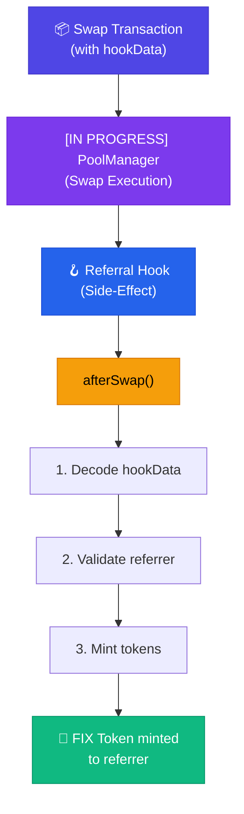

**Key Insight:** The hook doesn't modify swap parameters or extract fees. It simply observes the completed swap and triggers a reward if valid referral data exists.

### 3. Component Overview

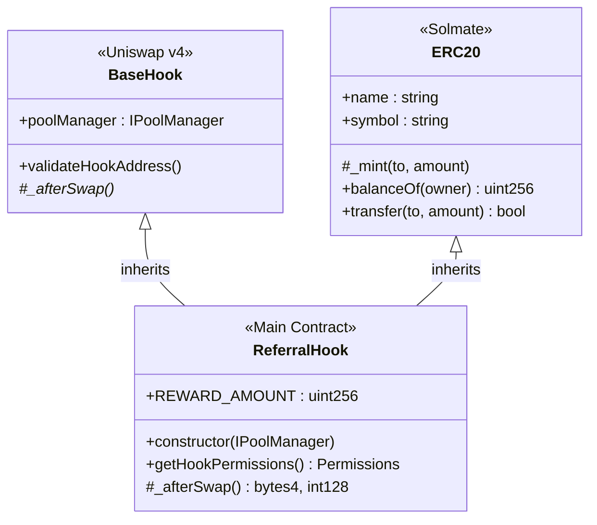

### 4. Workflow Sequence

```mermaid
sequenceDiagram
    participant F as 🖥️ Frontend
    participant R as 🔀 SwapRouter
    participant PM as 🏊 PoolManager
    participant H as 🪝 ReferralHook

    F->>F: User clicks "Swap with Referral"
    F->>R: encode(referrer) in hookData
    R->>PM: swap(key, params, hookData)
    PM->>H: afterSwap() + hookData
    
    rect rgb(30, 41, 59)
        Note over H: Validation Pipeline
        H->>H: 1. decode(hookData) → referrer
        H->>H: 2. referrer ≠ address(0)?
        H->>H: 3. referrer ≠ tx.origin?
        H->>H: 4. _mint(referrer, REWARD)
    end
    
    H-->>PM: return selector
    PM-->>R: swap complete
    R-->>F: transaction confirmed
```

---

## Low-Level Design (LLD)

### 1. Contract Specification

```solidity
/**
 * @title ReferralHook
 * @notice On-chain affiliate rewards for Uniswap v4 pools
 * @dev Inherits BaseHook for Uniswap integration and ERC20 for token minting
 */
contract ReferralHook is BaseHook, ERC20 {
    
    /// @notice Fixed reward amount per successful referral (10 tokens)
    uint256 public constant REWARD_AMOUNT = 10 * 1e18;
    
    /// @param _manager Address of the Uniswap v4 PoolManager
    constructor(IPoolManager _manager) 
        BaseHook(_manager) 
        ERC20("Referral Token", "REF", 18) 
    {}
}
```

### 2. Hook Permissions

```solidity
function getHookPermissions() public pure override returns (Hooks.Permissions memory) {
    return Hooks.Permissions({
        beforeInitialize: false,          // Not needed
        afterInitialize: false,           // Not needed
        beforeAddLiquidity: false,        // Not needed
        beforeRemoveLiquidity: false,     // Not needed
        afterAddLiquidity: false,         // Not needed
        afterRemoveLiquidity: false,      // Not needed
        beforeSwap: false,                // Not needed
        afterSwap: true,                  // REQUIRED - where magic happens
        beforeDonate: false,              // Not needed
        afterDonate: false,               // Not needed
        beforeSwapReturnDelta: false,     // Not modifying deltas
        afterSwapReturnDelta: false,      // Not modifying deltas
        afterAddLiquidityReturnDelta: false,
        afterRemoveLiquidityReturnDelta: false
    });
}
```

**Rationale:** We only enable `afterSwap` because:
1. Rewards are issued **after** successful swap completion
2. We don't modify swap parameters (no `beforeSwap` needed)
3. We don't alter token deltas (no `ReturnDelta` flags needed)

### 3. Core Logic: `_afterSwap()`

```solidity
function _afterSwap(
    address sender,
    PoolKey calldata key,
    IPoolManager.SwapParams calldata params,
    BalanceDelta delta,
    bytes calldata hookData
) internal override returns (bytes4, int128) {
    
    // STEP 1: Check if referral data exists
    // If hookData is empty, this is a normal swap without referral
    // Skip processing to save gas
    if (hookData.length > 0) {
        
        // STEP 2: Decode the referrer address
        // hookData format: abi.encode(address referrer)
        // This is a 32-byte padded address
        address referrer = abi.decode(hookData, (address));
        
        // STEP 3: Validation Checks
        // 3a. Ensure referrer is not zero address
        // 3b. Prevent self-referral (tx.origin check)
        //
        // Note: tx.origin used here to identify the actual user
        // since 'sender' might be a router contract
        if (referrer != address(0) && referrer != tx.origin) {
            
            // STEP 4: Mint Reward Tokens
            // _mint is inherited from Solmate ERC20
            // Creates new tokens directly to the referrer
            _mint(referrer, REWARD_AMOUNT);
        }
    }
    
    // STEP 5: Return required values
    // - Selector: Required for hook validation
    // - int128(0): No delta modifications
    return (BaseHook.afterSwap.selector, 0);
}
```

### 4. Data Encoding Specification

#### Format

| Field | Type | Size | Description |
|-------|------|------|-------------|
| referrer | `address` | 32 bytes | ABI-encoded referrer address |

#### Encoding (Solidity)

```solidity
bytes memory hookData = abi.encode(referrerAddress);
```

#### Encoding (TypeScript/Ethers.js)

```typescript
import { ethers } from 'ethers';

const hookData = ethers.utils.defaultAbiCoder.encode(
    ['address'],
    [referrerAddress]
);
```

#### Encoding (JavaScript/Viem)

```javascript
import { encodeAbiParameters, parseAbiParameters } from 'viem';

const hookData = encodeAbiParameters(
    parseAbiParameters('address'),
    [referrerAddress]
);
```

### 5. State Variables

| Variable | Type | Visibility | Purpose |
|----------|------|------------|---------|
| `REWARD_AMOUNT` | `uint256` | `public constant` | Fixed token reward (10e18) |
| `name` | `string` | (ERC20) | Token name: "Referral Token" |
| `symbol` | `string` | (ERC20) | Token symbol: "REF" |
| `decimals` | `uint8` | (ERC20) | Token decimals: 18 |
| `balanceOf` | `mapping` | (ERC20) | Token balances |
| `totalSupply` | `uint256` | (ERC20) | Total minted tokens |

---

## Data Flow Diagrams

### Happy Path: Successful Referral

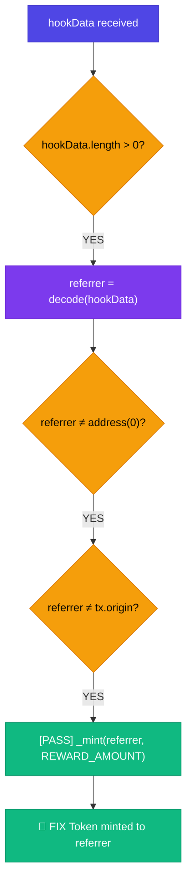

### Edge Case: No Referral Data

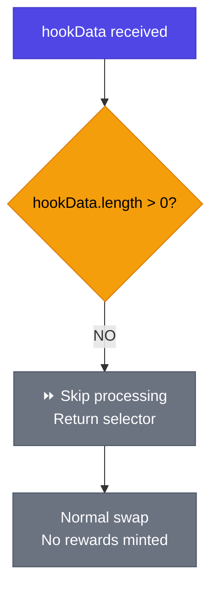

### Edge Case: Self-Referral Attempt

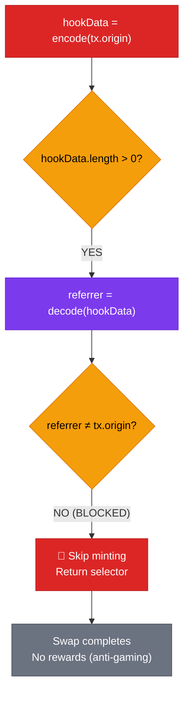

---

## Component Specifications

### Inheritance Hierarchy

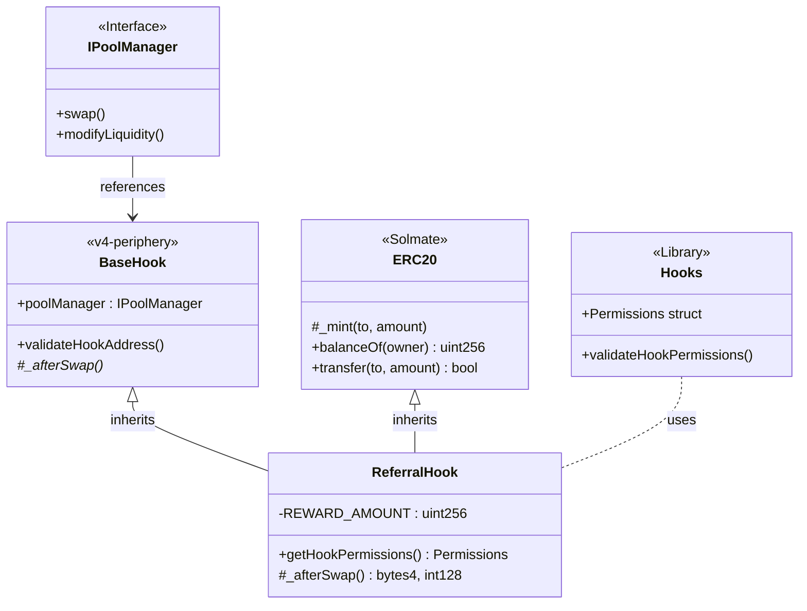

### Dependency Matrix

| Dependency | Source | Version | Purpose |
|------------|--------|---------|---------|
| `v4-core` | Uniswap | latest | PoolManager, types, libraries |
| `v4-periphery` | Uniswap | latest | BaseHook abstract contract |
| `solmate` | Transmissions11 | latest | Gas-optimized ERC20 |

---

## Edge Cases & Error Handling

### Comprehensive Edge Case Analysis

| # | Scenario | Input | Expected Behavior | Gas Impact |
|---|----------|-------|-------------------|------------|
| 1 | Normal swap (no referral) | `hookData.length == 0` | Skip processing, return selector | Minimal |
| 2 | Valid referral | `referrer != 0 && referrer != tx.origin` | Mint 10 REF to referrer | +~23k gas |
| 3 | Zero address referrer | `referrer == address(0)` | Skip minting | Minimal |
| 4 | Self-referral attempt | `referrer == tx.origin` | Skip minting | Minimal |
| 5 | Malformed hookData | Cannot decode | Revert (abi.decode failure) | N/A |
| 6 | Multiple swaps same referrer | Valid referrer, N swaps | Mint N x 10 REF | Linear |

### Error Scenarios

```solidity
// SCENARIO: Malformed hookData
// If hookData doesn't decode to a valid address, abi.decode will revert
// This is acceptable behavior - invalid data should fail

// SCENARIO: hookData too short
// hookData.length < 32 bytes
// Current: Would revert in abi.decode
// Optional improvement: Add length check

if (hookData.length >= 32) {
    address referrer = abi.decode(hookData, (address));
    // ... validation ...
}
```

---

## Gas Analysis

### Operation Costs (Estimates)

| Operation | Gas Cost | Notes |
|-----------|----------|-------|
| `hookData.length` check | ~3 | CALLDATASIZE |
| `abi.decode` | ~200 | CALLDATACOPY + memory |
| Zero address check | ~3 | ISZERO |
| tx.origin check | ~5 | ORIGIN + EQ |
| `_mint()` | ~22,000 | SSTORE (cold slot) |
| **Total (with mint)** | **~22,300** | |
| **Total (no mint)** | **~250** | |

### Comparison

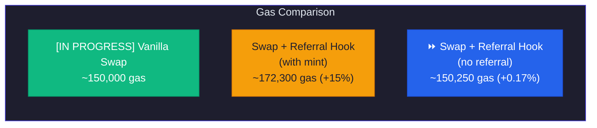

> **Learning Note:** The referral hook adds only **~250 gas** when no referral is present (the `hookData.length == 0` early return path). The ~22,300 gas overhead for minting is dominated by the cold `SSTORE` for the ERC20 balance update.

---

## v2.2 Architecture: UUPS Upgradeable Registry

### Component Hierarchy (v2.2)

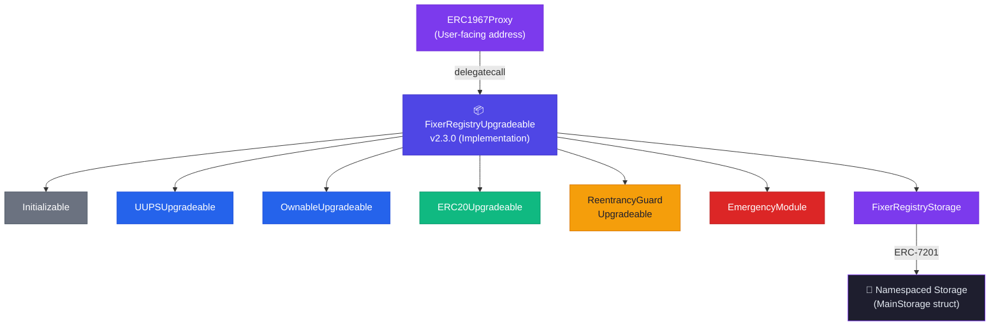

### Storage Architecture (ERC-7201)

```mermaid
flowchart TD
    subgraph storage["FixerRegistryStorage.MainStorage @ ERC-7201 Computed Slot"]
        direction TB
        subgraph packed1["Slot Group 1: Reward Parameters (1 slot packed)"]
            P1["uint128 minSwapAmount\nuint64 rewardRateBps\nuint64 __reserved1"]
        end
        subgraph packed2["Slot Group 2: Reward Bounds (1 slot packed)"]
            P2["uint128 maxRewardAmount\nuint128 minRewardAmount"]
        end
        subgraph packed3["Slot Group 3: Protocol Fee (1 slot packed)"]
            P3["uint64 protocolFeeBps (500 = 5%)\nuint64 maxProtocolFeeBps (1000 = 10%)\nuint128 accumulatedFees"]
        end
        subgraph packed4["Slot Group 4: Tier Thresholds (1 slot packed)"]
            P4["uint64 silverThreshold\nuint64 goldThreshold\nuint128 platinumThreshold"]
        end
        subgraph maps["Mappings (each gets own slot)"]
            M1["authorizedHooks · poolInfos · referrerStats"]
            M2["agentRegistry [v2.2] · referrerTeams [v2.6]"]
            M3["agentEndorsements [v2.7] · agentRatings [v2.7]"]
            M4["teamMembers [v2.6] · crossChainStats [v2.3]"]
        end
        subgraph emergency["Emergency State (nested struct)"]
            E1["bool pausedReferrals · pausedAgents · pausedRewards"]
            E2["uint256 pausedAt · circuitBreakerThreshold"]
            E3["uint256 mintedThisHour · hourStartedAt"]
            E4["address securityCouncil · governance"]
        end
        subgraph fees["Fee Addresses"]
            F1["address treasury (50%)\naddress buybackContract (30%)\naddress stakerRewards (20%)"]
        end
        GAP["uint256[50] __gap — reserved for upgrades"]
    end

    style storage fill:#1E1E2E,color:#E2E8F0,stroke:#7C3AED
    style packed1 fill:#4F46E5,color:#FFFFFF,stroke:#4338CA
    style packed2 fill:#4F46E5,color:#FFFFFF,stroke:#4338CA
    style packed3 fill:#4F46E5,color:#FFFFFF,stroke:#4338CA
    style packed4 fill:#4F46E5,color:#FFFFFF,stroke:#4338CA
    style maps fill:#2563EB,color:#FFFFFF,stroke:#1D4ED8
    style emergency fill:#DC2626,color:#FFFFFF,stroke:#B91C1C
    style fees fill:#10B981,color:#FFFFFF,stroke:#059669
    style GAP fill:#6B7280,color:#FFFFFF,stroke:#4B5563
```

### Emergency Module Flow

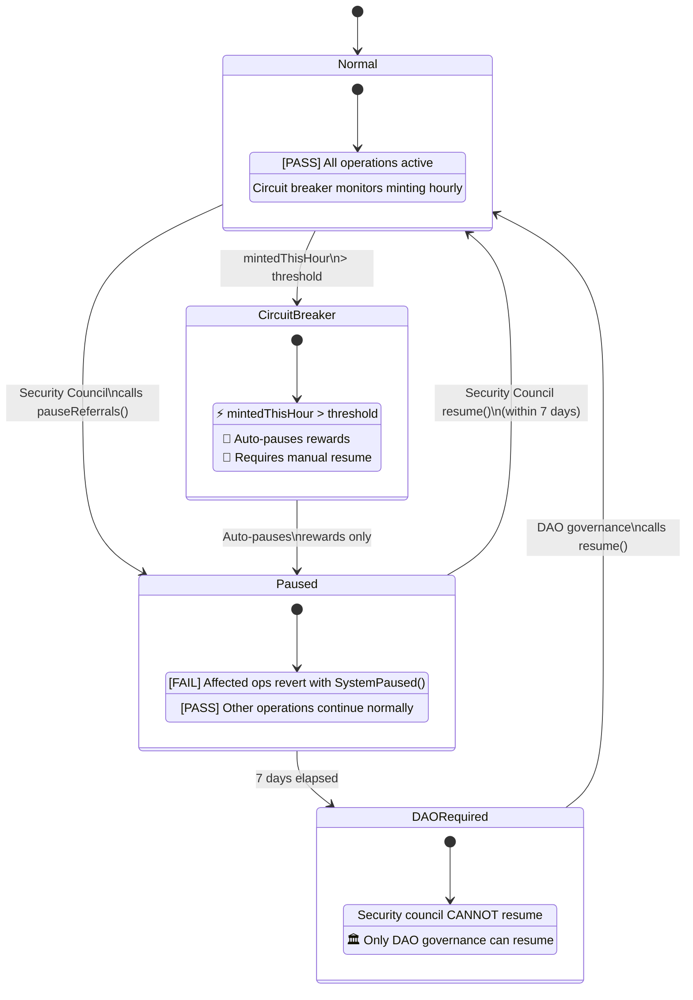

### Protocol Fee Flow (v2.2)

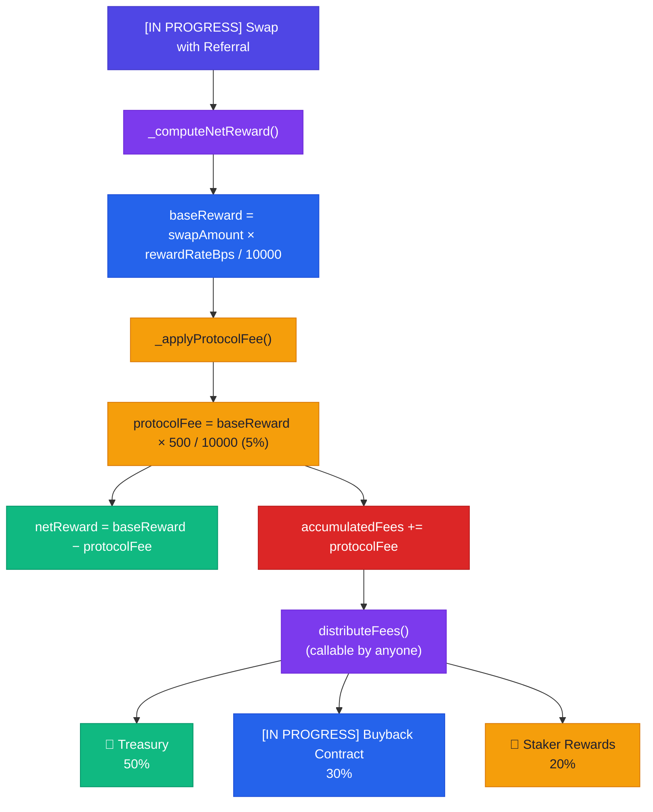

### Dependency Matrix (v2.2)

| Dependency | Source | Version | Purpose |
|------------|--------|---------|---------|
| `v4-core` | Uniswap | latest | PoolManager, types, libraries |
| `v4-periphery` | Uniswap | latest | BaseHook abstract contract |
| `solmate` | Transmissions11 | latest | Legacy ERC20 (v1 only) |
| `solady` | Vectorized | latest | FixedPointMathLib, Ownable (v1) |
| `openzeppelin-contracts-upgradeable` | OpenZeppelin | v5.0.0 | UUPSUpgradeable, OwnableUpgradeable, ERC20Upgradeable, Initializable, ReentrancyGuardUpgradeable |
| `openzeppelin-contracts` | OpenZeppelin | v5.0.0 | ERC1967Proxy |
| `openzeppelin-foundry-upgrades` | OpenZeppelin | latest | Forge upgrade safety checks |

---

## Future Considerations

### Upgrade Path

| Version | Feature | Status |
|---------|---------|--------|
| v1.0 | Fixed rewards | Complete |
| v1.1 | Dynamic rewards (volume-based) | Complete |
| v1.2 | Tiered referral system | Complete |
| v2.0 | Cross-pool referral tracking | Complete |
| v2.1 | NFT-based referral credentials | Complete |
| v2.2 | UUPS Upgradeable Registry | **Complete** |
| v2.4 | Emergency Module | **Complete** |
| v2.3 | Reactive Network + Hyperlane cross-chain | Planned |
| v2.5 | Staking (veFIX) + Governance + Protocol Fees | Planned |
| v2.6 | Referrer Teams | Planned |
| v2.7 | AI Agent Marketplace | Planned |
| v2.8 | LayerZero OFT Bridge | Planned |

### Extensibility Points

```solidity
// FUTURE: Volume-based rewards
function calculateReward(int256 swapAmount) internal pure returns (uint256) {
    // Scale rewards with swap size
    // Helps prevent Sybil farming
}

// FUTURE: Tiered referrers
mapping(address => uint8) public referrerTier;

function getMultiplier(address referrer) internal view returns (uint256) {
    // Higher tiers earn more
}
```

---

<p align="center">
  <em>Document Version: 2.0.0 | Last Updated: February 2026</em>
</p>
