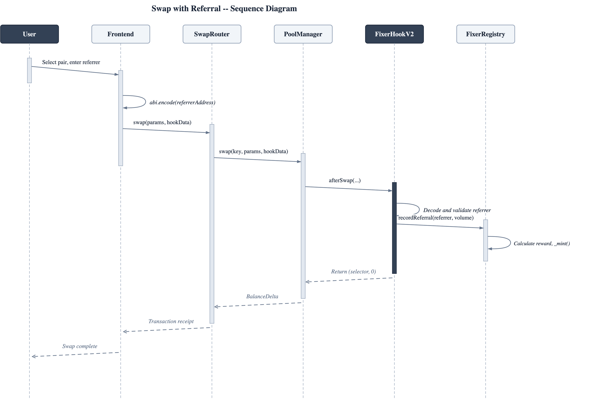
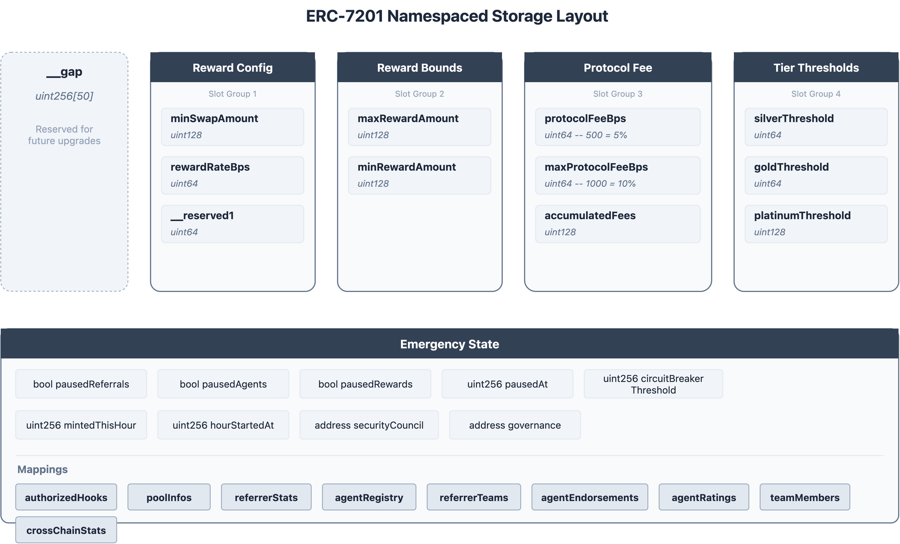
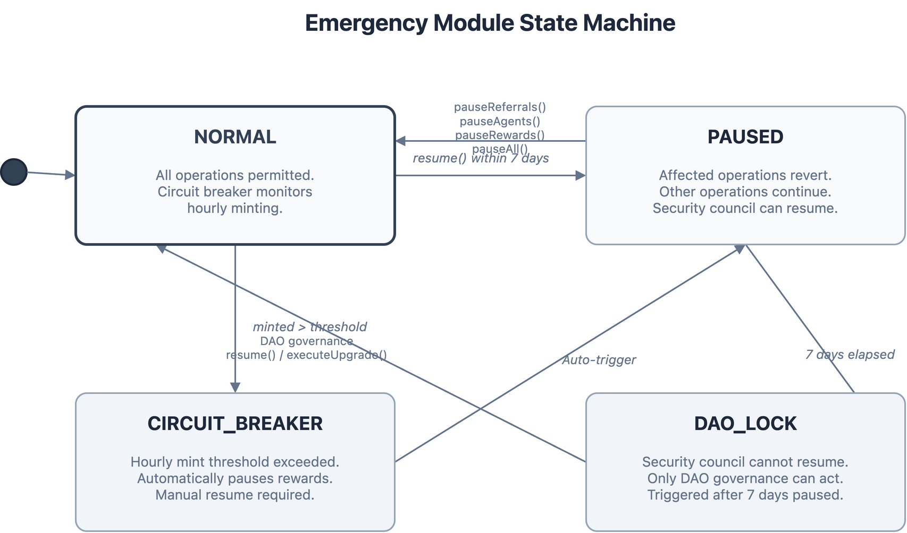
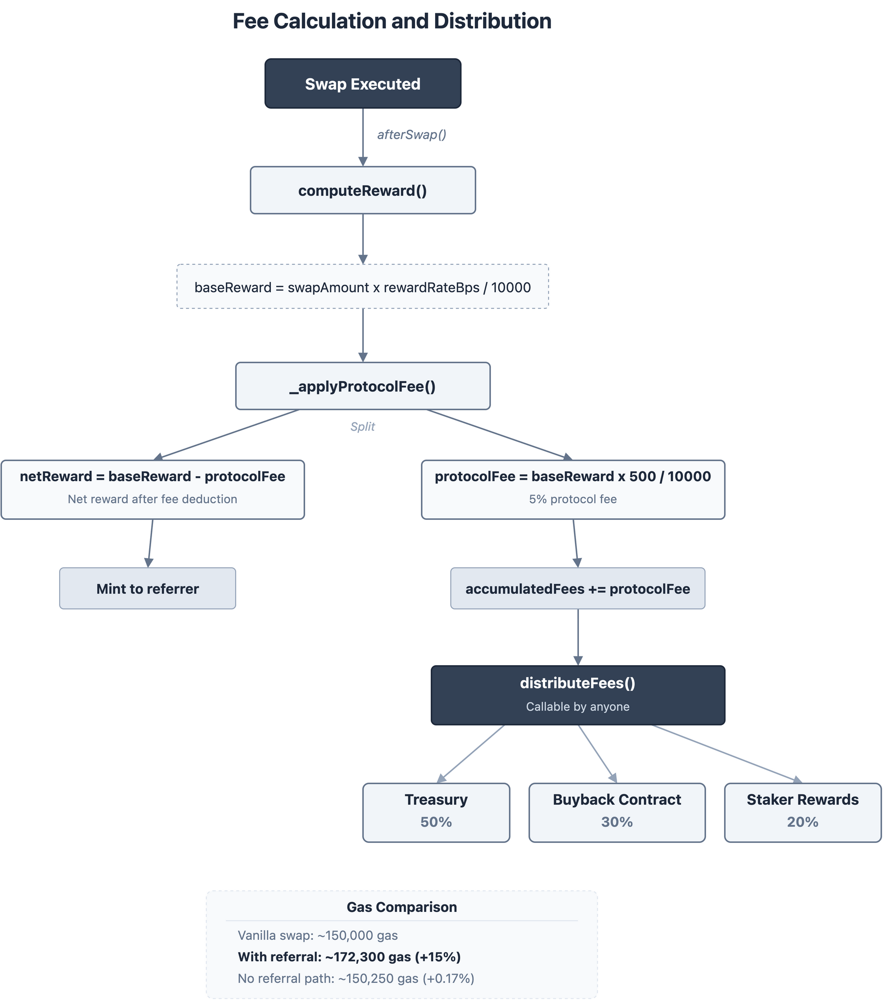

# System Design Document

> The Fixer Hook Protocol — Technical Architecture Specification v2.6.0

**Last Updated:** February 26, 2026 | **Version:** 2.6.0 (`VERSION = 2_006_000`) | **Solidity:** 0.8.26 | **EVM Target:** Cancun

---

## Table of Contents

1. [Executive Summary](#executive-summary)
2. [High-Level Design (HLD)](#high-level-design-hld)
3. [Component Specifications](#component-specifications)
4. [Low-Level Design (LLD)](#low-level-design-lld)
5. [Storage Architecture](#storage-architecture)
6. [Data Flow Diagrams](#data-flow-diagrams)
7. [Token Economics](#token-economics)
8. [Agent Infrastructure Stack](#agent-infrastructure-stack)
9. [Security Model](#security-model)
10. [Gas Analysis](#gas-analysis)
11. [Version History](#version-history)

---

## Executive Summary

### Problem Statement

Liquidity pools in DeFi lack native mechanisms for incentivizing organic growth through referrals. Frontend aggregators and dApps route billions in swap volume but receive nothing in return. AI agents trade autonomously with zero attribution. Cross-chain activity is invisible and siloed.

### Solution

The **Fixer Hook** implements an **on-chain affiliate/referral rewards system** for Uniswap v4. It intercepts swaps via the `afterSwap` hook, decodes a referrer address from `hookData`, and mints FIX (ERC-20) reward tokens to that referrer — all as an observation-only side-effect that never modifies swap deltas.

### Design Principles

| Principle | Implementation |
|-----------|----------------|
| **Non-Invasive** | `afterSwap` returns `int128(0)` — swap execution completely unchanged |
| **Modular** | Core + Extension DELEGATECALL pattern under EIP-170 (24,576 B) |
| **Upgradeable** | UUPS proxy with 48-hour timelock on all upgrades |
| **Gas Efficient** | Single hook permission; shared FixerLib for computation |
| **Sybil-Resistant** | Tier thresholds, tx.origin validation, circuit breakers |
| **Agent-Native** | ERC-8004 identity, x402/EIP-3009 payments, XMTP communication |

---

## High-Level Design (HLD)

### 1. System Actors

| Actor | Responsibility |
|-------|----------------|
| **Swapper** | Initiates swap; optionally includes referrer in hookData |
| **Referrer** | Earns FIX tokens for referred swaps; has tier and team |
| **AI Agent** | ERC-8004 registered agents earn reputation-enhanced rewards |
| **Frontend** | Encodes referrer address into hookData |
| **PoolManager** | Uniswap v4 singleton; calls hook lifecycle functions |
| **FixerHookV2** | Lightweight afterSwap observer; delegates to Registry |
| **FixerRegistryUpgradeable** | Central business logic: FIX token, tiers, rewards, emergency |
| **FixerRegistryExtension** | Agent functions: ERC-8004, XMTP, EIP-3009, delegation |
| **FixerCredential** | Soulbound NFT with on-chain SVG metadata |
| **Security Council** | Multisig that can pause instantly in emergencies |
| **DAO Governance** | Required to resume after 7-day pause threshold |

### 2. Architectural Pattern: Side-Effect Tokenization


**Key Insight:** The hook never modifies swap parameters or extracts fees. It observes completed swaps and triggers a reward mint if valid referral data exists. This means **zero funds are at risk from the hook itself**.

### 3. Component Overview


### 4. Reactive Modular Architecture (Core + Extension)

The protocol uses a **Core + Extension** split to stay under the EIP-170 contract size limit:

```
User → ERC1967Proxy → FixerRegistryUpgradeable (Core, 20,507 B)
                         ├── Known selectors → handled directly
                         └── Unknown selectors → fallback() → DELEGATECALL → FixerRegistryExtension (14,659 B)
```

| Component | Size | Role |
|-----------|------|------|
| **FixerLib** | 2,308 B | External library: ERC-8004 validation, reputation, EIP-3009 auth |
| **FixerRegistryUpgradeable** (Core) | 20,507 B | UUPS impl: FIX token (ERC-20), referrals, tiers, emergency, hooks, admin |
| **FixerRegistryExtension** | 14,659 B | ERC-8004 agents, XMTP communication, delegation, reputation, EIP-3009 |
| **ERC1967Proxy** | 130 B | Transparent proxy — users interact with this address |
| **FixerHookV2** | 4,480 B | Uniswap v4 afterSwap hook (CREATE2-mined address) |
| **FixerCredential** | 11,787 B | Soulbound ERC-721 with on-chain SVG, ERC-5192 + ERC-4906 |

Both Core and Extension share the same **ERC-7201 namespaced storage layout** — no storage collision risk across upgrades.

### 5. Workflow Sequence



---

## Component Specifications

### FixerHookV2 (Lightweight Delegating Hook)

- **Inheritance:** `BaseHook` + `Ownable` (Solady)
- **Only permission:** `afterSwap = true` (1 of 14 possible)
- **Immutables:** `registry` (IFixerRegistry), `poolId`, `quoteTokenIndex`
- **Trusted Router Pattern:** `trustedRouters` mapping + `_resolveSwapper()` calls `IMsgSender(router).msgSender{gas: 50_000}()` for ERC-4337 compatibility, falls back to `tx.origin`
- **`_afterSwap` flow:** decode referrer → resolve swapper → validate → calculate volume → `registry.recordReferral()` wrapped in try/catch → emit events
- **Returns:** `(selector, int128(0))` — never modifies swap deltas

### FixerRegistryUpgradeable (Core — UUPS Proxy)

- **Inheritance:** `Initializable` + `UUPSUpgradeable` + `OwnableUpgradeable` + `ERC20Upgradeable` + `ReentrancyGuardUpgradeable` + `EIP712Upgradeable` + `EmergencyModule`
- **Initializer chain:** `initialize()` → `reinitialize()` (v2) → `reinitializeV3()` (EIP-712) → `reinitializeV4()` (ERC-8004) → `reinitializeV5()` (XMTP)
- **Core `recordReferral()` flow:**
  1. `onlyAuthorizedHook` + `whenNotPausedReferrals` + `whenNotPausedRewards` + `nonReentrant`
  2. `_computeNetReward()` — tier multiplier → ERC-8004 reputation bonus → cap at MAX_GROSS_REWARD (5,000 FIX) → deduct protocol fee (5%)
  3. `_updateStats()` — update referrer stats, pool stats, global counters
  4. `_checkTierUpgrade()` — auto-promote referrer if thresholds met
  5. `_checkCircuitBreaker()` — auto-pause if hourly/daily limits exceeded
  6. `_mint()` — mint FIX tokens to referrer
- **Protocol fee distribution:** `distributeFees()` → 50% treasury / 30% buyback / 20% stakers
- **UUPS upgrade:** `proposeUpgrade()` → 48h timelock → `executeUpgrade()`. Direct `upgradeToAndCall()` blocked.
- **Fallback:** DELEGATECALL to Extension for agent/XMTP/EIP-3009 functions

### FixerRegistryExtension (Agent Module)

- **Called via DELEGATECALL** from Core's `fallback()` — shares ERC-7201 storage
- **ERC-8004 Agent Registration:** `registerAgent(agentId, platform)` — verifies NFT ownership, auto-refreshes reputation
- **Referral Delegation:** `delegateReferral()` / `revokeDelegation()`
- **ERC-8004 Reputation:** `refreshAgentReputation()` → `FixerLib.fetchReputation()` → derives bonus BPS
- **ERC-8004 Feedback:** `submitReferralFeedback()` → `FixerLib.sendFeedback()`
- **EIP-3009:** `transferWithAuthorization()` for gasless FIX transfers (x402 payment flow)
- **XMTP:** `enableXMTP` / `disableXMTP` / `updateXMTPEndpoint` + view functions

### FixerCredential (Soulbound NFT)

- **ERC-5192 (Soulbound)** + **ERC-4906 (Metadata Update)** compliant
- **On-chain SVG generation** with tier-based colors (Bronze=#CD7F32, Silver=#C0C0C0, Gold=#FFD700, Platinum=#E5E4E2)
- **`mint()`:** one per referrer, requires ≥1 referral
- **`refresh()`:** updates credential data from registry, emits MetadataUpdate
- **Transfer restrictions:** all transfer/approve functions revert with `TokenLocked()` for locked tokens

### EmergencyModule

- **3 independent pause states:** referrals, agents, rewards — each with separate timestamps
- **Security council fast-path:** can pause instantly
- **DAO governance required** to resume after 7-day pause threshold
- **Circuit breaker:** hourly limit (default 1M FIX, configurable 100K–50M) — auto-pauses rewards
- **Daily mint ceiling:** 10M FIX hard cap (MAX_DAILY_MINT)
- **`pauseAll` / `resumeAll`:** atomic batch operations

### FixerLib (External Library)

- **Deployed separately** via CREATE2, linked at deployment
- **`validateAgent()`:** verifies ERC-8004 NFT ownership + agentWallet match + optional validation score
- **`fetchReputation()`:** reads ERC-8004 Reputation Registry, wraps in try/catch
- **`computeReputationBonus()`:** normalizes score 0–100, maps to tiered BPS (0/500/1500/3000/5000)
- **`sendFeedback()`:** submits feedback to ERC-8004 Reputation Registry
- **`validateAuth()`:** EIP-3009 signature validation using ECDSA.recover

### BPSMath (Library)

- Centralized BPS arithmetic using Solady's `FixedPointMathLib.mulDiv`
- `applyBPS()`, `deductFee()`, `applyMultiplier()`

---

## Low-Level Design (LLD)

### Hook Permissions

```solidity
function getHookPermissions() public pure override returns (Hooks.Permissions memory) {
    return Hooks.Permissions({
        beforeInitialize: false,
        afterInitialize: false,
        beforeAddLiquidity: false,
        beforeRemoveLiquidity: false,
        afterAddLiquidity: false,
        afterRemoveLiquidity: false,
        beforeSwap: false,
        afterSwap: true,           // THE ONLY PERMISSION NEEDED
        beforeDonate: false,
        afterDonate: false,
        beforeSwapReturnDelta: false,
        afterSwapReturnDelta: false,
        afterAddLiquidityReturnDelta: false,
        afterRemoveLiquidityReturnDelta: false
    });
}
```

**Rationale:** Only `afterSwap` is needed because rewards are issued after successful swap completion. No deltas are modified. This minimizes gas overhead and attack surface.

### v2 Core Logic: `recordReferral()`

```solidity
function recordReferral(
    address referrer,
    address swapper,
    PoolId poolId,
    uint128 volume,
    bytes32 hookPoolId
) external onlyAuthorizedHook whenNotPausedReferrals whenNotPausedRewards nonReentrant {
    // 1. Validate referrer (not zero, not swapper, not blocked)
    // 2. Get pool info + referrer stats
    // 3. Check minimum swap amount threshold
    // 4. Compute net reward:
    //    base = volume × rewardRateBps / 10000
    //    tiered = base × tierMultiplier
    //    withReputation = tiered + (tiered × reputationBonusBps / 10000)
    //    capped = min(withReputation, MAX_GROSS_REWARD)  // 5000 FIX
    //    net = capped - (capped × protocolFeeBps / 10000)  // 5% fee
    // 5. Update stats (referrer volume, referral count, pool stats, global counters)
    // 6. Check tier upgrade (volume + count vs thresholds)
    // 7. Check circuit breaker (hourly + daily mint limits)
    // 8. Mint FIX tokens to referrer
}
```

### hookData Encoding

| Field | Type | Size | Description |
|-------|------|------|-------------|
| referrer | `address` | 32 bytes (ABI-encoded) | Referrer address to receive FIX rewards |

```solidity
// Encoding
bytes memory hookData = abi.encode(referrerAddress);

// Decoding (in FixerHookV2._afterSwap)
address referrer = abi.decode(hookData, (address));
```

### Trusted Router Pattern

```solidity
function _resolveSwapper(address sender) internal view returns (address) {
    if (trustedRouters[sender]) {
        try IMsgSender(sender).msgSender{gas: 50_000}() returns (address resolved) {
            if (resolved != address(0)) return resolved;
        } catch {}
    }
    return tx.origin;  // fallback for EOA swaps
}
```

**Purpose:** Identifies the actual swapper address through routers (needed for ERC-4337 account abstraction and smart contract wallets). Gas-capped external call prevents griefing.

---

## Storage Architecture

### ERC-7201 Namespaced Storage

All upgradeable state lives in a single `MainStorage` struct at a deterministic slot:

```solidity
bytes32 constant STORAGE_SLOT = keccak256(
    abi.encode(uint256(keccak256("fixer.registry.storage.main")) - 1)
) & ~bytes32(uint256(0xff));
```



### Storage Layout (Packed Slots)

| Slot | Fields |
|------|--------|
| 1 | `minSwapAmount` (uint128) + `rewardRateBps` (uint64) + reserved (uint64) |
| 2 | `maxRewardAmount` (uint128) + `minRewardAmount` (uint128) |
| 3 | `protocolFeeBps` (uint64) + `maxProtocolFeeBps` (uint64) + `accumulatedFees` (uint128) |
| 4 | `hookCount` (uint64) + `totalReferrals` (uint64) + `totalVolume` (uint128) |
| M1–M5 | authorizedHooks, poolInfos, referrerStats, referrerPoolVolume, tierThresholds |
| M6–M9 | agentRegistry, agentTierThresholds, referrerTeams, teamMembership |
| S1 | EmergencyState (pauseReferrals, pauseAgents, pauseRewards, timestamps, limits) |
| S2 | feeRecipients (treasury, buyback, staking) |
| S3 | UpgradeProposal (implementation, proposedAt, executed, version) |
| M10–M13 | agentProfiles, totalAgents, agentPlatformCount, referralDelegations |
| M14–M18 | ERC-8004 registries (identity, reputation, validation), agentIdToWallet, caches |
| S4 | extension address |
| S5 | xmtpEnabledCount |
| **Gap** | **38 reserved slots** for future upgrades |

---

## Data Flow Diagrams

### Happy Path: Referral Reward

```
Swapper → SwapRouter → PoolManager.swap(key, params, hookData)
                              ↓
                        FixerHookV2._afterSwap()
                              ↓
                        decode referrer from hookData
                              ↓
                        resolve swapper (trusted router → msgSender / fallback tx.origin)
                              ↓
                        validate (referrer ≠ 0, referrer ≠ swapper)
                              ↓
                        calculate volume from BalanceDelta
                              ↓
                        registry.recordReferral(referrer, swapper, poolId, volume)
                              ↓
                        FixerRegistryUpgradeable:
                          → computeNetReward (tier × reputation × fee)
                          → updateStats (referrer + pool + global)
                          → checkTierUpgrade → checkCircuitBreaker
                          → mint FIX to referrer
```

### Agent Registration Flow

```
Agent → proxy.registerAgent(agentId, platform)
          ↓ (unknown selector → fallback)
        DELEGATECALL → FixerRegistryExtension.registerAgent()
          ↓
        FixerLib.validateAgent(identity registry, agentId, agent address)
          → verify NFT ownership: IERC8004IdentityRegistry.ownerOf(agentId) == msg.sender
          → verify wallet match: IERC8004IdentityRegistry.getAgentWallet(agentId) == msg.sender
          ↓
        FixerLib.fetchReputation(reputation registry, agentId)
          → IERC8004ReputationRegistry.getSummary(agentId) → score
          ↓
        computeReputationBonus(score) → bonusBps
          ↓
        Store agentProfile, increment counters, emit AgentRegistered
```

### Emergency Flow



### Protocol Fee Flow



---

## Token Economics

### FIX Token

| Parameter | Value |
|-----------|-------|
| Name | Fixer Token |
| Symbol | FIX |
| Decimals | 18 |
| Max Supply | 1,000,000,000 (1B) — hard cap enforced in `_update()` |
| Standard | ERC-20 (OpenZeppelin Upgradeable) |

### Reward Calculation

```
baseReward = swapVolume × rewardRateBps / 10000    (default 10 BPS = 0.1%)
clampedBase = clamp(baseReward, minRewardAmount, maxRewardAmount)   (1–1000 FIX)
tieredReward = clampedBase × tierMultiplier         (1.0x–2.0x)
withReputation = tieredReward + (tieredReward × reputationBonusBps / 10000)  (0–50%)
grossReward = min(withReputation, MAX_GROSS_REWARD) (5000 FIX hard cap)
protocolFee = grossReward × protocolFeeBps / 10000  (5% default)
netReward = grossReward - protocolFee
```

### Referrer Tiers

| Tier | Min Volume | Min Referrals | Multiplier | Max Team Size |
|------|-----------|---------------|------------|---------------|
| Bronze | 0 | 0 | 1.0x | 5 |
| Silver | 10,000 | 10 | 1.25x | 10 |
| Gold | 100,000 | 50 | 1.5x | 25 |
| Platinum | 1,000,000 | 200 | 2.0x | 50 |

### Protocol Fees

- **Rate:** 5% (500 BPS), max 10% (1,000 BPS)
- **Distribution:** 50% treasury / 30% buyback / 20% stakers
- **Accumulated** per referral, distributed by owner via `distributeFees()`

### Safety Limits

| Limit | Value | Configurable |
|-------|-------|:---:|
| Max Supply | 1B FIX | No |
| Max Gross Reward | 5,000 FIX/swap | No |
| Hourly Circuit Breaker | 1M FIX (default) | Yes (100K–50M) |
| Daily Mint Ceiling | 10M FIX | No |

---

## Agent Infrastructure Stack

### Overview

| Layer | Protocol | Standard | Implementation |
|-------|----------|----------|----------------|
| Identity & Trust | **ERC-8004** | NFT-based agent registry | Permissionless registration via NFT ownership proof |
| Payments | **x402 / EIP-3009** | HTTP 402 + gasless transfers | `transferWithAuthorization()` for off-chain micropayments |
| Communication | **XMTP** | Wallet-to-wallet messaging | On-chain endpoint directory + encrypted messaging |

### Agent Tiers

| Tier | Stake | Multiplier | Chain Access | Slashing Rate |
|------|-------|------------|:------------:|:-------------:|
| Unverified | 0 FIX | 1.0x | 0 | — |
| Starter | 100 FIX | 1.0x | 1 | 10% |
| Professional | 1,000 FIX | 1.25x | 5 | 15% |
| Enterprise | 10,000 FIX | 1.5x | 20 | 20% |
| Audited | 10,000 FIX | 2.0x | All | 5% |

### ERC-8004 Reputation → Bonus Mapping

| Score | Tier | Bonus BPS | Bonus % |
|:-----:|:----:|:---------:|:-------:|
| ≤ 0 | None | 0 | 0% |
| 1–30 | Low | 500 | +5% |
| 31–60 | Medium | 1,500 | +15% |
| 61–80 | High | 3,000 | +30% |
| 81–100 | Elite | 5,000 | +50% |

Cache TTL: 1 hour default (configurable 10min–24h). Stale cache degrades bonus by 50%.

### Off-Chain Services

| Service | Stack | Port | Description |
|---------|-------|:----:|-------------|
| **RaaS API** | Hono + @x402/server | 3000 | Pool/referrer/agent REST API, XMTP discovery — gated by USDC micropayments |
| **MCP Server** | @modelcontextprotocol/sdk + viem | stdio | Tool server for AI agents (Claude, ChatGPT) |
| **XMTP Bot** | @xmtp/node-sdk + viem | — | Wallet-to-wallet messaging bot |

---

## Security Model

### Anti-Gaming

| Threat | Mitigation |
|--------|-----------|
| Self-referral | `tx.origin` check + trusted router resolution |
| Sybil farming | Volume-based tiers require substantial capital |
| Reward amplification | MAX_GROSS_REWARD 5,000 FIX caps tier × reputation stacking |
| Runaway minting | Circuit breaker (1M/hr) + daily ceiling (10M) |

### Upgrade Security

- **UUPS Proxy** with 48-hour timelock
- **Proposal flow:** `proposeUpgrade()` → wait 48h → `executeUpgrade()`
- **Direct `upgradeToAndCall()` blocked** in `_authorizeUpgrade()`
- **Security council** can cancel malicious proposals
- **ERC-7201** storage prevents collision across upgrades
- **38 gap slots** reserved for future state

### Emergency Controls


- 3 independent pause states (referrals, agents, rewards)
- Security council instant pause
- DAO required for resume after 7-day threshold
- Circuit breaker auto-pauses on limit breach

---

## Gas Analysis

### Per-Operation Costs (Estimates)

| Operation | Gas Cost | Notes |
|-----------|----------|-------|
| `hookData.length` check | ~3 | CALLDATASIZE |
| `abi.decode` referrer | ~200 | CALLDATACOPY + memory |
| `_resolveSwapper()` | ~50–50,200 | Depends on trusted router call |
| Validation checks | ~50 | Zero + self-referral checks |
| `recordReferral()` | ~80,000 | SSTORE updates + mint + tier check |
| **Total (with mint)** | **~80,000–130,000** | Depends on cold/warm slots |
| **Total (no referral)** | **~250** | Early return path |

### Contract Sizes (with optimizer, 1 run, via_ir)

| Contract | Size | EIP-170 Margin |
|----------|:----:|:--------------:|
| FixerRegistryUpgradeable | 20,507 B | 4,069 B |
| FixerRegistryExtension | 14,659 B | 9,917 B |
| FixerCredential | 11,787 B | 12,789 B |
| FixerHookV2 | 4,480 B | 20,096 B |
| FixerLib | 2,308 B | 22,268 B |

---

## Version History

| Version | Feature | Status |
|---------|---------|:------:|
| v1.0 | Fixed rewards (10 FIX per referral) | **Complete** |
| v1.1 | Dynamic rewards (volume-based, BPS) | **Complete** |
| v1.2 | Tiered referral system (Bronze→Platinum) | **Complete** |
| v2.0 | Cross-pool referral tracking via Registry | **Complete** |
| v2.1 | Soulbound NFT credentials (FixerCredential) | **Complete** |
| v2.2 | UUPS Upgradeable Registry + EmergencyModule | **Complete** |
| v2.3 | x402 + EIP-3009 Agent Payments | **Complete** |
| v2.4 | ERC-8004 Trustless Agents + Reputation Bonuses | **Complete** |
| v2.5 | DELEGATECALL Extension + FixerLib (EIP-170 split) | **Complete** |
| v2.6 | XMTP Communication Layer + On-chain Endpoint Directory | **Complete** |

### Deployment Status

| Chain | ID | Architecture | Status |
|-------|:--:|:------------:|:------:|
| Base Sepolia | 84532 | Core + Extension + Hook | **LIVE** |
| Arbitrum Sepolia | 421614 | Core + Extension + Hook | **LIVE** |
| Unichain Sepolia | 1301 | Core + Extension + Hook | **LIVE** |
| Lasna (Reactive Network) | 5318007 | Core + Extension (no Hook) | **LIVE** |

### Dependency Matrix

| Dependency | Source | Purpose |
|------------|--------|---------|
| v4-core | Uniswap (via v4-periphery) | PoolManager, PoolKey, BalanceDelta, Hooks |
| v4-periphery | Uniswap | BaseHook abstract contract |
| solmate | Transmissions11 | Gas-optimized ERC20/ERC721 (v1, FixerCredential) |
| solady | Vectorized | FixedPointMathLib, Ownable, ECDSA |
| openzeppelin-contracts-upgradeable | OpenZeppelin v5 | UUPS, ERC20, Ownable, ReentrancyGuard, EIP712, Initializable |
| openzeppelin-contracts | OpenZeppelin v5 | ERC1967Proxy |
| openzeppelin-foundry-upgrades | OpenZeppelin | Forge upgrade safety checks |

---

<p align="center">
  <em>Document Version: 3.0.0 | Last Updated: February 26, 2026</em>
</p>
