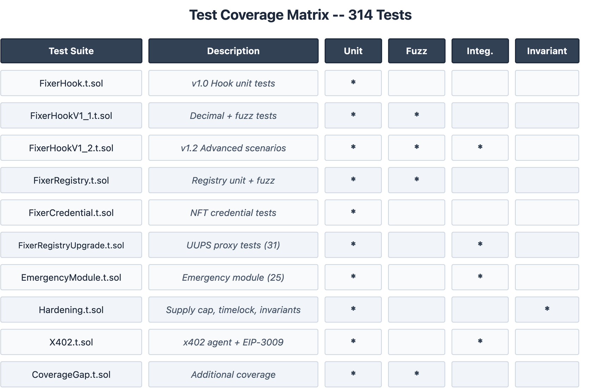

# Testing Strategy

> Comprehensive test coverage for the FixerHook Protocol

**Last Updated:** February 6, 2026  
**Total Tests:** 191 across 19 test suites (all passing)

---

## Current Test Suite Summary

| Test Suite | File | Tests | Category |
|------------|------|-------|----------|
| FixerHookTest | `test/FixerHook.t.sol` | Unit | v1.0 Hook logic |
| FixerHookV1_1FuzzTest | `test/FixerHookV1_1.t.sol` | Fuzz | Decimal combinations |
| FixerHookV1_2Test | `test/FixerHookV1_2.t.sol` | Unit | Advanced hook scenarios |
| FixerRegistryTest | `test/FixerRegistry.t.sol` | Unit | v1 Registry logic |
| FixerRegistryFuzzTest | `test/FixerRegistry.t.sol` | Fuzz | Referral + tier fuzz |
| FixerCredentialTest | `test/FixerCredential.t.sol` | Unit | NFT credentials |
| FixerCredentialFuzzTest | `test/FixerCredential.t.sol` | Fuzz | Mint fuzz |
| **FixerRegistryUpgradeTest** | `test/FixerRegistryUpgrade.t.sol` | **31** | **v2.2 UUPS + proxy** |
| **EmergencyModuleTest** | `test/EmergencyModule.t.sol` | **25** | **v2.4 Emergency module** |

### v2.2 Test Coverage (FixerRegistryUpgrade.t.sol — 31 tests)

| Area | Tests | Description |
|------|-------|-------------|
| Initialization | 5 | Owner, name, symbol, fee defaults, emergency state |
| Referrals | 5 | Record referral, reward bounds, self-referral block, unauthorized hook |
| Protocol Fees | 4 | Default 5%, fee deduction, max cap enforcement, accumulated fees |
| Hooks | 3 | Authorize/deauthorize, unauthorized revert |
| Upgrades | 4 | Owner upgrade, non-owner revert, state preservation, post-upgrade referrals |
| Tiers | 4 | Bronze → Silver → Gold → Platinum progression, view functions |
| Admin | 4 | Set reward params, protocol fee, fee addresses, min swap amount |
| Fee Distribution | 2 | 50/30/20 split, zero-fee revert |

### v2.4 Test Coverage (EmergencyModule.t.sol — 25 tests)

| Area | Tests | Description |
|------|-------|-------------|
| Pause/Resume | 9 | All 3 states (referrals, agents, rewards) pause + resume |
| Pause Guards | 3 | Paused state blocks `recordReferral()` |
| Double-Pause | 3 | Already-paused reverts with `*AlreadyPaused` errors |
| DAO Threshold | 2 | 7-day DAO requirement for resume, council can resume before |
| Pause All | 2 | `pauseAll()` and `resumeAll()` |
| Circuit Breaker | 3 | Trigger on excessive minting, hourly counter reset |
| Admin | 2 | Set circuit breaker threshold, set security council |
| Access Control | 1 | Non-council pause revert |

---

## Test Categories

| Category | Purpose | Priority |
|----------|---------|----------|
| Unit Tests | Individual function behavior | High |
| Integration Tests | Full swap flow with hook | High |
| Fuzz Tests | Edge cases via randomization | Medium |
| Invariant Tests | System-wide properties | Medium |

---

## Unit Tests

### 1. Configuration Tests

```solidity
function test_HookPermissions() public {
    Hooks.Permissions memory perms = hook.getHookPermissions();
    
    assertTrue(perms.afterSwap, "afterSwap should be enabled");
    assertFalse(perms.beforeSwap, "beforeSwap should be disabled");
    assertFalse(perms.afterSwapReturnDelta, "no delta modifications");
}

function test_TokenMetadata() public {
    assertEq(hook.name(), "Referral Token");
    assertEq(hook.symbol(), "REF");
    assertEq(hook.decimals(), 18);
}

function test_RewardAmount() public {
    assertEq(hook.REWARD_AMOUNT(), 10 * 1e18);
}
```

### 2. Validation Logic Tests

```solidity
function test_RejectsZeroAddress() public {
    address referrer = address(0);
    
    // Simulate afterSwap with zero address referrer
    bytes memory hookData = abi.encode(referrer);
    
    // Balance should not change
    uint256 balBefore = hook.balanceOf(referrer);
    // ... call hook
    uint256 balAfter = hook.balanceOf(referrer);
    
    assertEq(balBefore, balAfter, "Zero address should not receive tokens");
}

function test_RejectsSelfReferral() public {
    address user = makeAddr("user");
    
    // User tries to refer themselves
    bytes memory hookData = abi.encode(user);
    
    vm.prank(user, user); // Set tx.origin = user
    
    // Should not mint
    assertEq(hook.balanceOf(user), 0);
}

function test_AcceptsValidReferral() public {
    address referrer = makeAddr("referrer");
    address user = makeAddr("user");
    
    bytes memory hookData = abi.encode(referrer);
    
    vm.prank(user, user);
    
    // Should mint 10 REF
    assertEq(hook.balanceOf(referrer), 10e18);
}
```

### 3. Empty Data Tests

```solidity
function test_EmptyHookDataSkipsProcessing() public {
    bytes memory hookData = "";
    
    // Should complete without error
    // No tokens minted
}

function test_NoReferralNormalSwap() public {
    // Swap without hookData should work normally
}
```

---

## Fuzz Tests

```solidity
function testFuzz_ValidReferrerReceivesReward(
    address referrer,
    address user
) public {
    // Assume valid inputs
    vm.assume(referrer != address(0));
    vm.assume(referrer != user);
    vm.assume(referrer.code.length == 0); // EOA
    
    bytes memory hookData = abi.encode(referrer);
    
    uint256 balBefore = hook.balanceOf(referrer);
    
    vm.prank(user, user);
    // ... execute swap with hook
    
    uint256 balAfter = hook.balanceOf(referrer);
    
    assertEq(balAfter - balBefore, 10e18);
}

function testFuzz_SelfReferralAlwaysBlocked(address user) public {
    vm.assume(user != address(0));
    
    bytes memory hookData = abi.encode(user);
    
    vm.prank(user, user);
    // ... execute swap
    
    assertEq(hook.balanceOf(user), 0, "Self-referral should be blocked");
}
```

---

## Invariant Tests

```solidity
contract ReferralInvariants is Test {
    ReferralHook hook;
    
    function invariant_TotalSupplyMatchesBalances() public {
        // Sum of all balances == totalSupply
    }
    
    function invariant_RewardAmountConstant() public {
        assertEq(hook.REWARD_AMOUNT(), 10e18);
    }
    
    function invariant_NoNegativeBalances() public {
        // All balanceOf returns >= 0
    }
}
```

---

## Gas Benchmarks

```solidity
function test_GasWithReferral() public {
    bytes memory hookData = abi.encode(referrer);
    
    uint256 gasBefore = gasleft();
    // ... swap with referral
    uint256 gasUsed = gasBefore - gasleft();
    
    emit log_named_uint("Gas with referral", gasUsed);
}

function test_GasWithoutReferral() public {
    bytes memory hookData = "";
    
    uint256 gasBefore = gasleft();
    // ... swap without referral
    uint256 gasUsed = gasBefore - gasleft();
    
    emit log_named_uint("Gas without referral", gasUsed);
}
```

---

## Running Tests

```bash
# All tests
forge test -vvv

# Specific test
forge test --match-test test_ValidReferral -vvv

# With gas report
forge test --gas-report

# Fuzz with more runs
forge test --fuzz-runs 1000

# Coverage
forge coverage
```

---

## Coverage Targets

| Component | Target | Current | Notes |
|-----------|--------|---------|-------|
| FixerHook._afterSwap | 100% | ~100% | Core v1 logic |
| FixerRegistryUpgradeable | 95%+ | ~90% | 31 tests |
| EmergencyModule | 95%+ | ~95% | 25 tests |
| FixerRegistry (v1) | 90%+ | ~90% | Legacy tests |
| FixerCredential | 90%+ | ~90% | NFT tests |
| AgentTypes | 100% | 100% | Constants only |

---

## Test File Structure



---

## Continuous Integration

```yaml
# .github/workflows/test.yml
name: Tests
on: [push, pull_request]
jobs:
  test:
    runs-on: ubuntu-latest
    steps:
      - uses: actions/checkout@v3
      - uses: foundry-rs/foundry-toolchain@v1
      - run: forge build
      - run: forge test -vvv
```
