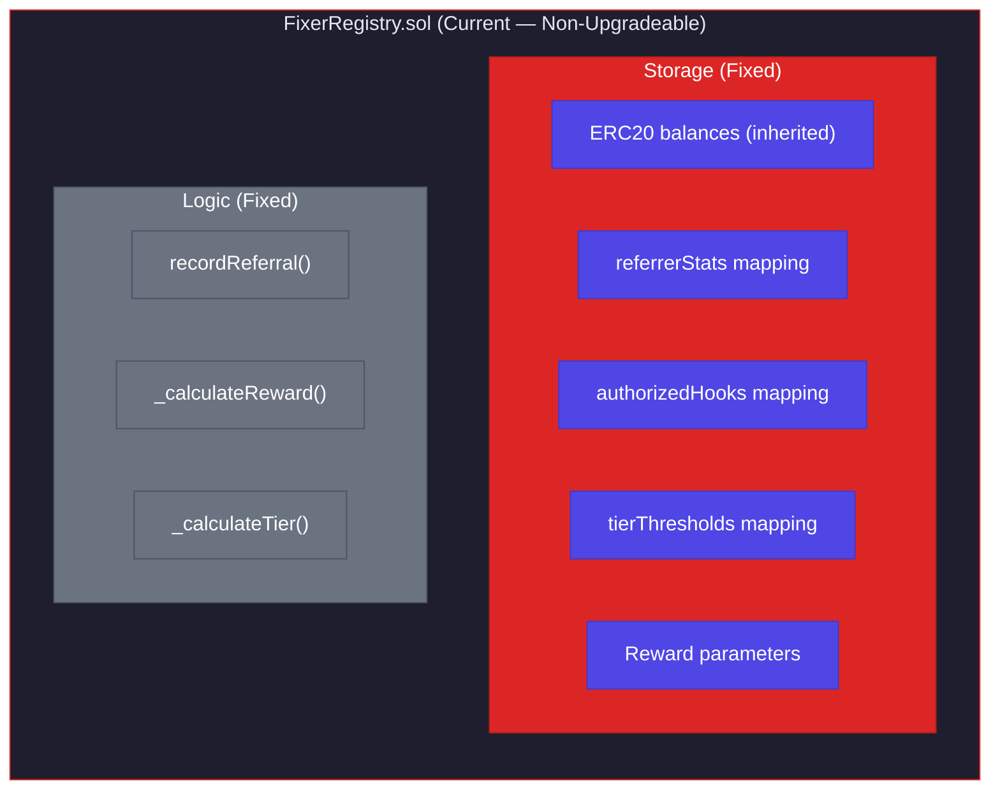
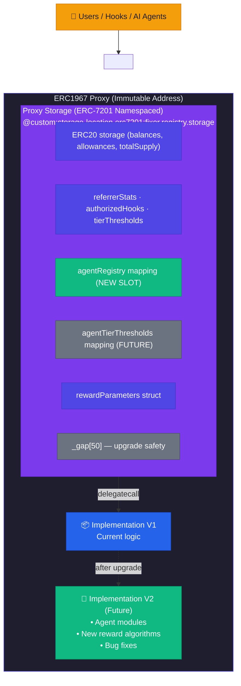
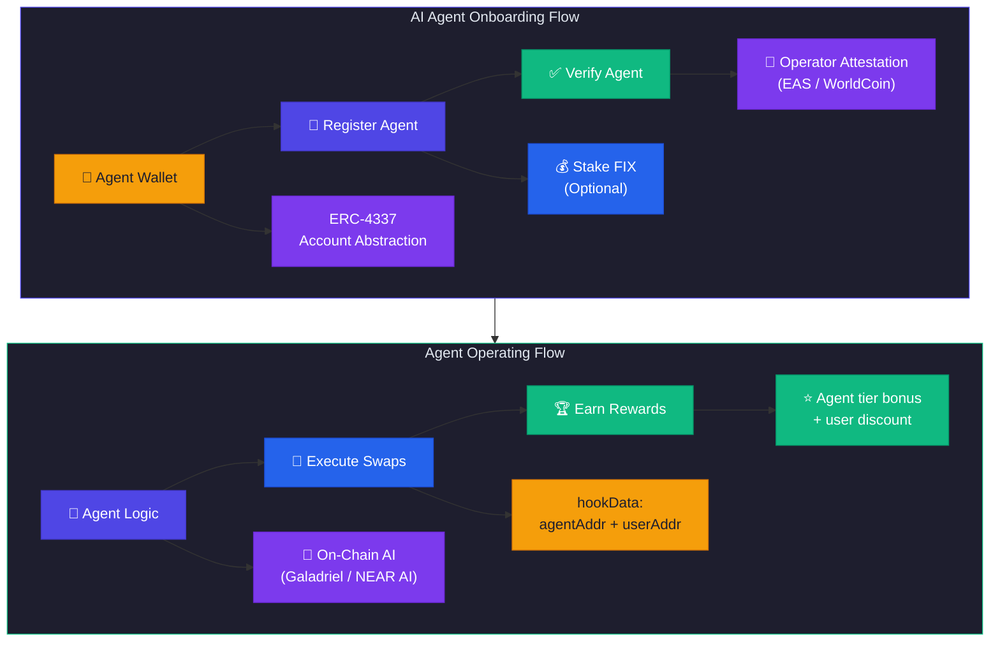
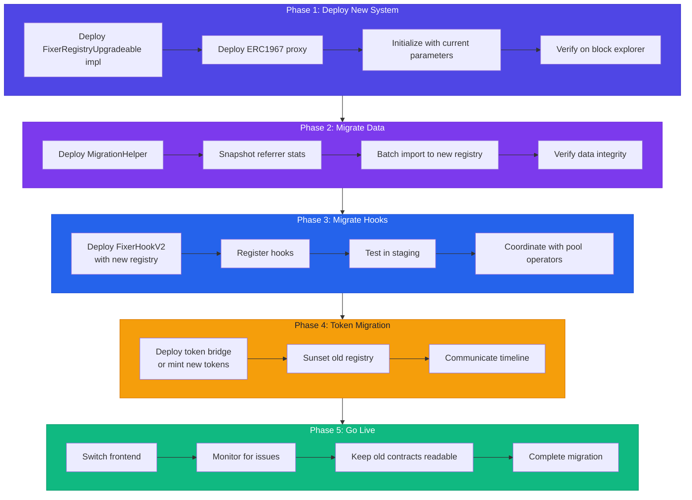

# UUPS Upgradeability & AI Agent Integration

> Technical Implementation Plan for FixerRegistry Upgradeability with AI Agent Support

**Document Version:** 1.1.0  
**Created:** February 5, 2026  
**Last Updated:** February 5, 2026  
**Status:** ✅ Decisions Finalized - Ready for Implementation

---

## ✅ Finalized Decisions

> Based on [Market Sentiment Analysis](./MARKET_SENTIMENT_ANALYSIS.md) research

| Decision | Finalized Value | Rationale |
|----------|-----------------|-----------|
| **FIX Token** | 🔒 Non-Upgradeable | User trust, "code is law", industry standard |
| **FixerRegistry** | ⚙️ UUPS Upgradeable | Logic layer flexibility, hot-fixes, AI evolution |
| **Agent Min Stake** | 100 FIX (Starter) | ERC-8004 aligned, low barrier to experiment |
| **Agent Max Stake** | 10,000 FIX (Enterprise) | Meaningful skin in game for high-volume agents |
| **Slashing Rates** | 10-20% by tier | Aligned with Virtuals Protocol, AgentLayer |

---

## Table of Contents

1. [Executive Summary](#executive-summary)
2. [Why UUPS for AI Agent Integration](#why-uups-for-ai-agent-integration)
3. [Architecture Overview](#architecture-overview)
4. [UUPS Implementation Plan](#uups-implementation-plan)
5. [AI Agent Integration Design](#ai-agent-integration-design)
6. [Security Considerations](#security-considerations)
7. [Migration Strategy](#migration-strategy)
8. [Task Breakdown](#task-breakdown)
9. [Testing Strategy](#testing-strategy)
10. [FOSS Resources](#foss-resources)

---

## Executive Summary

This document outlines the implementation plan for making the `FixerRegistry` contract UUPS-upgradeable and integrating AI agent support. As AI agents become more prevalent in DeFi (for automated trading, portfolio management, and social trading), the FixerHook system needs to be flexible enough to:

1. **Adapt to new AI agent patterns** (new authentication methods, agent reputation)
2. **Add new reward mechanisms** (AI-specific bonuses, automated strategy rewards)
3. **Integrate with evolving infrastructure** (new oracles, cross-chain messaging)
4. **Fix bugs without full redeployment** (critical for maintaining user trust)

### Key Benefits

| Aspect | Current (Non-Upgradeable) | With UUPS |
|--------|---------------------------|-----------|
| **Bug Fixes** | Requires full migration | Hot-fix deployment |
| **New Features** | New contract + migration | Seamless upgrade |
| **AI Agent Support** | Limited | Extensible |
| **Token Continuity** | Break on migration | Preserved |
| **Stats Continuity** | Requires migration tool | Preserved |
| **User Trust** | "Will my tokens migrate?" | Continuous experience |

---

## Why UUPS for AI Agent Integration

### AI Agent Use Cases in FixerHook

```mermaid
flowchart TD
    subgraph agents["AI Agent Ecosystem"]
        direction LR
        Trading["🤖 Trading Agent\n• Auto-swaps\n• Arbitrage\n• MEV capture"]
        Social["📱 Social Agent\n• Recommends\n• Influencer\n• Education"]
        Portfolio["📊 Portfolio Agent\n• Rebalances\n• DCA strategies\n• Yield farming"]
    end

    Trading --> Wallet
    Social --> Wallet
    Portfolio --> Wallet

    Wallet["🔐 Agent Wallet (Smart Account)\nERC-4337 · Multi-sig · Session Keys"]
    
    Wallet --> Registry

    subgraph registry["FixerRegistry (UUPS Proxy)"]
        direction LR
        AgentMod["🧩 Agent Module\n• Agent auth\n• Agent tiers\n• Reputation"]
        V2Logic["🚀 V2 Logic (future)\n• New features\n• Bug fixes\n• Integrations"]
    end

    Registry[""] ~~~ AgentMod

    subgraph state["Preserved State (Proxy Storage)"]
        S1["💰 FIX token balances"]
        S2["📊 Referrer statistics"]
        S3["⭐ Tier progressions"]
        S4["🔗 Hook authorizations"]
    end

    AgentMod --> state
    V2Logic --> state

    style agents fill:#1E1E2E,color:#E2E8F0,stroke:#4F46E5
    style Trading fill:#4F46E5,color:#FFFFFF,stroke:#4338CA
    style Social fill:#7C3AED,color:#FFFFFF,stroke:#6D28D9
    style Portfolio fill:#2563EB,color:#FFFFFF,stroke:#1D4ED8
    style Wallet fill:#F59E0B,color:#1E1E2E,stroke:#D97706
    style registry fill:#1E1E2E,color:#E2E8F0,stroke:#10B981
    style AgentMod fill:#10B981,color:#FFFFFF,stroke:#059669
    style V2Logic fill:#7C3AED,color:#FFFFFF,stroke:#6D28D9
    style state fill:#1E1E2E,color:#E2E8F0,stroke:#7C3AED
    style S1 fill:#4F46E5,color:#FFFFFF,stroke:#4338CA
    style S2 fill:#4F46E5,color:#FFFFFF,stroke:#4338CA
    style S3 fill:#4F46E5,color:#FFFFFF,stroke:#4338CA
    style S4 fill:#4F46E5,color:#FFFFFF,stroke:#4338CA
```

### Future Features Requiring Upgrades

| Feature | Why Upgrade Needed |
|---------|-------------------|
| **Agent Reputation Scores** | New storage layout for agent-specific metrics |
| **Multi-Agent Referral Chains** | Agent A refers Agent B refers User C |
| **Cross-Chain Agent Identity** | Integration with Chainlink CCIP or LayerZero |
| **Dynamic Reward Algorithms** | ML-optimized reward curves |
| **Agent-Specific Tiers** | Different tier system for agents vs humans |
| **Compliance Modules** | KYC/AML hooks for regulated markets |
| **Oracle Integration** | Price feeds for accurate volume measurement |
| **Governance Integration** | DAO control over parameters |

---

## Architecture Overview

### Current Architecture (Non-Upgradeable)



### Proposed Architecture (UUPS Upgradeable)



### Why UUPS over Transparent Proxy?

| Aspect | UUPS | Transparent Proxy |
|--------|------|-------------------|
| **Gas Cost (Calls)** | Lower | Higher (admin check on every call) |
| **Upgrade Logic** | In implementation | In proxy |
| **Security** | Slightly higher risk (disable initializers) | Admin-separated |
| **Complexity** | Simpler proxy | More complex proxy |
| **Recommendation** | ✅ For FixerHook | For highly critical DAOs |

**Decision:** UUPS is more gas-efficient, which is critical for a hook that's called on every swap.

---

## UUPS Implementation Plan

### Phase 1: Storage Layout Design

```solidity
// SPDX-License-Identifier: MIT
pragma solidity 0.8.26;

/// @custom:storage-location erc7201:fixer.registry.storage.main
struct FixerRegistryStorage {
    // ═══════════════════════════════════════════════════════════════
    // SLOT GROUP 1: Reward Parameters (1 slot packed)
    // ═══════════════════════════════════════════════════════════════
    uint128 minSwapAmount;          // 16 bytes
    uint64 rewardRateBps;           // 8 bytes 
    uint64 __reserved1;             // 8 bytes (future use)
    
    // ═══════════════════════════════════════════════════════════════
    // SLOT GROUP 2: Reward Bounds (1 slot packed)
    // ═══════════════════════════════════════════════════════════════
    uint128 maxRewardAmount;        // 16 bytes
    uint128 minRewardAmount;        // 16 bytes
    
    // ═══════════════════════════════════════════════════════════════
    // SLOT GROUP 3: Counters (1 slot packed)
    // ═══════════════════════════════════════════════════════════════
    uint64 hookCount;               // 8 bytes
    uint64 totalReferrals;          // 8 bytes
    uint128 totalVolume;            // 16 bytes
    
    // ═══════════════════════════════════════════════════════════════
    // MAPPINGS (each starts new slot)
    // ═══════════════════════════════════════════════════════════════
    mapping(address => bool) authorizedHooks;
    mapping(bytes32 => PoolInfo) poolInfos;
    mapping(address => ReferrerStats) referrerStats;
    mapping(address => mapping(bytes32 => uint256)) referrerPoolVolume;
    mapping(ReferrerTier => TierThresholds) tierThresholds;
    
    // ═══════════════════════════════════════════════════════════════
    // FUTURE EXPANSION: AI Agent Support (V2+)
    // ═══════════════════════════════════════════════════════════════
    mapping(address => AgentInfo) agentRegistry;            // V2
    mapping(address => AgentStats) agentStats;              // V2
    mapping(AgentTier => AgentTierThresholds) agentTiers;   // V2
    
    // ═══════════════════════════════════════════════════════════════
    // GAP: Reserve slots for future upgrades
    // ═══════════════════════════════════════════════════════════════
    uint256[40] __gap;
}

/// @notice AI Agent information (UPDATED with finalized staking)
struct AgentInfo {
    bool isRegistered;              // 1 byte
    bool isVerified;                // 1 byte
    AgentTier tier;                 // 1 byte (enum) - RENAMED from agentType
    uint8 __reserved;               // 1 byte
    uint32 registeredAt;            // 4 bytes
    uint64 operatorCount;           // 8 bytes (users being served)
    address operator;               // 20 bytes
    uint256 stakedAmount;           // 32 bytes - NEW: tracks staked FIX
    // Total: 68 bytes = 3 slots
}

/// @notice Agent type classification
enum AgentType {
    Trading,        // Automated trading
    Social,         // Recommendations/influence  
    Portfolio,      // Portfolio management
    Aggregator,     // Multi-protocol
    Custom          // User-defined
}

/// @notice Agent verification tier (FINALIZED from market research)
/// @dev See MARKET_SENTIMENT_ANALYSIS.md for research backing
enum AgentTier {
    Unverified,     // 0 FIX - no rewards, testing only
    Starter,        // 100 FIX - 1.0x multiplier
    Professional,   // 1,000 FIX - 1.25x multiplier
    Enterprise,     // 10,000 FIX - 1.5x multiplier
    Audited         // 10,000 FIX + audit - 2.0x multiplier
}

/// @notice FINALIZED staking constants based on ERC-8004 and market research
library AgentStakingConstants {
    // Stake amounts (FINALIZED)
    uint256 constant UNVERIFIED_STAKE = 0;
    uint256 constant STARTER_STAKE = 100e18;        // 100 FIX
    uint256 constant PROFESSIONAL_STAKE = 1_000e18; // 1,000 FIX
    uint256 constant ENTERPRISE_STAKE = 10_000e18;  // 10,000 FIX
    uint256 constant AUDITED_STAKE = 10_000e18;     // 10,000 FIX (+ audit requirement)
    
    // Reward multipliers (basis points, 10000 = 1.0x) (FINALIZED)
    uint16 constant UNVERIFIED_MULTIPLIER = 0;       // No rewards
    uint16 constant STARTER_MULTIPLIER = 10000;      // 1.0x
    uint16 constant PROFESSIONAL_MULTIPLIER = 12500; // 1.25x
    uint16 constant ENTERPRISE_MULTIPLIER = 15000;   // 1.5x
    uint16 constant AUDITED_MULTIPLIER = 20000;      // 2.0x
    
    // Slashing rates (basis points) (FINALIZED)
    uint16 constant STARTER_SLASHING = 1000;         // 10% = 10 FIX
    uint16 constant PROFESSIONAL_SLASHING = 1500;    // 15% = 150 FIX
    uint16 constant ENTERPRISE_SLASHING = 2000;      // 20% = 2,000 FIX
    uint16 constant AUDITED_SLASHING = 500;          // 5% = 500 FIX (trusted)
    
    // Chain access by tier (FINALIZED)
    uint8 constant STARTER_MAX_CHAINS = 1;
    uint8 constant PROFESSIONAL_MAX_CHAINS = 5;
    uint8 constant ENTERPRISE_MAX_CHAINS = type(uint8).max;  // Unlimited
    uint8 constant AUDITED_MAX_CHAINS = type(uint8).max;     // Unlimited
}
```


### Phase 2: Contract Structure

```solidity
// SPDX-License-Identifier: MIT
pragma solidity 0.8.26;

// OpenZeppelin Upgradeable Contracts
import {Initializable} from "@openzeppelin/contracts-upgradeable/proxy/utils/Initializable.sol";
import {UUPSUpgradeable} from "@openzeppelin/contracts-upgradeable/proxy/utils/UUPSUpgradeable.sol";
import {OwnableUpgradeable} from "@openzeppelin/contracts-upgradeable/access/OwnableUpgradeable.sol";
import {ERC20Upgradeable} from "@openzeppelin/contracts-upgradeable/token/ERC20/ERC20Upgradeable.sol";

// Solady for gas efficiency (used selectively)
import {FixedPointMathLib} from "solady/utils/FixedPointMathLib.sol";

/// @title FixerRegistryUpgradeable
/// @notice UUPS-upgradeable central registry for cross-pool referrals
/// @dev Uses ERC-7201 namespaced storage for safe upgrades
contract FixerRegistryUpgradeable is 
    Initializable, 
    ERC20Upgradeable, 
    OwnableUpgradeable, 
    UUPSUpgradeable 
{
    // ═══════════════════════════════════════════════════════════════
    // STORAGE (ERC-7201)
    // ═══════════════════════════════════════════════════════════════
    
    /// @custom:storage-location erc7201:fixer.registry.storage
    bytes32 private constant STORAGE_LOCATION = 
        keccak256(abi.encode(uint256(keccak256("fixer.registry.storage")) - 1)) & ~bytes32(uint256(0xff));
    
    function _getStorage() private pure returns (FixerRegistryStorage storage $) {
        bytes32 position = STORAGE_LOCATION;
        assembly {
            $.slot := position
        }
    }
    
    // ═══════════════════════════════════════════════════════════════
    // CONSTRUCTOR (disable initializers in implementation)
    // ═══════════════════════════════════════════════════════════════
    
    /// @custom:oz-upgrades-unsafe-allow constructor
    constructor() {
        _disableInitializers();
    }
    
    // ═══════════════════════════════════════════════════════════════
    // INITIALIZER (replaces constructor for proxy)
    // ═══════════════════════════════════════════════════════════════
    
    function initialize(address initialOwner) public initializer {
        __ERC20_init("Fixer Token", "FIX");
        __Ownable_init(initialOwner);
        __UUPSUpgradeable_init();
        
        _initializeDefaultParameters();
        _initializeTiers();
    }
    
    function _initializeDefaultParameters() internal {
        FixerRegistryStorage storage $ = _getStorage();
        $.minSwapAmount = 100 * 1e18;
        $.rewardRateBps = 10;
        $.maxRewardAmount = 1000 * 1e18;
        $.minRewardAmount = 1 * 1e18;
    }
    
    function _initializeTiers() internal {
        FixerRegistryStorage storage $ = _getStorage();
        
        $.tierThresholds[ReferrerTier.Bronze] = TierThresholds(0, 0, 10000);
        $.tierThresholds[ReferrerTier.Silver] = TierThresholds(10_000e18, 10, 12500);
        $.tierThresholds[ReferrerTier.Gold] = TierThresholds(100_000e18, 50, 15000);
        $.tierThresholds[ReferrerTier.Platinum] = TierThresholds(1_000_000e18, 200, 20000);
    }
    
    // ═══════════════════════════════════════════════════════════════
    // UPGRADE AUTHORIZATION
    // ═══════════════════════════════════════════════════════════════
    
    /// @notice Authorizes an upgrade to a new implementation
    /// @dev Only callable by owner; consider adding timelock in production
    function _authorizeUpgrade(address newImplementation) internal override onlyOwner {
        // Future: Add timelock requirement
        // Future: Add governance vote requirement
    }
    
    // ═══════════════════════════════════════════════════════════════
    // VERSIONING
    // ═══════════════════════════════════════════════════════════════
    
    /// @notice Returns the current implementation version
    function version() public pure virtual returns (string memory) {
        return "1.0.0";
    }
    
    // ... (rest of the contract logic remains similar to current FixerRegistry)
}
```

### Phase 3: Deployment Scripts

```solidity
// script/DeployRegistryUpgradeable.s.sol
// SPDX-License-Identifier: MIT
pragma solidity 0.8.26;

import {Script} from "forge-std/Script.sol";
import {FixerRegistryUpgradeable} from "../src/FixerRegistryUpgradeable.sol";
import {ERC1967Proxy} from "@openzeppelin/contracts/proxy/ERC1967/ERC1967Proxy.sol";

contract DeployRegistryUpgradeable is Script {
    function run() external returns (address proxy, address implementation) {
        uint256 deployerPrivateKey = vm.envUint("PRIVATE_KEY");
        address owner = vm.envAddress("OWNER_ADDRESS");
        
        vm.startBroadcast(deployerPrivateKey);
        
        // 1. Deploy implementation
        implementation = address(new FixerRegistryUpgradeable());
        
        // 2. Encode initializer call
        bytes memory initData = abi.encodeCall(
            FixerRegistryUpgradeable.initialize,
            (owner)
        );
        
        // 3. Deploy proxy
        proxy = address(new ERC1967Proxy(implementation, initData));
        
        vm.stopBroadcast();
        
        // Log addresses
        console.log("Proxy deployed at:", proxy);
        console.log("Implementation deployed at:", implementation);
        
        return (proxy, implementation);
    }
}
```

---

## AI Agent Integration Design

### Agent Registration Flow



### Agent-Aware Reward Model

```solidity
/// @notice Extended hookData format for AI agent referrals
/// @dev Format: abi.encode(referrer, agentAddress, userAddress)
struct AgentReferralData {
    address referrer;           // Human referrer (if any)
    address agent;              // AI agent processing the swap
    address user;               // End user
    bytes32 sessionId;          // Agent session identifier
}

/// @notice Calculate reward with agent consideration
function _calculateAgentAwareReward(
    uint256 volume,
    address referrer,
    address agent
) internal view returns (uint256 referrerReward, uint256 agentReward) {
    FixerRegistryStorage storage $ = _getStorage();
    
    uint256 baseReward = _calculateBaseReward(volume);
    
    if (agent == address(0)) {
        // Traditional referral
        ReferrerStats memory stats = $.referrerStats[referrer];
        uint256 multiplier = $.tierThresholds[stats.tier].multiplierBps;
        referrerReward = FixedPointMathLib.mulDiv(baseReward, multiplier, 10000);
        agentReward = 0;
    } else {
        // Agent-facilitated referral
        AgentStats memory agentStats = $.agentStats[agent];
        
        // Split: 70% to referrer, 30% to agent (configurable)
        uint256 referrerShare = 7000; // 70%
        uint256 agentShare = 3000;    // 30%
        
        // Apply referrer tier
        ReferrerStats memory refStats = $.referrerStats[referrer];
        uint256 refMultiplier = $.tierThresholds[refStats.tier].multiplierBps;
        
        // Apply agent tier
        uint256 agentMultiplier = $.agentTiers[agentStats.tier].multiplierBps;
        
        referrerReward = FixedPointMathLib.mulDiv(
            FixedPointMathLib.mulDiv(baseReward, referrerShare, 10000),
            refMultiplier,
            10000
        );
        
        agentReward = FixedPointMathLib.mulDiv(
            FixedPointMathLib.mulDiv(baseReward, agentShare, 10000),
            agentMultiplier,
            10000
        );
    }
}
```

### Agent Verification Options

| Method | Trust Level | Gas Cost | Decentralization |
|--------|-------------|----------|------------------|
| **Owner Whitelist** | High (centralized) | Low | ❌ Centralized |
| **Stake-based** | Medium | Medium | ✅ Decentralized |
| **Attestation (EAS)** | High | Medium | ✅ Decentralized |
| **WorldCoin Orb** | Very High (human check) | Low | ⚠️ Semi-centralized |
| **Multi-sig Approval** | High | High | ✅ Decentralized |

### Recommended: Hybrid Approach

```solidity
/// @notice Agent verification levels
enum AgentVerificationLevel {
    Unverified,     // Just registered
    Staked,         // Has staked FIX tokens
    Attested,       // Has EAS/WC attestation
    Audited         // Smart contract audited by partner
}

/// @notice Register an AI agent
function registerAgent(
    address agentWallet,
    AgentType agentType,
    bytes calldata verificationProof
) external {
    FixerRegistryStorage storage $ = _getStorage();
    
    require(!$.agentRegistry[agentWallet].isRegistered, "Already registered");
    
    $.agentRegistry[agentWallet] = AgentInfo({
        isRegistered: true,
        isVerified: false,
        agentType: agentType,
        __reserved: 0,
        registeredAt: uint32(block.timestamp),
        operatorCount: 0,
        operator: msg.sender
    });
    
    $.agentStats[agentWallet] = AgentStats({
        totalVolume: 0,
        referralCount: 0,
        totalEarned: 0,
        tier: AgentTier.Starter,
        verificationLevel: AgentVerificationLevel.Unverified
    });
    
    emit AgentRegistered(agentWallet, msg.sender, agentType);
}

/// @notice Stake FIX to verify agent
function stakeForAgent(address agentWallet, uint256 amount) external {
    require(amount >= MIN_STAKE_AMOUNT, "Insufficient stake");
    
    _transfer(msg.sender, address(this), amount);
    
    FixerRegistryStorage storage $ = _getStorage();
    $.agentStats[agentWallet].verificationLevel = AgentVerificationLevel.Staked;
    $.agentRegistry[agentWallet].isVerified = true;
    
    emit AgentVerified(agentWallet, AgentVerificationLevel.Staked, amount);
}
```

---

## Security Considerations

### UUPS-Specific Risks

| Risk | Mitigation |
|------|------------|
| **Unauthorized Upgrade** | `_authorizeUpgrade` checks `onlyOwner` |
| **Storage Collision** | ERC-7201 namespaced storage |
| **Initialization Attack** | `_disableInitializers()` in constructor |
| **Reinitializer Abuse** | Version check in `reinitializer(n)` |
| **Proxy Selector Clash** | OpenZeppelin's battle-tested proxy |
| **Delegate Call Misuse** | No external delegate calls |

### AI Agent Security

| Risk | Mitigation |
|------|------------|
| **Sybil Agents** | Stake requirement + rate limiting |
| **Malicious Agents** | Slashing mechanism + reputation |
| **Agent Impersonation** | Signature verification |
| **MEV Extraction** | Flashbots integration option |
| **Wash Trading** | Graph analysis + volume caps |

### Upgrade Governance

```solidity
/// @notice Timelock for upgrades (recommended for production)
uint256 public constant UPGRADE_TIMELOCK = 48 hours;

mapping(address => uint256) public pendingUpgrades;

event UpgradeProposed(address indexed implementation, uint256 executeAfter);
event UpgradeExecuted(address indexed implementation);
event UpgradeCancelled(address indexed implementation);

function proposeUpgrade(address newImplementation) external onlyOwner {
    require(pendingUpgrades[newImplementation] == 0, "Already proposed");
    
    uint256 executeAfter = block.timestamp + UPGRADE_TIMELOCK;
    pendingUpgrades[newImplementation] = executeAfter;
    
    emit UpgradeProposed(newImplementation, executeAfter);
}

function executeUpgrade(address newImplementation) external onlyOwner {
    uint256 executeAfter = pendingUpgrades[newImplementation];
    require(executeAfter != 0, "Not proposed");
    require(block.timestamp >= executeAfter, "Timelock not expired");
    
    delete pendingUpgrades[newImplementation];
    
    // Perform the upgrade
    _upgradeToAndCallUUPS(newImplementation, "", false);
    
    emit UpgradeExecuted(newImplementation);
}

function cancelUpgrade(address newImplementation) external onlyOwner {
    require(pendingUpgrades[newImplementation] != 0, "Not proposed");
    
    delete pendingUpgrades[newImplementation];
    
    emit UpgradeCancelled(newImplementation);
}
```

---

## Migration Strategy

### From Current FixerRegistry to Upgradeable Version



### Migration Helper Contract

```solidity
contract FixerMigrationHelper {
    IFixerRegistry public immutable oldRegistry;
    IFixerRegistryUpgradeable public immutable newRegistry;
    
    mapping(address => bool) public migrated;
    
    constructor(address _old, address _new) {
        oldRegistry = IFixerRegistry(_old);
        newRegistry = IFixerRegistryUpgradeable(_new);
    }
    
    /// @notice Migrate a single referrer's stats
    function migrateReferrer(address referrer) external {
        require(!migrated[referrer], "Already migrated");
        
        IFixerRegistry.ReferrerStats memory oldStats = oldRegistry.getReferrerStats(referrer);
        
        // Import to new registry (requires admin permission on new registry)
        newRegistry.importReferrerStats(
            referrer,
            oldStats.totalVolume,
            oldStats.referralCount,
            oldStats.totalEarned,
            oldStats.tier
        );
        
        migrated[referrer] = true;
        
        emit ReferrerMigrated(referrer, oldStats.totalVolume);
    }
    
    /// @notice Batch migrate referrers
    function batchMigrate(address[] calldata referrers) external {
        for (uint256 i = 0; i < referrers.length; i++) {
            if (!migrated[referrers[i]]) {
                migrateReferrer(referrers[i]);
            }
        }
    }
}
```

---

## Task Breakdown

### Phase 1: UUPS Infrastructure (Week 1)

| Task | Priority | Estimate |
|------|----------|----------|
| Install OpenZeppelin upgradeable contracts | High | 2 hours |
| Create storage layout struct (ERC-7201) | High | 4 hours |
| Refactor FixerRegistry to upgradeable | High | 1 day |
| Implement `_authorizeUpgrade` | High | 2 hours |
| Add versioning system | Medium | 2 hours |
| Create deployment script for proxy | High | 4 hours |
| Write upgrade test suite | High | 1 day |

### Phase 2: AI Agent Module (Week 2)

| Task | Priority | Estimate |
|------|----------|----------|
| Design agent storage structs | High | 4 hours |
| Implement agent registration | High | 1 day |
| Implement agent verification levels | High | 1 day |
| Add agent tier system | Medium | 4 hours |
| Implement agent reward split | High | 1 day |
| Create agent stats view functions | Medium | 4 hours |

### Phase 3: Testing (Week 3)

| Task | Priority | Estimate |
|------|----------|----------|
| Unit tests for upgradeable contract | High | 1 day |
| Upgrade path tests | High | 1 day |
| Fuzz tests for agent rewards | High | 1 day |
| Integration tests | High | 1 day |
| Fork tests with mainnet data | Medium | 4 hours |
| Gas benchmarks | Medium | 4 hours |

### Phase 4: Migration & Documentation (Week 4)

| Task | Priority | Estimate |
|------|----------|----------|
| Create migration helper contract | High | 1 day |
| Write migration scripts | High | 1 day |
| Update documentation | High | 1 day |
| Create upgrade runbook | High | 4 hours |
| Security review checklist | High | 4 hours |

---

## Testing Strategy

### Upgrade Tests

```solidity
// test/FixerRegistryUpgrade.t.sol

contract FixerRegistryUpgradeTest is Test {
    FixerRegistryUpgradeable public implementation;
    ERC1967Proxy public proxy;
    FixerRegistryUpgradeable public registry;
    
    function setUp() public {
        implementation = new FixerRegistryUpgradeable();
        
        bytes memory initData = abi.encodeCall(
            FixerRegistryUpgradeable.initialize,
            (address(this))
        );
        
        proxy = new ERC1967Proxy(address(implementation), initData);
        registry = FixerRegistryUpgradeable(address(proxy));
    }
    
    function test_UpgradePreservesState() public {
        // Setup: Add some state
        address hook = makeAddr("hook");
        registry.registerHook(hook, keccak256("pool1"));
        
        // Record a referral
        vm.prank(hook);
        registry.recordReferral(makeAddr("referrer"), makeAddr("swapper"), 1000e18, keccak256("pool1"));
        
        // Get state before upgrade
        uint256 balanceBefore = registry.balanceOf(makeAddr("referrer"));
        IFixerRegistry.ReferrerStats memory statsBefore = registry.getReferrerStats(makeAddr("referrer"));
        
        // Deploy new implementation
        FixerRegistryUpgradeableV2 newImpl = new FixerRegistryUpgradeableV2();
        
        // Perform upgrade
        registry.upgradeToAndCall(address(newImpl), "");
        
        // Verify state preserved
        assertEq(registry.balanceOf(makeAddr("referrer")), balanceBefore);
        
        IFixerRegistry.ReferrerStats memory statsAfter = registry.getReferrerStats(makeAddr("referrer"));
        assertEq(statsAfter.totalVolume, statsBefore.totalVolume);
        assertEq(statsAfter.referralCount, statsBefore.referralCount);
    }
    
    function test_CannotUpgradeWithoutAuth() public {
        FixerRegistryUpgradeableV2 newImpl = new FixerRegistryUpgradeableV2();
        
        vm.prank(makeAddr("unauthorized"));
        vm.expectRevert();
        registry.upgradeToAndCall(address(newImpl), "");
    }
    
    function test_CannotReinitialize() public {
        vm.expectRevert();
        registry.initialize(makeAddr("attacker"));
    }
}
```

---

## FOSS Resources

### Required Libraries

```bash
# OpenZeppelin Upgradeable Contracts
forge install OpenZeppelin/openzeppelin-contracts-upgradeable@v5.0.0 --no-commit

# OpenZeppelin Contracts (for proxy)
forge install OpenZeppelin/openzeppelin-contracts@v5.0.0 --no-commit

# ERC-4337 (optional - for agent wallets)
forge install eth-infinitism/account-abstraction --no-commit 

# EAS (Ethereum Attestation Service - optional)
forge install ethereum-attestation-service/eas-contracts --no-commit
```

### Remappings Update

```txt
# Add to remappings.txt
@openzeppelin/contracts/=lib/openzeppelin-contracts/contracts/
@openzeppelin/contracts-upgradeable/=lib/openzeppelin-contracts-upgradeable/contracts/
```

### Reference Implementations

| Component | Reference |
|-----------|-----------|
| UUPS Proxy | OpenZeppelin v5.0 |
| ERC-7201 Storage | OpenZeppelin docs |
| Agent Wallets | ERC-4337 reference |
| Attestations | EAS Protocol |
| On-chain AI | Galadriel, NEAR AI |

---

## Summary

This document outlines a comprehensive plan for:

1. **Making FixerRegistry UUPS-upgradeable** using OpenZeppelin's proven patterns
2. **Adding AI agent support** with registration, verification, and reward sharing
3. **Safe migration strategy** from current non-upgradeable contracts
4. **Security considerations** for both upgradeability and AI agent integration
5. **Testing strategy** to ensure state preservation during upgrades

The implementation should proceed in phases:
- **Phase 1**: UUPS infrastructure (most critical)
- **Phase 2**: AI agent module (adds new capabilities)
- **Phase 3**: Comprehensive testing
- **Phase 4**: Migration and documentation

**Estimated Total Effort**: 4-5 weeks for full implementation with testing
