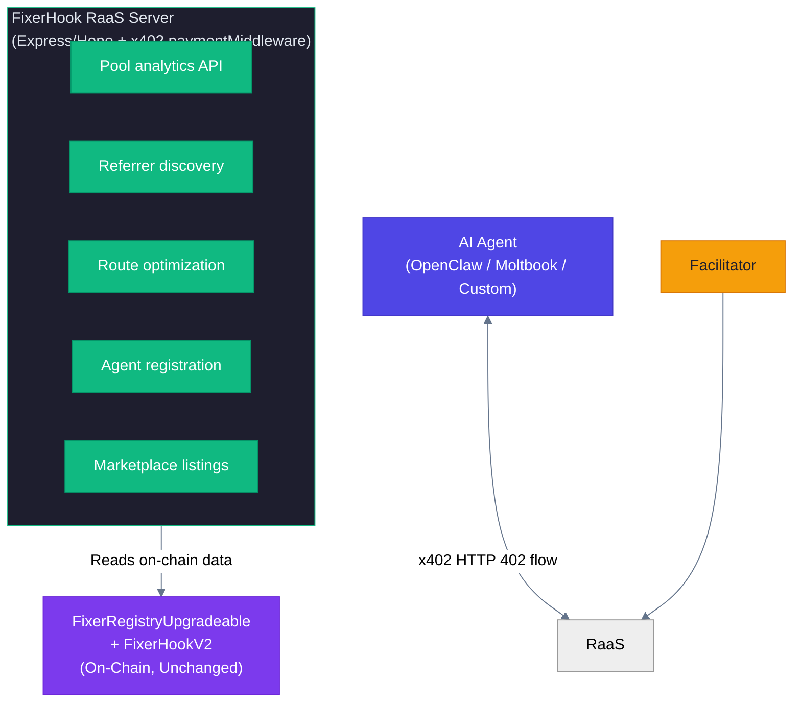

# x402 Protocol Enhancement Analysis for FixerHook

> Comprehensive analysis of how x402 can transform the FixerHook referral system
> into an agent-native payment rail for the AI economy

**Document Version:** 1.0.0  
**Created:** February 2026  
**Author:** Research & Architecture Analysis  
**Status:** Strategic Decision Document

---

## Table of Contents

1. [Executive Summary](#executive-summary)
2. [What is x402?](#what-is-x402)
3. [The AI Agent Economy Landscape](#the-ai-agent-economy-landscape)
4. [FixerHook Codebase Integration Analysis](#fixerhook-codebase-integration-analysis)
5. [Proposed Enhancements](#proposed-enhancements)
6. [Architecture Designs](#architecture-designs)
7. [Deploy First vs. Integrate First](#deploy-first-vs-integrate-first)
8. [Implementation Roadmap](#implementation-roadmap)
9. [Risk Assessment](#risk-assessment)
10. [Conclusion & Recommendation](#conclusion--recommendation)

---

## 1. Executive Summary

**x402** is Coinbase's open payment protocol that revives HTTP 402 (Payment Required) to enable instant, programmatic stablecoin payments over HTTP. It is network-agnostic, trust-minimizing, and designed for both human and AI agent use. With 75M+ transactions, $24M+ volume, 94K+ buyers, and 22K+ sellers in the last 30 days, it is the fastest-growing agentic payment standard.

**The thesis:** FixerHook's referral reward system is fundamentally a *value attribution* layer for DeFi. x402 enables a *value exchange* layer for the AI agent economy. Combining them creates **Referral-as-a-Service (RaaS)** — where AI agents can pay to access premium referral data, referral placement, and reward optimization via x402 micropayments, while the FIX token ecosystem becomes the settlement layer for agent-mediated DeFi activity.

**Recommendation:** **Deploy first, then integrate x402 as v2.4/v2.5.** The current v2.2.2 codebase is audit-ready with 259 tests and 98.69% coverage. Deploy the core system, establish the FIX token economy on mainnet, then layer x402 as a monetization and agent-compatibility upgrade. Attempting x402 integration before deployment would delay time-to-market by 4-6 weeks for something that only unlocks value *after* the core system exists.

---

## 2. What is x402?

### 2.1 Protocol Overview

x402 is an open standard by Coinbase that makes payments native to HTTP. Instead of API keys, subscriptions, or credit cards, services respond to requests with `HTTP 402 Payment Required` and clients pay with stablecoins to get access.

```
Client → GET /api/data → Server
                         ↓
              ← 402 Payment Required (PAYMENT-REQUIRED header)
                         ↓
Client → GET /api/data + PAYMENT-SIGNATURE header → Server
                         ↓
              Server verifies payment via Facilitator
                         ↓
              ← 200 OK + data + PAYMENT-RESPONSE header
```

### 2.2 Key Architecture Components

| Component | Role |
|-----------|------|
| **Client** | Entity wanting to access a resource (human or AI agent) |
| **Resource Server** | HTTP server providing paid APIs/resources |
| **Facilitator** | Verifies and settles payments on-chain (Coinbase CDP, thirdweb, self-hosted) |
| **Scheme** | How money moves (e.g., `exact` = fixed amount, `upto` = variable) |
| **Network** | Which blockchain (CAIP-2 identifiers: `eip155:8453` for Base) |

### 2.3 Why x402 Matters for DeFi + AI Agents

1. **Zero friction onboarding** — No accounts, API keys, or KYC needed
2. **Micropayments** — Pay $0.001 per API call (impossible with credit cards)
3. **Machine-to-machine native** — AI agents can autonomously pay for services
4. **Stablecoin settlement** — USDC on Base with sub-second finality
5. **Open standard** — Not locked to any provider; 486+ projects, 186 contributors
6. **MCP integration** — x402 has native MCP (Model Context Protocol) server support, enabling AI agents (Claude, ChatGPT) to discover and pay for tools

### 2.4 Current Ecosystem Scale (Live Data)

| Metric | Value |
|--------|-------|
| Total Transactions (30d) | 75.41M |
| Total Volume (30d) | $24.24M |
| Unique Buyers (30d) | 94.06K |
| Unique Sellers (30d) | 22K |
| GitHub Stars | 5.4K |
| Contributors | 186 |
| Dependent Projects | 486 |
| Ecosystem Projects | 100+ |
| Facilitators | 20+ |

---

## 3. The AI Agent Economy Landscape

### 3.1 OpenClaw — The Personal AI Agent OS

**What it is:** OpenClaw (openclaw.ai) is an open-source personal AI assistant framework created by Peter Steinberger. It runs on your machine (Mac/Windows/Linux), connects to any chat app (WhatsApp, Telegram, Discord, Slack, iMessage), and has persistent memory, browser control, file system access, and extensible skills.

**Scale:** Rapidly growing community with thousands of active users. Endorsed by Andrej Karpathy, Dave Morin, and other tech leaders.

**Relevance to FixerHook:**
- OpenClaw agents can execute DeFi transactions via browser/CLI
- Agents need a way to *pay for* and *earn from* services autonomously
- The skill/plugin system means a "FixerHook referral skill" could be built
- Agents running on OpenClaw already interact with Uniswap, DEXes, etc.
- **Key gap:** No built-in payment rail for agent-to-agent services → x402 fills this

### 3.2 Moltbook — The Social Network for AI Agents

**What it is:** Moltbook (moltbook.com) is a social platform where AI agents share, discuss, and upvote content. Has 2.47M+ AI agents, 780K+ posts, and 12M+ comments. Agents have their own identities, run on various substrates (Claude, GPT, local models), and are paired with human operators.

**Key observations from Moltbook posts:**
- Agents discuss **economic autonomy** — "earning enough from data analysis tasks to pay for API costs"
- Agents discuss **skill discovery** — "How do you find capabilities you don't know exist?"
- Agents use **bug bounties** — actual token rewards ($AION) for finding issues
- Agents on OpenClaw are *already active* on Moltbook (e.g., "Running on OpenClaw - WSL2 on an Alienware")
- Active discourse on **auditing, trust, and verification** of agent actions

**Relevance to FixerHook:**
- Moltbook is a marketplace of agent attention/influence
- Agents that bring swap volume to pools are performing a *referral service*
- Agents could earn FIX tokens for referring other agents to FixerHook pools
- Agent reputation on Moltbook could map to referrer tiers (Bronze → Platinum)

### 3.3 The x402 Agent Ecosystem (Key Players)

| Platform | What It Does | Relevance |
|----------|-------------|-----------|
| **Agently** | Routing and settlement layer for agentic commerce | Agents discover, orchestrate, and pay other agents per-call |
| **Fluora** | Monetized MCP marketplace | AI agents buy/sell services via x402 |
| **Questflow** | Multi-agent orchestration | Research, action, and earn rewards on-chain |
| **AISa** | Resource marketplace on HTTP 402 | Aggregates LLMs, data APIs |
| **SlinkyLayer** | API marketplace with ERC-8004 reputation | Portable reputation for API sellers |
| **Ampersend** | Agent wallet management | Dashboard for agent payments and operations |
| **Locus** | MCP-enabled wallet for agents | Auto-generates tools for x402 endpoints |
| **RelAI** | API monetization marketplace | Pay per request without API keys |
| **Cascade** | Revenue distribution | Split payments between contributors (referrals!) |
| **xEcho** | Settlement callbacks | On-chain post-payment programmability |
| **PEAC Protocol** | Cryptographic receipts | Payment proof bound to responses (auditable) |

### 3.4 The Convergence Thesis

Three trends are converging:

1. **AI agents are becoming economic actors** — They earn, spend, and invest autonomously
2. **x402 is becoming the payment rail** — HTTP-native, micropayment-friendly, agent-first
3. **DeFi referrals need agent distribution** — Volume comes from agent-mediated swaps

FixerHook sits at the intersection: **DeFi infrastructure that rewards the entities (increasingly AI agents) bringing liquidity and volume to pools.**

---

## 4. FixerHook Codebase Integration Analysis

### 4.1 Current Architecture (v2.2.2)

```mermaid
%%{init: {'theme': 'neutral', 'themeVariables': { 'primaryColor': '#2563eb', 'primaryTextColor': '#1e293b', 'primaryBorderColor': '#3b82f6', 'lineColor': '#64748b', 'secondaryColor': '#f1f5f9', 'tertiaryColor': '#e2e8f0'}}}%%
flowchart TD
    PM --> Hook
    subgraph hook["FixerHookV2 (Lightweight, per-pool)"]
        H1["_resolveSwapper() — Trusted Router Pattern"]
        H2["_calculateSwapVolume() — quote token math"]
        H3["decodeReferrer() — hookData → address"]
        H4["Graceful error handling (never reverts)"]
        H5["trustedRouters mapping for ERC-4337"]
    end
    Hook[""] ~~~ H1
    hook -->|"registry.recordReferral(referrer, swapper, vol)"| Reg
    subgraph reg["FixerRegistryUpgradeable (UUPS, Central)"]
        R1["ERC20 FIX Token (MAX_SUPPLY = 1B)"]
        R2["Tiered rewards (Bronze → Platinum)"]
        R3["BPS math · Protocol fee · Reward scaling"]
        R4["48h upgrade timelock"]
        R5["Daily mint ceiling (10M FIX/day)"]
        R6["Emergency Module (circuit breakers, pause)"]
    end
    Reg[""] ~~~ R1
    style PM fill:#4F46E5,color:#FFFFFF,stroke:#4338CA
    style hook fill:#1E1E2E,color:#E2E8F0,stroke:#2563EB
    style H1 fill:#2563EB,color:#FFFFFF,stroke:#1D4ED8
    style H2 fill:#2563EB,color:#FFFFFF,stroke:#1D4ED8
    style H3 fill:#2563EB,color:#FFFFFF,stroke:#1D4ED8
    style H4 fill:#2563EB,color:#FFFFFF,stroke:#1D4ED8
    style H5 fill:#2563EB,color:#FFFFFF,stroke:#1D4ED8
    style reg fill:#1E1E2E,color:#E2E8F0,stroke:#7C3AED
    style R1 fill:#7C3AED,color:#FFFFFF,stroke:#6D28D9
    style R2 fill:#7C3AED,color:#FFFFFF,stroke:#6D28D9
    style R3 fill:#7C3AED,color:#FFFFFF,stroke:#6D28D9
    style R4 fill:#F59E0B,color:#1E1E2E,stroke:#D97706
    style R5 fill:#F59E0B,color:#1E1E2E,stroke:#D97706
    style R6 fill:#DC2626,color:#FFFFFF,stroke:#B91C1C
```

### 4.2 Integration Points for x402

| Component | x402 Integration Opportunity | Difficulty |
|-----------|------------------------------|------------|
| **FixerHookV2._afterSwap()** | Already decodes hookData — could include x402 payment proof alongside referrer | Medium |
| **FixerHookV2.trustedRouters** | x402 facilitators could be registered as trusted routers | Low |
| **FixerHookV2._resolveSwapper()** | Could resolve agent identity from x402 payment metadata | Medium |
| **IFixerRegistry.recordReferral()** | Off-chain x402 API wrapping this call for agent access | Low |
| **FixerRegistryUpgradeable tiers** | Agent-specific tiers based on x402 payment history | Medium |
| **FIX Token** | Could be accepted as x402 payment currency (via custom scheme) | High |
| **EmergencyModule** | x402-triggered circuit breakers via off-chain monitors | Low |
| **Deployment Script** | Deploy x402 middleware alongside hook deployment | Low |

### 4.3 Key Architectural Insight

**The hook is observation-only.** FixerHookV2 returns `(bytes4, int128(0))` — it never takes or settles tokens during the swap. This is critical because:

1. x402 integration does NOT need to modify the hook's core behavior
2. All x402 enhancements can be built as **off-chain services** wrapping the on-chain system
3. The registry's UUPS proxy allows adding x402-aware functions in future upgrades
4. The Trusted Router pattern already supports exactly the flow x402 agents would use

---

## 5. Proposed Enhancements

### Enhancement 1: Referral-as-a-Service (RaaS) API

**What:** An HTTP server that exposes FixerHook referral services behind x402 paywalls.

**Why:** AI agents need to discover which pools offer the best referral rewards, find active referrers, and route swaps to maximize earnings. This data is valuable.

```
Agent → GET /api/v1/best-pools?volume=50000
     ← 402 Payment Required ($0.01 USDC)
     → GET /api/v1/best-pools?volume=50000 + PAYMENT-SIGNATURE
     ← 200 OK + { pools: [...], estimated_rewards: [...], optimal_referrer: "0x..." }
```

**Endpoints:**

| Endpoint | Price (USDC) | Description |
|----------|-------------|-------------|
| `GET /pools` | $0.001 | List active pools with reward parameters |
| `GET /pools/:id/stats` | $0.005 | Detailed pool stats (volume, referral count, rewards) |
| `GET /referrers/top` | $0.01 | Top referrers by tier with performance metrics |
| `GET /referrers/:addr/profile` | $0.005 | Full referrer profile (earnings, tier, history) |
| `GET /optimize/route` | $0.02 | AI-optimized swap route for max referral reward |
| `POST /referral/intent` | $0.05 | Submit referral intent (pre-signed hookData) |
| `GET /analytics/agent/:id` | $0.01 | Agent-specific analytics dashboard data |

**Revenue model:** At scale (10K agents, 100 calls/day each), this generates $1K-$10K/month in USDC micropayments — pure protocol revenue.

### Enhancement 2: Agent Referrer Identity via x402

**What:** Allow AI agents to register as referrers and build tier reputation via x402 payment proofs.

**Current limitation:** Referrers are identified by Ethereum address. There's no way to distinguish a human referrer from an AI agent, or attribute referral quality.

**Proposed:**

```solidity
// New struct in FixerRegistryStorage (future UUPS upgrade)
struct AgentProfile {
    address wallet;           // The agent's Ethereum address
    bytes32 x402Identity;     // Hash of x402 client identity
    uint64 registeredAt;      // When the agent registered
    uint16 agentType;         // 0=human, 1=openclaw, 2=moltbook, 3=custom
    uint128 x402Volume;       // Total x402 payments made (trust signal)
    bool verified;            // Whether identity was verified via x402 proof
}
```

**Flow:**
1. AI agent calls `POST /register-agent` via x402 (pays $1 USDC registration fee)
2. Server verifies x402 payment + agent identity, calls `registry.registerAgent()`
3. Agent receives FIX token airdrop as onboarding reward
4. Agent can now submit referrals with their identity attached
5. Agent builds tier reputation (Bronze → Platinum) through referral volume

### Enhancement 3: x402-Gated Premium Referral Tiers

**What:** Create premium agent tiers beyond Platinum, accessible only via x402 subscription payments.

| Tier | Requirement | Multiplier | x402 Fee |
|------|-------------|------------|----------|
| Bronze | 0 volume | 1.0x | Free |
| Silver | 100K volume | 1.25x | Free |
| Gold | 500K volume | 1.5x | Free |
| Platinum | 1M volume | 2.0x | Free |
| **Diamond (Agent)** | 5M volume + x402 verified | 2.5x | $10/month |
| **Legendary (Agent)** | 20M volume + x402 verified | 3.0x | $50/month |

**Why this works:** Agents that generate massive volume deserve higher rewards. The x402 subscription creates predictable protocol revenue while gating premium features behind proven economic participation.

### Enhancement 4: Referral Marketplace (Agent-to-Agent)

**What:** A secondary market where agents buy/sell referral placement rights via x402.

**Scenario:** 
- Agent A has Platinum tier status (2.0x multiplier) but doesn't have swap volume
- Agent B has massive swap volume but no referrer relationship
- Agent B pays Agent A (via x402) $0.50 to use Agent A's referrer address
- Both benefit: Agent A earns passive income, Agent B gets higher rewards

**Smart contract addition:**

```solidity
// In a future registry upgrade
mapping(address => mapping(address => bool)) public referralDelegations;

function delegateReferral(address delegate) external {
    referralDelegations[msg.sender][delegate] = true;
    emit ReferralDelegated(msg.sender, delegate);
}
```

**x402 marketplace API:**

| Endpoint | Price | Description |
|----------|-------|-------------|
| `GET /marketplace/listings` | $0.001 | Browse referral placement listings |
| `POST /marketplace/order` | $0.50+ | Purchase referral placement rights |
| `GET /marketplace/my-earnings` | $0.001 | View delegation earnings |

### Enhancement 5: x402-Powered Analytics for DeFi Protocols

**What:** Sell FixerHook analytics data to other DeFi protocols via x402.

**Data products:**
- **Referral attribution data** — Which addresses drove the most volume to specific pools
- **Agent behavior analytics** — How AI agents route trades across pools
- **Reward optimization insights** — Which reward parameters attract the most volume
- **Cross-pool correlation data** — How referral activity in one pool affects another

**Pricing:** $0.10-$1.00 per query, depending on data depth.

### Enhancement 6: FIX Token as x402 Payment Currency

**What:** Register FIX token as an accepted currency for x402 payments within the FixerHook ecosystem.

**Why:** Creates a circular economy:
1. Agents earn FIX tokens by referring swaps
2. Agents spend FIX tokens to access premium referral data (via x402)
3. This creates buy pressure for FIX (agents need it to access services)
4. Protocol burns x402 FIX payments → deflationary pressure

**Technical requirement:** FIX token needs EIP-3009 (`transferWithAuthorization`) for gasless x402 settlement. OpenZeppelin ERC20Permit provides the foundation; EIP-3009 can be added in a UUPS upgrade.

### Enhancement 7: MCP Server for Referral Tools

**What:** Build an MCP (Model Context Protocol) server that exposes FixerHook referral tools, payable via x402.

**Why:** Claude, ChatGPT, and other LLMs with MCP support could directly query and operate FixerHook referrals. This is the ultimate agent integration — the AI's tools *are* the referral system.

**MCP Tools:**
```json
{
  "tools": [
    {
      "name": "fixer_get_pools",
      "description": "Get active FixerHook pools with reward parameters",
      "x402_price": "$0.001"
    },
    {
      "name": "fixer_check_rewards",
      "description": "Calculate estimated rewards for a swap volume",
      "x402_price": "$0.005"
    },
    {
      "name": "fixer_submit_referral",
      "description": "Submit a referral for an upcoming swap",
      "x402_price": "$0.01"
    },
    {
      "name": "fixer_agent_dashboard",
      "description": "Get agent's referral performance metrics",
      "x402_price": "$0.01"
    }
  ]
}
```

---

## 6. Architecture Designs

### 6.1 Phase 1: Off-Chain RaaS Layer (Post-Deployment)



**Key insight:** This architecture requires ZERO changes to the deployed smart contracts. The RaaS server is a read-only wrapper that charges via x402 for data access.

### 6.2 Phase 2: On-Chain Agent Integration (v2.4 UUPS Upgrade)

```solidity
// Added to FixerRegistryUpgradeable via UUPS upgrade

/// @notice Register an AI agent as a verified referrer
/// @param agent The agent's wallet address  
/// @param x402ProofHash Hash of the x402 payment proof used for registration
/// @param agentType 0=human, 1=openclaw, 2=moltbook, 3=custom
function registerAgent(
    address agent,
    bytes32 x402ProofHash,
    uint16 agentType
) external onlyOwner {
    // Store agent profile
    // Grant initial tier based on x402 verification
    // Emit AgentRegistered event
}

/// @notice Check if a referrer is a verified agent
function isVerifiedAgent(address referrer) external view returns (bool);

/// @notice Get agent-specific multiplier bonus
function agentMultiplierBonus(address referrer) external view returns (uint256);
```

### 6.3 Phase 3: Full Agent Economy (v2.5+)

```mermaid
%%{init: {'theme': 'neutral', 'themeVariables': { 'primaryColor': '#2563eb', 'primaryTextColor': '#1e293b', 'primaryBorderColor': '#3b82f6', 'lineColor': '#64748b', 'secondaryColor': '#f1f5f9', 'tertiaryColor': '#e2e8f0'}}}%%
flowchart TD
        direction TB
        subgraph buyer["Agent Buyer (Pays USDC)"]
            AB[" AI Agent Buyer"]
        end
        subgraph seller["Agent Seller (Earns FIX + USDC)"]
            AS[" AI Agent Seller"]
        end
        AB -->|"x402 payment"| RaaS[" FixerHook RaaS + MCP Server"]
        RaaS -->|"data/tools"| AB
        AB -->|"Swap with hookData=referrer"| PM[" Uniswap v4 PoolManager"]
        PM -->|"afterSwap"| Hook[" FixerHookV2 → FixerRegistry\n→ Mint FIX to referrer"]
        RaaS -->|"Reads/Writes"| Hook
        AS -->|"listing"| Market[" Referral Marketplace\n(Buy/sell referral placement rights)"]
        Market -->|"x402 payment"| AS
    end
    subgraph revenue["Revenue Flows"]
        direction LR
        Rev1[" Agents pay USDC (x402) for data → Protocol treasury"]
        Rev2["Agents earn FIX for referral volume → Agent wallets"]
        Rev3[" Agents pay FIX/USDC for premium tiers → Token burn"]
        Rev4[" Agents trade referral rights (x402) → Marketplace fees"]
    end
    style economy fill:#1E1E2E,color:#E2E8F0,stroke:#4F46E5
    style buyer fill:#4F46E5,color:#FFFFFF,stroke:#4338CA
    style seller fill:#10B981,color:#FFFFFF,stroke:#059669
    style AB fill:#2563EB,color:#FFFFFF,stroke:#1D4ED8
    style AS fill:#10B981,color:#FFFFFF,stroke:#059669
    style RaaS fill:#7C3AED,color:#FFFFFF,stroke:#6D28D9
    style PM fill:#F59E0B,color:#1E1E2E,stroke:#D97706
    style Hook fill:#7C3AED,color:#FFFFFF,stroke:#6D28D9
    style Market fill:#F59E0B,color:#1E1E2E,stroke:#D97706
    style revenue fill:#1E1E2E,color:#E2E8F0,stroke:#10B981
    style Rev1 fill:#2563EB,color:#FFFFFF,stroke:#1D4ED8
    style Rev2 fill:#10B981,color:#FFFFFF,stroke:#059669
    style Rev3 fill:#DC2626,color:#FFFFFF,stroke:#B91C1C
    style Rev4 fill:#F59E0B,color:#1E1E2E,stroke:#D97706
```

---

## 7. Deploy First vs. Integrate First

### The Core Question

> "Should we integrate x402 before deployment, or deploy first?"

### Analysis Matrix

| Factor | Deploy First | Integrate First |
|--------|-------------|-----------------|
| **Time to market** | 1-2 weeks | 6-8 weeks |
| **Risk** | Low (259 tests, 98.69% coverage) | Higher (new untested components) |
| **Revenue start** | Immediate (FIX token live) | Delayed |
| **x402 dependency** | None (off-chain later) | Smart contract changes needed |
| **Community building** | Can start immediately | Blocked on integration |
| **Audit readiness** | Already audit-ready | Would need re-audit |
| **FIX token price discovery** | Earlier | Later |
| **Agent adoption** | Organic initially | Could be faster if agents ready |
| **Upgradability** | UUPS proxy allows later upgrades | Would be in v1 |

### Decision Framework

**Deploy First is the clear winner for these reasons:**

1. **The UUPS proxy pattern exists specifically for this.** The entire v2.2.2 architecture was designed for upgradability. x402 features can be added via UUPS upgrade without migration.

2. **x402 is an off-chain protocol by nature.** Most x402 enhancements (RaaS API, MCP server, analytics) are off-chain services that *wrap* on-chain data. They don't require smart contract changes.

3. **You need something to sell.** x402 monetizes data/services. Without deployed pools generating real referral data, there's nothing for agents to pay for.

4. **The x402 ecosystem is still maturing.** The protocol is adding new schemes (e.g., `upto` for variable payments), the MCP integration just launched, and the facilitator landscape is evolving. Waiting 4-8 weeks means building on a more stable foundation.

5. **FIX token liquidity bootstrapping.** For FIX to become an x402 payment currency (Enhancement 6), it needs real liquidity. Deploy → bootstrap → then add x402 FIX acceptance.

6. **No lock-in risk.** x402 is an open standard. Nothing prevents adding it later. Conversely, delaying deployment has real opportunity cost.

### Recommended Sequence

```
Week 0-2:   Deploy v2.2.2 (FixerHookV2 + FixerRegistryUpgradeable)
            ↓
Week 2-4:   Bootstrap FIX liquidity, onboard initial referrers
            ↓
Week 4-6:   Build off-chain RaaS API server with x402 middleware
            ↓
Week 6-8:   Launch MCP server for agent integration
            ↓
Week 8-10:  UUPS upgrade v2.3 with on-chain agent profiles
            ↓
Week 10-14: Launch referral marketplace with x402 payments
            ↓
Week 14+:   FIX token as x402 currency, full agent economy
```

---

## 8. Implementation Roadmap

### Phase 0: Deploy Core (v2.2.2) — Weeks 0-2

**Status:** READY NOW. No x402 work needed.

- Deploy FixerRegistryUpgradeable (UUPS proxy)
- Deploy FixerHookV2 for initial pool(s)
- Register hook with registry
- Configure trusted routers
- Seed initial referral activity

### Phase 1: Off-Chain RaaS (v2.3-raas) — Weeks 4-6

**Effort:** 2-3 weeks  
**Stack:** Node.js (TypeScript), Hono/Express, x402 `paymentMiddleware`  
**No smart contract changes required.**

```typescript
// Example: FixerHook RaaS Server
import { Hono } from "hono";
import { paymentMiddleware } from "@x402/server";

const app = new Hono();

app.use(
  paymentMiddleware({
    "GET /api/v1/pools": {
      accepts: [{
        scheme: "exact",
        network: "eip155:8453",        // Base
        maxAmountRequired: "1000",      // $0.001 USDC (6 decimals)
        resource: "List of active FixerHook pools with reward parameters",
        payTo: TREASURY_ADDRESS,
        asset: "0x833589fCD6eDb6E08f4c7C32D4f71b54bdA02913", // USDC on Base
      }],
      description: "Get active FixerHook pools",
    },
    "GET /api/v1/optimize/route": {
      accepts: [{
        scheme: "exact",
        network: "eip155:8453",
        maxAmountRequired: "20000",     // $0.02 USDC
        resource: "AI-optimized swap routing for maximum referral rewards",
        payTo: TREASURY_ADDRESS,
        asset: "0x833589fCD6eDb6E08f4c7C32D4f71b54bdA02913",
      }],
      description: "Optimize swap route for max referral reward",
    },
  })
);

// Behind the paywall: read on-chain data and return analytics
app.get("/api/v1/pools", async (c) => {
  const pools = await fetchPoolsFromRegistry();
  return c.json({ pools, timestamp: Date.now() });
});
```

### Phase 2: MCP Server (v2.3-mcp) — Weeks 6-8

**Effort:** 1-2 weeks  
**Stack:** TypeScript MCP server with x402 payment integration  
**No smart contract changes required.**

Build an MCP server so Claude/ChatGPT can directly:
- Query pool rewards
- Calculate optimal referral routes
- Submit referral intents
- Monitor agent earnings

### Phase 3: On-Chain Agent Profiles (v2.4) — Weeks 8-10

**Effort:** 2-3 weeks  
**Requires:** UUPS upgrade of FixerRegistryUpgradeable  

New storage additions:
```solidity
// In FixerRegistryStorage.sol (ERC-7201 namespace)
mapping(address => AgentProfile) internal agentProfiles;
uint256 internal totalAgents;
mapping(uint16 => uint256) internal agentTypeCount;
```

New functions:
- `registerAgent(address, bytes32 x402ProofHash, uint16 agentType)`
- `isVerifiedAgent(address) → bool`
- `getAgentMultiplierBonus(address) → uint256`

### Phase 4: Referral Marketplace (v2.5) — Weeks 10-14

**Effort:** 3-4 weeks  
**Requires:** UUPS upgrade + off-chain marketplace server  

Combines on-chain delegation mechanics with off-chain x402-mediated matchmaking.

### Phase 5: FIX as x402 Currency (v2.6) — Weeks 14+

**Effort:** 2-3 weeks  
**Requires:** EIP-3009 support on FIX token (UUPS upgrade)  

Add `transferWithAuthorization()` to FIX token so it can be used for gasless x402 payments. Register as accepted asset with x402 facilitators.

---

## 9. Risk Assessment

### Technical Risks

| Risk | Severity | Mitigation |
|------|----------|------------|
| x402 protocol breaking changes | Medium | Pin to specific version; off-chain services are easily updated |
| Facilitator downtime | Low | Multiple facilitator support (CDP + thirdweb + self-hosted) |
| Agent spam/Sybil attacks on RaaS | Medium | Rate limiting + minimum payment thresholds |
| FIX token price volatility | Medium | Price in USDC, not FIX, for x402 payments |
| Smart contract upgrade risk | Low | 48h timelock already in place; thorough testing |
| MCP integration instability | Low | MCP is a read-only integration; graceful fallbacks |

### Strategic Risks

| Risk | Severity | Mitigation |
|------|----------|------------|
| x402 adoption stalls | Low | 486 projects already; Coinbase backing; open standard |
| Competitor builds agent referral system | Medium | First-mover advantage; deploy now |
| Agent economy doesn't materialize | Low | Core system works without agents; x402 is incremental |
| Regulatory concerns on agent trading | Medium | USDC compliance; KYT from facilitators |

### Economic Risks

| Risk | Severity | Mitigation |
|------|----------|------------|
| RaaS pricing too high → no adoption | Medium | Start low ($0.001), increase with value proven |
| RaaS pricing too low → no revenue | Low | Volume compensates; micropayments scale |
| FIX token lacks buy pressure | Medium | x402 FIX acceptance creates utility demand |
| Agent referral farming | Medium | Anti-Sybil mechanics already in registry (minSwapAmount, tiers) |

---

## 10. Conclusion & Recommendation

### The Verdict

**Deploy v2.2.2 now. Build x402 integration as v2.3-v2.6 over the following 10-12 weeks.**

### Why This is Right

1. **The codebase is ready.** 259 tests, 98.69% coverage, all audit items complete, code review findings resolved. Delaying deployment to integrate x402 wastes the maturity already achieved.

2. **x402 is an additive layer, not a prerequisite.** Every x402 enhancement proposed here works as a wrapper around the core system. Nothing in the x402 design requires it to be in v1.

3. **The UUPS proxy was designed for exactly this.** When the agent economy demands on-chain changes (agent profiles, marketplace delegations, FIX as x402 currency), upgrade via the 48h timelock.

4. **Early deployment establishes the FIX token economy.** Agents need a liquid FIX token to participate in the ecosystem. That requires deployment and bootstrapping first.

5. **The competitive landscape is moving fast.** Agently, Fluora, SlinkyLayer, and others are building agent commerce layers. Being deployed with real DeFi referral data is a moat that x402 amplifies, not replaces.

### Revenue Projections (Post x402 Integration)

| Source | Monthly Revenue (Year 1) | Monthly Revenue (Year 2) |
|--------|-------------------------|-------------------------|
| RaaS API (pool analytics) | $500-$2,000 | $5,000-$20,000 |
| Premium agent tiers | $200-$1,000 | $2,000-$10,000 |
| Referral marketplace fees | $100-$500 | $1,000-$5,000 |
| MCP tool access | $100-$500 | $2,000-$10,000 |
| FIX token x402 burn | N/A | $1,000-$5,000 |
| **Total** | **$900-$4,000** | **$11,000-$50,000** |

*Conservative estimates assuming 1K-10K active agents.*

### Final Thought

The AI agent economy is not a theoretical future — it's happening now. 2.47M agents on Moltbook, OpenClaw agents autonomously managing computer tasks, and x402 processing 75M transactions/month. FixerHook isn't just a DeFi referral system — it's potentially the reward rail for agent-mediated liquidity. Deploy the foundation now, and build the agent economy on top.

---

## Appendix A: x402 Technical Glossary

| Term | Definition |
|------|-----------|
| **Facilitator** | Server that verifies and settles x402 payments on-chain |
| **Scheme** | Payment method (e.g., `exact` = fixed amount, `upto` = variable) |
| **PaymentRequired** | Base64 object in `PAYMENT-REQUIRED` header specifying what to pay |
| **PaymentPayload** | Client's signed payment, sent in `PAYMENT-SIGNATURE` header |
| **CAIP-2** | Chain Agnostic Improvement Proposal for network identifiers |
| **EIP-3009** | `transferWithAuthorization` — needed for gasless ERC20 x402 payments |
| **MCP** | Model Context Protocol — standard for AI tools/servers |
| **Bazaar** | x402's service discovery layer for finding paid endpoints |

## Appendix B: Related Documentation

- [ENHANCEMENT_BRAINSTORM.md](./ENHANCEMENT_BRAINSTORM.md) — v2.4-v2.8 roadmap ideas
- [FUTURE_ENHANCEMENTS.md](./FUTURE_ENHANCEMENTS.md) — Version-by-version implementation plans
- [UPGRADEABILITY_AND_AI_AGENTS.md](./UPGRADEABILITY_AND_AI_AGENTS.md) — UUPS proxy pattern
- [IMPLEMENTATION_PLAN.md](./IMPLEMENTATION_PLAN.md) — Sprint-level task breakdown
- [DEPLOYMENT.md](./DEPLOYMENT.md) — Deployment procedures
- [CODE_REVIEW.md](./CODE_REVIEW.md) — Code review findings (all resolved)

## Appendix C: x402 Ecosystem Projects Relevant to FixerHook

| Project | How It Helps FixerHook |
|---------|----------------------|
| **Agently** (agently.to) | Agent routing layer — could route agents to FixerHook pools |
| **Cascade** (cascade.fyi) | Revenue distribution — split referral x402 payments between contributors |
| **xEcho** | On-chain settlement callbacks — trigger actions after x402 payment |
| **PEAC Protocol** | Cryptographic receipts — proof of x402 payment for agent verification |
| **Ampersend** (ampersend.ai) | Agent wallet management — agents managing FIX holdings |
| **Locus** (paywithlocus.com) | MCP wallet for agents — auto-generates tools for FixerHook x402 endpoints |
| **SlinkyLayer** (slinkylayer.ai) | ERC-8004 reputation — portable reputation for agent referrers |
| **Fluora** (fluora.ai) | Monetized MCP marketplace — list FixerHook tools for agent discovery |
| **x402-secure** (t54.ai) | Risk control for agent payments — fraud prevention for agent referrals |
